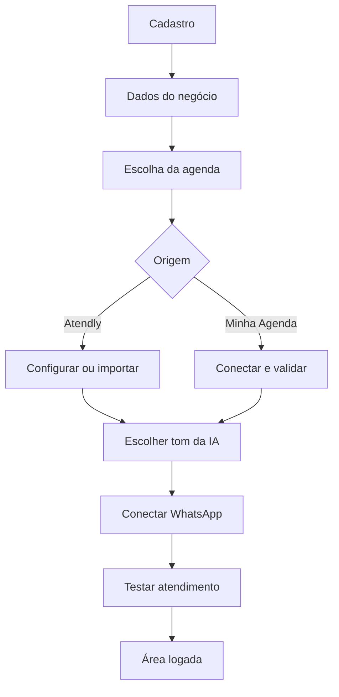

# Especificação de Telas e Fluxos UX/UI — Atendly

**Status:** especificação funcional para prototipação  
**Escopo:** primeira versão comercial focada em agendamentos  
**Público prioritário:** profissionais autônomos que administram o próprio negócio  
**Plataformas:** web responsiva, desktop e mobile  

---

## 1. Finalidade deste documento

Este documento descreve as telas da Atendly na ordem natural da jornada do usuário. O objetivo é fornecer ao profissional de UX/UI informações suficientes para criar wireframes, fluxos, protótipos navegáveis, estados alternativos e especificações responsivas sem precisar inferir regras críticas do produto.

Para cada tela são descritos, quando aplicável:

- objetivo;
- ponto de entrada e saída;
- hierarquia de conteúdo;
- campos e componentes;
- ações principais e secundárias;
- comportamento funcional;
- variações por origem da agenda;
- validações;
- estados de loading, vazio, sucesso e erro;
- edge cases;
- requisitos visuais e responsivos;
- observações para prototipação.

Este documento não define arquitetura técnica, contratos de API ou implementação de componentes.

---

# 2. Premissas do produto

## 2.1 Usuário principal

O usuário principal é um profissional autônomo que normalmente:

- administra o próprio negócio;
- presta os serviços;
- controla a agenda;
- responde o WhatsApp;
- possui pouco tempo para configurar ferramentas;
- acessa o sistema com frequência pelo celular.

Na primeira versão, não é necessário apresentar gestão de equipes, cargos ou múltiplas unidades na interface.

## 2.2 Tenant

- Cada conta cria automaticamente um ambiente de negócio isolado.
- O ambiente do negócio é o tenant.
- O telefone do WhatsApp é um canal do tenant, não o identificador do tenant.
- Na primeira versão, cada tenant possui um proprietário e um WhatsApp ativo por vez.
- Todos os clientes, serviços, conversas, agendamentos e configurações pertencem ao tenant.

## 2.3 Modos de agenda

Todo tenant deve utilizar exatamente uma fonte oficial de agendamento:

### Agenda Atendly

A Atendly controla serviços, disponibilidade, clientes e agendamentos.

### Minha Agenda

O Minha Agenda continua sendo a fonte oficial. A Atendly consulta e envia operações por meio da integração.

O usuário pode trocar de fonte futuramente, mas essa troca deve ocorrer por um fluxo assistido de migração, nunca por um toggle imediato.

## 2.4 Estados globais da operação

O protótipo deve prever os seguintes estados do ambiente:

| Estado | Significado |
| --- | --- |
| Configuração incompleta | Agenda ou WhatsApp ainda não está pronto |
| Ativo com Agenda Atendly | Atendly é a fonte oficial |
| Ativo com Minha Agenda | Minha Agenda é a fonte oficial |
| Integração instável | Minha Agenda está conectado, mas apresenta falhas |
| WhatsApp desconectado | Atendimento automático indisponível |
| Migração em preparação | Dados sendo analisados, sem troca da fonte ativa |
| Migração em andamento | Alterações temporariamente limitadas |
| Ação humana necessária | Existe conflito, erro ou conversa aguardando atendimento |

---

# 3. Diretrizes globais de UX/UI

## 3.1 Identidade visual

Manter a identidade visual já estabelecida para a Atendly:

- Verde Vivo: `#00C98B`;
- Verde Acessível: `#007A57`;
- Navy: `#0B1727`;
- Violeta: `#7C5CFC`;
- Coral: `#FF7A59`;
- fundos claros e neutros;
- tipografia moderna, legível e com contraste mínimo WCAG AA;
- elementos gráficos derivados do conceito “Conversation Flow”.

Uso recomendado:

- verde acessível para ações principais e estados positivos;
- verde vivo para elementos de marca e destaques não textuais;
- navy para títulos e superfícies de marca;
- violeta para automação, IA ou informações especiais;
- coral para alertas que exigem atenção, sem substituir o vermelho semântico de erro.

## 3.2 Espaçamento e dimensões

- Grid baseado em múltiplos de 8 px.
- Painéis: raio de 24 px.
- Cards: raio entre 16 e 20 px.
- Inputs: raio de 12 px.
- Altura mínima de inputs e botões: 48 px; preferencialmente 52–56 px no mobile.
- Área de toque mínima: 44 × 44 px.
- CTA principal do mobile deve permanecer visível na safe area inferior quando isso não conflitar com o teclado.

## 3.3 Comportamento mobile-first

- Uma tarefa principal por tela.
- No máximo dois inputs principais visíveis por tela de onboarding.
- Evitar scroll no onboarding.
- Quando houver teclado aberto, permitir scroll suficiente para manter campo, erro e CTA acessíveis.
- Não usar stepper horizontal com todos os nomes no mobile.
- Usar badge `ETAPA X DE Y`, barra de progresso e botão voltar.
- Modais complexos devem virar páginas ou bottom sheets de tela cheia no mobile.

## 3.4 Feedback

Toda ação assíncrona deve comunicar:

- que começou;
- se pode ser cancelada;
- se o usuário pode sair da tela;
- resultado de sucesso;
- motivo compreensível do erro;
- ação de recuperação.

Não utilizar apenas toasts para erros que impedem a continuidade. O erro deve aparecer próximo ao componente relacionado.

## 3.5 Estados obrigatórios dos componentes

Todos os componentes interativos devem possuir:

- default;
- hover;
- pressed/active;
- focus visível;
- disabled;
- loading;
- success, quando aplicável;
- error, quando aplicável.

---

# 4. Arquitetura de navegação

## 4.1 Navegação desktop

Usar sidebar com:

- logo Atendly;
- nome do negócio;
- status resumido do WhatsApp;
- itens de navegação;
- acesso às configurações;
- menu da conta.

## 4.2 Navegação mobile

Bottom navigation recomendada:

1. Início;
2. Conversas;
3. Agenda;
4. Mais.

Dentro de “Mais”:

- Clientes;
- Serviços;
- Configurações;
- Ajuda;
- Sair.

## 4.3 Matriz de menus por origem da agenda

| Área | Agenda Atendly | Minha Agenda |
| --- | --- | --- |
| Início | Completo | Completo com status da integração |
| Conversas | Completo | Completo |
| Agenda | Gestão completa | Consulta e ações suportadas pela integração |
| Clientes | Gestão completa | Dados sincronizados + informações locais da Atendly |
| Serviços | Gestão completa | Consulta; edição direcionada ao Minha Agenda quando necessário |
| Disponibilidade | Visível e editável | Oculta; gerenciada no Minha Agenda |
| Bloqueios de horário | Visível | Oculto ou somente leitura conforme integração |
| Integração | Estado da agenda interna | Estado detalhado do Minha Agenda |
| Alterar origem da agenda | “Conectar Minha Agenda” | “Migrar para Agenda Atendly” |

Quando uma operação não puder ser executada pela integração, a interface deve explicar onde realizá-la. Não exibir controles editáveis que falharão após o envio.

---

# 5. Mapa geral da jornada

---

# 6. Autenticação e acesso

## AUTH-01 — Login

### Objetivo

Permitir que um usuário existente acesse o ambiente do seu negócio.

### Entrada

- Acesso direto à aplicação.
- Retorno após logout.
- Retorno após expiração de sessão.

### Conteúdo

- Logo Atendly.
- Identificador visual “Bem-vindo de volta”.
- Título “Entrar”.
- Descrição curta: “Acesse suas conversas, agenda e configurações.”
- Campo e-mail.
- Campo senha.
- Ação para mostrar/ocultar senha.
- Link “Esqueci minha senha”.
- Botão “Entrar”.
- Divisor.
- Link “Ainda não tem uma conta? Criar conta”.

### Comportamento

- O botão envia o formulário.
- Enter no campo senha também envia.
- Durante autenticação, o botão exibe loading e evita múltiplos envios.
- Usuário autenticado com onboarding incompleto retorna à última etapa válida.
- Usuário autenticado e configurado vai para Início.

### Validações

- E-mail obrigatório.
- Formato de e-mail válido.
- Senha obrigatória.
- Mensagem genérica para credenciais incorretas: “E-mail ou senha incorretos.”
- Não revelar se um e-mail específico possui conta.

### Edge cases

- Conta bloqueada ou temporariamente limitada.
- Sessão expirada.
- Falha de conexão.
- Serviço indisponível.
- Usuário tenta acessar login já autenticado.

### Visual e responsividade

- Desktop: composição de marca e card de autenticação centralizado, sem altura excessiva.
- Mobile: header de marca em navy e card branco sobreposto, respeitando safe areas.
- O formulário inteiro deve caber em telas comuns sem ocultar a ação principal.

---

## AUTH-02 — Cadastro

### Objetivo

Criar a conta proprietária e iniciar o ambiente do negócio.

### Conteúdo

- Logo Atendly.
- Badge “Nova conta”.
- Título “Criar conta”.
- Descrição: “Configure seu negócio e conecte seu WhatsApp.”
- Campo e-mail.
- Campo senha.
- Campo confirmar senha.
- Checkbox de aceite.
- Links “Termos de Uso” e “Política de Privacidade”.
- Botão “Criar conta”.
- Link “Já possui uma conta? Entrar”.

### Microcopy do aceite

> Li e concordo com os Termos de Uso e declaro que li a Política de Privacidade.

### Comportamento

- Checkbox começa desmarcado.
- Clicar nos links legais não altera o checkbox.
- Ao abrir um documento e voltar, preservar e-mail e estado do aceite.
- Senha e confirmação podem permanecer apenas durante a navegação interna; não devem sobreviver a recarregamento completo.
- Após sucesso, iniciar o onboarding.

### Validações

- E-mail obrigatório e válido.
- Senha conforme política definida pelo produto.
- Confirmação idêntica à senha.
- Aceite obrigatório.
- Erros próximos aos campos.
- E-mail já cadastrado deve oferecer acesso ao login ou recuperação de senha.

### Edge cases

- Cadastro duplicado.
- Senha colada apenas em um campo.
- Documento legal aberto em nova aba e formulário mantido.
- Versão dos termos alterada durante o cadastro.
- Falha ao criar tenant depois da conta: mostrar recuperação segura, sem criar duplicidade.

### Visual e responsividade

- Manter padrão visual do login.
- No mobile, evitar que o rodapé do card ultrapasse a viewport.
- Checkbox, texto e links devem possuir alinhamento consistente e área de toque acessível.

---

## AUTH-03 — Termos de Uso

### Objetivo

Permitir leitura dos termos antes ou depois do cadastro.

### Conteúdo

- Logo.
- Botão “Voltar para criar conta” quando originado do cadastro.
- Título.
- Versão e data de vigência.
- Sumário com âncoras.
- Seções do documento.
- Canal de contato.
- Link para Política de Privacidade.

### Comportamento

- Botão voltar usa o histórico quando possível.
- Acesso direto usa Cadastro como fallback.
- O documento não marca o aceite automaticamente.
- Conteúdo deve ser imprimível e navegável por teclado.

### Estados

- Conteúdo disponível.
- Falha ao carregar: mensagem e ação “Tentar novamente”.
- Versão atualizada: exibir versão vigente.

---

## AUTH-04 — Política de Privacidade

Mesma estrutura de AUTH-03, com conteúdo específico sobre tratamento de dados, integrações, IA, direitos do titular e canal de privacidade.

Deve oferecer link para Termos de Uso e retorno ao contexto anterior.

---

## AUTH-05 — Recuperar senha

### Objetivo

Solicitar instruções de redefinição sem revelar se a conta existe.

### Conteúdo

- Título “Recuperar senha”.
- Campo e-mail.
- Botão “Enviar instruções”.
- Link “Voltar para entrar”.

### Resultado

Mensagem neutra:

> Se existir uma conta para este e-mail, você receberá as instruções em instantes.

### Edge cases

- Reenvio com temporizador.
- Link expirado.
- Muitas tentativas.
- Falha de rede.

---

## AUTH-06 — Criar nova senha

### Conteúdo

- Campo nova senha.
- Campo confirmar nova senha.
- Requisitos de senha.
- Botão “Salvar nova senha”.

### Estados

- Link válido.
- Link expirado ou já utilizado.
- Sucesso com ação “Entrar”.

---

# 7. Onboarding comum

## Elementos persistentes

Todas as etapas possuem:

- logo compacto;
- botão voltar, exceto na primeira etapa;
- badge `ETAPA X DE Y`;
- barra linear de progresso;
- título curto;
- descrição de até duas linhas;
- área principal;
- CTA primário na base;
- opção de sair e continuar depois quando houver estado salvo.

Ao voltar e alterar uma decisão que invalida etapas posteriores, solicitar confirmação antes de descartar configurações do ramo anterior.

---

## ONB-01 — Seu negócio

### Objetivo

Criar o contexto mínimo utilizado pela IA e pela interface.

### Conteúdo

- Título “Vamos começar pelo seu negócio”.
- Campo nome do negócio.
- Seletor de segmento.
- CTA “Continuar”.

### Segmentos sugeridos

- Salão de beleza.
- Barbearia.
- Estética.
- Manicure.
- Massagem.
- Personal trainer.
- Consultório.
- Outro.

### Comportamento

- Idioma sugerido: português do Brasil.
- Moeda sugerida: real brasileiro.
- Fuso detectado automaticamente e editável posteriormente.
- Não solicitar data de nascimento ou sexo.

### Validações

- Nome obrigatório.
- Segmento obrigatório.
- Nome com limite visual e técnico razoável.
- “Outro” não precisa abrir um formulário longo; pode exibir um campo curto opcional.

### Edge cases

- Nome muito longo.
- Segmento não encontrado.
- Fuso detectado incorretamente.
- Usuário sai antes de continuar.

---

## ONB-02 — Escolha da agenda

### Objetivo

Definir a fonte oficial dos agendamentos.

### Conteúdo

- Título “Onde você quer controlar seus agendamentos?”.
- Descrição “Escolha uma opção. Você poderá migrar depois.”
- Card Agenda Atendly.
- Card Minha Agenda.
- CTA “Continuar”.

### Card Agenda Atendly

> Gerencie serviços, horários, clientes e agendamentos diretamente na Atendly.

### Card Minha Agenda

> Continue usando o Minha Agenda conectado à Atendly.

### Comportamento

- Nenhuma opção selecionada inicialmente.
- Seleção obrigatória.
- Card selecionado possui borda, fundo suave e check.
- Continuar direciona ao ramo correspondente.

### Edge cases

- Usuário não conhece a diferença: disponibilizar “Comparar opções” em bottom sheet curta.
- Usuário ainda não possui Minha Agenda: orientar a escolher Agenda Atendly.
- Usuário volta e troca de opção após preencher dados: solicitar confirmação.

---

# 8. Ramo Agenda Atendly

## ONB-A01 — Como começar

### Objetivo

Escolher entre configuração manual e migração inicial.

### Cards

#### Começar do zero

> Cadastre seu primeiro serviço e seus horários.

#### Importar do Minha Agenda

> Traga clientes, serviços e agendamentos existentes.

### Regras

- Nenhuma opção pré-selecionada.
- Importar é migração única; deixar isso explícito.
- A opção escolhida define as próximas subetapas.

---

## ONB-A02 — Primeiro serviço

### Objetivo

Cadastrar o serviço mínimo necessário para o teste da agenda.

### Conteúdo

- Título “Qual serviço você oferece?”.
- Campo nome do serviço.
- Seletor de duração.
- CTA “Continuar”.

### Validações

- Nome obrigatório.
- Duração obrigatória e maior que zero.
- Evitar serviço duplicado no mesmo tenant.

### Edge cases

- Duração fora das opções: permitir valor personalizado.
- Serviço sem duração conhecida: não permitir ativar antes de definir.
- Usuário oferece muitos serviços: informar que os demais podem ser cadastrados depois.

---

## ONB-A03 — Preço do serviço

### Objetivo

Definir como a IA apresenta o preço do primeiro serviço.

### Conteúdo

- Título “Quanto custa esse serviço?”.
- Opção “Preço fixo”.
- Opção “Valor sob consulta”.
- Campo monetário condicional.
- CTA “Continuar”.

### Validações

- Preço maior ou igual a zero quando fixo.
- Máscara em real brasileiro.
- Não exibir campo de preço quando “sob consulta” estiver selecionado.

### Edge cases

- Serviço gratuito.
- Preço variável.
- Valores muito altos.

---

## ONB-A04 — Dias de atendimento

### Objetivo

Definir os dias habituais de disponibilidade.

### Conteúdo

- Título “Em quais dias você atende?”.
- Controles Seg, Ter, Qua, Qui, Sex, Sáb e Dom.
- CTA “Continuar”.

### Comportamento

- Segunda a sexta podem aparecer como sugestão, mas o usuário precisa confirmar.
- Pelo menos um dia é obrigatório.
- Seleção múltipla.

### Visual

- Botões com largura uniforme.
- Não representar apenas por cor.
- No mobile, organizar sem quebra visual irregular.

---

## ONB-A05 — Horário habitual

### Objetivo

Definir uma disponibilidade inicial simples.

### Conteúdo

- Título “Qual é seu horário habitual?”.
- Campo início.
- Campo término.
- Opção “Meus horários variam por dia”.
- CTA “Continuar”.

### Comportamento

- O horário é aplicado inicialmente aos dias selecionados.
- Se os horários variarem, permitir conclusão com aviso para revisar a disponibilidade antes da ativação definitiva.
- Configuração detalhada fica disponível na área logada.

### Validações

- Início anterior ao término.
- Período compatível com a duração do serviço.
- Fuso horário visível de forma discreta.

---

## ONB-A06 — Conectar para importar

### Objetivo

Autorizar leitura dos dados do Minha Agenda para migração à Atendly.

### Conteúdo

- Explicação de importação única.
- Dados solicitados pelo método oficial de conexão.
- Lista resumida do que será lido.
- CTA “Conectar Minha Agenda”.

### Estados

- Aguardando autenticação.
- Autenticando.
- Conectado.
- Credenciais inválidas.
- Serviço indisponível.
- Permissão insuficiente.

### Observação

Não prometer tipos de dados que a integração real não disponibilize.

---

## ONB-A07 — Prévia da importação

### Objetivo

Permitir que o usuário entenda o que será migrado.

### Conteúdo

- Quantidade de clientes.
- Quantidade de serviços.
- Agendamentos futuros.
- Agendamentos anteriores, se disponíveis.
- Duplicidades encontradas.
- Itens incompatíveis.
- CTA “Importar e usar a Agenda Atendly”.
- Ação secundária “Cancelar”.

### Regras

- A Atendly ainda não é a fonte oficial antes da confirmação.
- Mostrar claramente que a sincronização contínua será encerrada ou não será criada.
- Erros críticos devem impedir a confirmação.

---

## ONB-A08 — Importando dados

### Objetivo

Comunicar andamento sem deixar o usuário sem contexto.

### Conteúdo

- Progresso geral.
- Etapa atual.
- Texto informando se é seguro sair.
- Ação de cancelar somente antes do ponto irreversível.

### Edge cases

- Processo demorado.
- Navegador fechado.
- Importação parcial.
- Conexão perdida.
- Dados alterados na origem durante o processo.

---

## ONB-A09 — Resultado da importação

### Conteúdo

- Resumo de sucesso.
- Itens importados.
- Itens ignorados.
- Duplicidades consolidadas.
- Erros pendentes.
- Ação “Continuar”.
- Link para relatório detalhado.

### Regras

- Se não existir serviço ou disponibilidade utilizável, direcionar para configuração complementar.
- Não ativar a IA apenas porque parte da importação terminou.

---

# 9. Ramo Minha Agenda

## ONB-M01 — Conectar Minha Agenda

### Objetivo

Conectar o sistema que permanecerá como fonte oficial.

### Conteúdo

- Título “Conecte sua agenda”.
- Explicação curta sobre sincronização contínua.
- Método oficial de autenticação.
- Lista resumida das permissões necessárias.
- CTA “Conectar”.

### Estados

- Não conectado.
- Autenticando.
- Conectado.
- Permissão insuficiente.
- Credencial inválida.
- Conta sem dados.
- Serviço indisponível.

---

## ONB-M02 — Verificação dos dados

### Objetivo

Confirmar que a integração possui os dados necessários para agendar.

### Conteúdo

- Serviços encontrados.
- Clientes encontrados.
- Agendamentos futuros.
- Disponibilidade encontrada.
- Data/hora da consulta.
- CTA “Usar esta agenda”.
- Ação “Conectar outra conta”.

### Regras

- Executar consulta de disponibilidade de teste.
- Não permitir continuidade se não houver serviço ou disponibilidade consultável.
- Explicar quando uma configuração precisa ser corrigida no Minha Agenda.

### Edge cases

- Conta correta, mas vazia.
- Serviços sem duração ou preço.
- Horários conflitantes.
- API permite leitura, mas não criação.
- Dados parcialmente disponíveis.

---

# 10. Etapas finais do onboarding

## ONB-06 — Como a IA deve conversar

### Objetivo

Definir o tom das respostas sem criar uma configuração extensa de persona.

### Conteúdo

- Título “Como a IA deve conversar?”.
- Descrição “Escolha o estilo que combina com seu atendimento.”
- Card “Profissional e objetiva”.
- Card “Leve e próxima”.
- Exemplo de mensagem em cada card.
- CTA “Continuar”.

### Regras

- Não existe opção Personalizada.
- A IA fala em nome do negócio.
- Não exigir nome, gênero ou avatar de uma atendente separada.
- Leve e próxima pode ser destacada como recomendada, mas a seleção deve ser confirmada.

### Estados dos cards

- Default.
- Hover com elevação discreta.
- Selected com borda de 2 px, fundo suave e check.
- Focus visível.

---

## ONB-07D — Conectar WhatsApp no desktop

### Objetivo

Vincular o número do negócio por QR Code.

### Conteúdo

- Título “Conecte seu WhatsApp”.
- Três passos curtos.
- QR Code em área de alto contraste.
- Indicador “Aguardando leitura segura”.
- Link “Como conectar”.
- Ação “Gerar novo QR Code”.

### Estados

- Gerando código.
- Aguardando leitura.
- QR expirado.
- Vinculando.
- Conectado.
- Falha.

### Regras

- Atualização automática após leitura.
- QR expirado oferece regeneração.
- Nunca apresentar conectado antes da confirmação real.

---

## ONB-07M — Conectar WhatsApp no mobile

### Objetivo

Permitir vinculação sem exigir que o usuário escaneie a própria tela.

### Conteúdo

- Título “Conecte seu WhatsApp”.
- Código numérico ou alfanumérico em destaque.
- Botão “Copiar código”.
- Passo a passo:
  1. Abra o WhatsApp;
  2. Acesse aparelhos conectados;
  3. Escolha conectar com número de telefone;
  4. Cole ou informe o código.
- Accordion “Como conectar”.
- Estado da conexão.
- CTA fixado quando aplicável.

### Estados

- Gerando código.
- Código disponível.
- Código copiado.
- Código expirado.
- Validando.
- Conectado.
- Falha.

### Edge cases

- WhatsApp não instalado.
- Usuário alterna entre aplicativos.
- Código expira durante a troca.
- Retorno ao navegador após conexão.
- Navegador suspende a página.

### Regras

- Ao retornar, consultar automaticamente o estado.
- O código deve ser copiável e legível.
- Não depender exclusivamente de clipboard.

---

## ONB-08 — Teste do atendimento

### Objetivo

Validar que a configuração consegue realizar a jornada principal.

### Conteúdo

- Checklist:
  - agenda disponível;
  - serviço encontrado;
  - horário consultado;
  - WhatsApp conectado;
  - resposta gerada.
- Simulação de pergunta.
- Resultado por item.
- CTA “Ir para o início”.

### Estados

- Testando.
- Tudo pronto.
- Parcialmente pronto.
- Falha de agenda.
- Falha do WhatsApp.

### Regras

- O sucesso exige agenda, serviço e WhatsApp válidos.
- Em caso de falha, indicar a etapa a corrigir.
- Não apagar configurações já concluídas.

---

# 11. Shell da área logada

## APP-00 — Estrutura global

### Header

- Nome ou logo da Atendly.
- Nome do negócio.
- Status do WhatsApp.
- Notificações relevantes.
- Menu da conta.

### Desktop

- Sidebar persistente.
- Conteúdo com largura adaptável.
- Breadcrumb apenas em fluxos profundos.

### Mobile

- Header compacto.
- Bottom navigation.
- Ações secundárias em bottom sheet ou menu “Mais”.

### Banners globais

Usar banners persistentes para:

- WhatsApp desconectado;
- Minha Agenda com erro;
- configuração incompleta;
- migração em andamento;
- termos atualizados que exigem nova ação.

Não empilhar vários banners. Priorizar o problema que impede atendimento.

---

# 12. Início

## APP-01 — Dashboard

### Objetivo

Mostrar rapidamente o estado do negócio e o valor gerado pela Atendly.

### Hierarquia

1. Saudação e data.
2. Status operacional.
3. Agenda de hoje e próximo atendimento.
4. Resultado da Atendly.
5. Conversas que precisam de atenção.
6. Ações rápidas.

### Cards sugeridos

- Atendimentos de hoje.
- Próximo atendimento.
- Agendamentos feitos pela IA.
- Conversas aguardando você.
- Horas economizadas.
- Receita estimada, quando calculável.

### Ações rápidas

- Novo agendamento.
- Bloquear horário, somente Agenda Atendly.
- Abrir conversas pendentes.
- Reconectar WhatsApp.
- Resolver integração.

### Variação Agenda Atendly

- Exibir controle completo da agenda.
- Ação de bloqueio de horário.
- Aviso quando serviços ou disponibilidade estiverem incompletos.

### Variação Minha Agenda

- Badge “Sincronizado com Minha Agenda”.
- Última sincronização.
- Estado da integração.
- Ações de edição somente quando suportadas.

### Estado vazio

> Ainda não há agendamentos. Envie uma mensagem de teste ou compartilhe seu WhatsApp com os clientes.

### Edge cases

- Nenhum atendimento hoje.
- WhatsApp desconectado.
- Agenda indisponível.
- Dados desatualizados.
- Agendamento sem preço.
- Métrica ainda sem volume suficiente.

---

# 13. Conversas

## CONV-01 — Lista de conversas

### Objetivo

Permitir localizar conversas e identificar quais exigem intervenção.

### Conteúdo

- Busca por nome ou telefone.
- Filtros:
  - todas;
  - não lidas;
  - IA atendendo;
  - aguardando humano;
  - pausadas;
  - resolvidas.
- Lista de conversas.
- Contagem de pendências.

### Item da lista

- nome ou telefone;
- última mensagem;
- horário;
- quantidade de não lidas;
- status da IA;
- indicador de agendamento relacionado;
- marcador de falha, quando aplicável.

### Estado vazio

> Suas conversas aparecerão aqui quando clientes entrarem em contato pelo WhatsApp.

### Edge cases

- Cliente sem nome.
- Mesmo telefone em tenants diferentes, sem mistura de dados.
- Mensagem não suportada.
- Conversa recebida enquanto o WhatsApp está reconectando.
- Muitas conversas: paginação ou carregamento progressivo.

### Mobile

- Lista ocupa a tela inteira.
- Abrir conversa navega para uma nova tela.
- Filtros em chips roláveis ou bottom sheet.

---

## CONV-02 — Detalhe da conversa

### Objetivo

Visualizar o histórico, responder e controlar a atuação da IA.

### Estrutura

- Header com cliente, telefone e status.
- Timeline de mensagens.
- Separadores de data.
- Eventos do sistema.
- Composer.
- Painel de contexto do cliente.
- Agendamentos relacionados.

### Ações principais

- Assumir conversa.
- Devolver para a IA.
- Enviar mensagem.
- Criar agendamento.
- Abrir cliente.
- Marcar como resolvida.

### Estados da IA

- IA ativa.
- Atendimento humano ativo.
- IA pausada.
- Aguardando ação humana.
- Erro operacional.

### Regras

- Ao assumir, a IA para de responder naquela conversa.
- Ao devolver, mostrar confirmação sobre retomada automática.
- Eventos como “Agendamento criado” devem ser visualmente diferentes de mensagens.
- Não exibir agendamento confirmado se a gravação falhou.

### Edge cases

- Mensagens chegam enquanto o usuário responde.
- Falha no envio.
- Cliente exclui ou altera mensagem.
- Anexo não suportado.
- Conversa vinculada a cliente duplicado.
- Falha da agenda durante a conversa.

### Desktop

- Layout em duas ou três colunas: lista, conversa e contexto.

### Mobile

- Uma coluna.
- Contexto do cliente em bottom sheet.
- Composer respeita teclado e safe area.

---

# 14. Agenda

## AGD-01 — Visão da agenda

### Objetivo

Consultar compromissos e disponibilidade.

### Conteúdo

- Alternância Dia/Semana/Lista no desktop.
- Dia/Lista como prioridade no mobile.
- Navegação por data.
- Botão “Hoje”.
- Ação “Novo agendamento”.
- Filtros por status e serviço.
- Agendamentos com horário, cliente, serviço e estado.

### Variação Agenda Atendly

- Edição completa.
- Criar agendamento.
- Arrastar para reagendar apenas no desktop e com confirmação.
- Bloquear horário.
- Visualizar disponibilidade livre.

### Variação Minha Agenda

- Badge de origem.
- Última sincronização.
- Ações limitadas ao que a integração suporta.
- Quando a edição não for suportada, usar “Editar no Minha Agenda”.
- Não exibir disponibilidade local editável.

### Estados

- Dia sem agendamentos.
- Carregando.
- Dados desatualizados.
- Integração offline.
- Conflito de sincronização.

### Edge cases

- Agendamentos sobrepostos vindos do sistema externo.
- Mudança de fuso.
- Horário de verão.
- Agendamento atravessa intervalo ou final do dia.
- Serviço removido depois de agendado.

---

## AGD-02 — Novo agendamento

### Objetivo

Criar um agendamento manualmente.

### Campos

- Cliente existente ou novo cliente.
- Serviço.
- Data.
- Horário disponível.
- Observação opcional.
- Resumo antes de confirmar.

### Comportamento

- Horários apresentados respeitam duração e disponibilidade.
- Seleção do serviço atualiza os horários.
- Confirmar somente após nova validação da disponibilidade.

### Variação Minha Agenda

- Usar os dados do sistema externo.
- Se criação não for suportada, não exibir formulário; direcionar ao Minha Agenda.

### Validações

- Cliente obrigatório.
- Serviço ativo.
- Horário disponível.
- Data não pode estar no passado.
- Evitar duplicidade por duplo clique.

### Edge cases

- Horário ocupado durante o preenchimento.
- Integração cai antes de confirmar.
- Cliente novo já existe com o mesmo telefone.
- Serviço muda de duração.

---

## AGD-03 — Detalhe do agendamento

### Conteúdo

- Status.
- Cliente.
- Serviço.
- Data e horário.
- Duração.
- Preço registrado no momento do agendamento.
- Origem: IA, usuário ou integração.
- Observações.
- Histórico de alterações.

### Ações

- Reagendar.
- Cancelar.
- Abrir conversa.
- Abrir cliente.
- Marcar atendimento conforme estados futuros definidos.

### Regra visual

Ações destrutivas não devem competir visualmente com a ação principal.

---

## AGD-04 — Reagendar

### Objetivo

Alterar data ou horário sem criar inconsistência.

### Fluxo

1. Mostrar horário atual.
2. Selecionar nova data.
3. Selecionar horário disponível.
4. Revisar alteração.
5. Confirmar.

### Regras

- O horário anterior só é liberado após confirmação da alteração.
- Em caso de falha, o agendamento original permanece válido.
- Informar se o cliente será notificado.

---

## AGD-05 — Cancelar agendamento

### Conteúdo

- Resumo do agendamento.
- Motivo opcional ou obrigatório conforme regra futura.
- Informação sobre notificação do cliente.
- Botão destrutivo “Cancelar agendamento”.
- Ação “Manter agendamento”.

### Regras

- Solicitar confirmação.
- Após sucesso, liberar disponibilidade.
- Preservar histórico.
- Em falha externa, não apresentar como cancelado.

---

## AGD-06 — Bloquear horário

### Disponibilidade

Somente para Agenda Atendly.

### Campos

- Data.
- Início e término.
- Motivo opcional.
- Repetição opcional em evolução futura.

### Regras

- Não permitir bloqueio silencioso sobre agendamento existente.
- Informar conflitos antes de confirmar.

---

# 15. Clientes

## CLI-01 — Lista de clientes

### Conteúdo

- Busca por nome ou telefone.
- Filtros básicos.
- Nome.
- Telefone.
- Último contato.
- Próximo agendamento.
- Total de agendamentos.

### Ações

- Novo cliente, quando permitido.
- Abrir cliente.
- Iniciar ou continuar conversa.

### Variação Minha Agenda

- Indicar origem sincronizada.
- Informações locais da conversa continuam pertencendo à Atendly.
- Campos controlados externamente ficam somente leitura.

### Estado vazio

> Seus clientes aparecerão aqui após o primeiro contato, cadastro ou importação.

---

## CLI-02 — Detalhe do cliente

### Conteúdo

- Nome e telefone.
- Dados editáveis permitidos.
- Histórico de conversas.
- Próximo agendamento.
- Histórico de agendamentos.
- Observações locais.
- Origem e última sincronização.

### Regras

- Alterações de campos externos devem respeitar a integração.
- Notas internas não devem ser enviadas automaticamente ao cliente.
- O histórico do tenant não é compartilhado com outros negócios que possuam o mesmo telefone.

### Edge cases

- Cliente duplicado.
- Cliente sem nome.
- Dados divergentes entre Atendly e Minha Agenda.
- Cliente removido na origem externa.

---

# 16. Serviços

## SER-01 — Lista de serviços

### Conteúdo

- Nome.
- Duração.
- Preço ou “sob consulta”.
- Estado ativo/inativo.
- Origem.
- Ações disponíveis.

### Agenda Atendly

- Criar.
- Editar.
- Ativar/desativar.

### Minha Agenda

- Consulta dos serviços sincronizados.
- Edição apenas quando suportada.
- Caso contrário, ação “Editar no Minha Agenda”.

### Estado vazio

- Agenda Atendly: CTA “Cadastrar primeiro serviço”.
- Minha Agenda: CTA “Verificar sincronização”.

---

## SER-02 — Criar ou editar serviço

### Disponibilidade

Completo na Agenda Atendly. Condicional no Minha Agenda.

### Campos

- Nome.
- Descrição curta opcional.
- Duração.
- Preço fixo ou sob consulta.
- Estado ativo.

### Regras

- Alterar preço não modifica o preço histórico de agendamentos confirmados.
- Alterar duração não deve modificar silenciosamente agendamentos existentes.
- Desativar serviço impede novos agendamentos, mas preserva histórico.

### Edge cases

- Serviço duplicado.
- Serviço com agendamentos futuros ao desativar.
- Alteração de duração cria conflito futuro.

---

# 17. Configurações

## CFG-01 — Central de configurações

### Seções

- Negócio.
- Atendente virtual.
- Agenda e disponibilidade.
- WhatsApp.
- Conta e segurança.
- Termos e privacidade.
- Plano e cobrança, quando disponível.

### Comportamento condicional

- Agenda Atendly mostra disponibilidade e gestão local.
- Minha Agenda mostra integração, sincronização e migração.

---

## CFG-02 — Dados do negócio

### Campos

- Nome do negócio.
- Segmento.
- Fuso horário.
- Idioma e moeda, inicialmente fixados em pt-BR/BRL, mas visíveis se necessário.
- Informações de localização somente quando relevantes.

### Regras

- Alterar o nome atualiza referências futuras da IA.
- Mudança de fuso deve mostrar impacto sobre horários existentes antes de confirmar.

---

## CFG-03 — Atendente virtual

### Conteúdo

- Estado ativa/pausada.
- Tom Profissional e objetiva ou Leve e próxima.
- Preview de resposta.
- Regras padrão de transferência humana.
- Mensagem fora de disponibilidade, quando definida.

### Regras

- Não oferecer Personalizada na primeira versão.
- Alterar o tom não altera dados objetivos.
- Pausar globalmente exige confirmação e informa impacto.

---

## CFG-04 — WhatsApp

### Conteúdo

- Número conectado.
- Estado.
- Última atualização.
- Ação reconectar.
- Ação desconectar.
- Diagnóstico básico.

### Estados

- Conectado.
- Desconectado.
- Reconectando.
- Sessão expirada.
- Erro.

### Regras

- Desconectar exige confirmação.
- Informar que o atendimento automático será interrompido.
- Reconexão segue QR no desktop e código no mobile.

---

## CFG-05 — Agenda e origem dos dados

### Objetivo

Mostrar qual sistema controla os agendamentos e permitir iniciar uma mudança assistida.

### Conteúdo comum

- Fonte atual em destaque.
- Estado operacional.
- Última atualização.
- Resumo de serviços, clientes e agendamentos.
- Explicação sobre fonte oficial.

### Agenda Atendly ativa

- Badge “Gerenciado pela Atendly”.
- Link para disponibilidade.
- Ação “Conectar Minha Agenda”.

### Minha Agenda ativo

- Badge “Sincronizado com Minha Agenda”.
- Estado da conexão.
- Ação “Sincronizar agora”.
- Ação “Migrar para Agenda Atendly”.

### Regra crítica

Alterar a fonte nunca é uma ação instantânea. A ação inicia o assistente de migração.

---

## CFG-06 — Disponibilidade

### Disponibilidade

Somente Agenda Atendly.

### Conteúdo

- Dias da semana.
- Períodos por dia.
- Intervalos.
- Exceções e bloqueios.
- Fuso horário.

### Requisitos UX

- Desktop pode usar grade semanal.
- Mobile usa edição de um dia por vez.
- Não usar uma tabela desktop comprimida no celular.

### Validações

- Períodos não podem se sobrepor.
- Início deve anteceder término.
- Alterações com impacto em agendamentos existentes exigem aviso.

---

## CFG-07 — Conta e segurança

### Conteúdo

- E-mail da conta.
- Alterar senha.
- Sessões ativas, quando disponível.
- Sair.
- Exclusão da conta e do ambiente, sujeita a fluxo específico.

### Regras

- Ações críticas exigem nova confirmação de identidade.
- Exclusão não deve ser uma ação de um clique.

---

# 18. Migração entre fontes de agenda

## Princípios

- Existe somente uma fonte oficial ativa por vez.
- A fonte atual continua ativa durante análise e preparação.
- A troca somente acontece após validação da nova fonte.
- Durante o corte final, operações podem ser temporariamente pausadas para evitar divergência.
- Conversas e histórico local da Atendly permanecem na Atendly.
- A capacidade de enviar dados para o Minha Agenda depende das operações realmente oferecidas por sua integração.
- Se o Minha Agenda não aceitar importação automática, a interface não deve prometer migração automática.

---

## MIG-01 — Introdução à mudança

### Minha Agenda para Agenda Atendly

Explicar:

- dados que serão importados;
- Atendly passará a controlar novos agendamentos;
- integração contínua será encerrada após o corte;
- histórico e pendências serão revisados antes da confirmação.

CTA: “Preparar migração”.

### Agenda Atendly para Minha Agenda

Explicar:

- Minha Agenda passará a controlar os dados;
- é necessário conectar e validar a conta;
- dados poderão ser transferidos automaticamente somente se a integração suportar;
- agendamentos futuros não podem ser perdidos.

CTA: “Conectar e verificar”.

---

## MIG-02 — Diagnóstico da origem e destino

### Objetivo

Verificar se a troca é segura antes de modificar qualquer fonte.

### Conteúdo

- Fonte atual.
- Destino.
- Serviços.
- Clientes.
- Agendamentos futuros.
- Disponibilidade.
- Campos incompatíveis.
- Dados ausentes.
- Capacidade real de transferência.

### Estados

- Pronto para continuar.
- Requer correções.
- Transferência parcial possível.
- Migração automática indisponível.

---

## MIG-03 — Mapeamento e conflitos

### Objetivo

Resolver diferenças entre os sistemas.

### Exemplos

- serviços com nomes diferentes;
- clientes duplicados pelo telefone;
- agendamentos no mesmo horário;
- duração ausente;
- preço ausente;
- status incompatível;
- disponibilidade diferente.

### Requisitos UX

- Apresentar resumo primeiro.
- Permitir resolver conflitos por categoria.
- Não obrigar o usuário a analisar registros sem problema.
- Oferecer recomendação segura, sem aplicar decisões irreversíveis silenciosamente.

---

## MIG-04 — Revisão da mudança

### Conteúdo

- O que será copiado.
- O que permanecerá apenas como histórico.
- O que não pôde ser transferido.
- Qual sistema será a nova fonte oficial.
- Impacto durante o corte.
- Estimativa de duração, se disponível.
- Checkbox de confirmação consciente.
- CTA “Iniciar migração”.

### Regras

- Não iniciar sem confirmação.
- Não excluir automaticamente a fonte anterior.
- Informar se novas mensagens e agendamentos serão pausados durante o corte.

---

## MIG-05 — Migração em andamento

### Conteúdo

- Progresso.
- Etapa atual.
- Fonte ainda ativa.
- Operações temporariamente indisponíveis.
- Orientação para não alterar dados no sistema externo.

### Edge cases

- Usuário fecha a tela.
- Processo ultrapassa o tempo esperado.
- Falha parcial.
- Integração expira.
- Dados mudam durante a migração.

### Regra

Se o corte não for concluído, preservar a fonte anterior como oficial.

---

## MIG-06 — Resultado

### Sucesso

- Nova fonte em destaque.
- Quantidade de itens transferidos.
- Pendências não críticas.
- Ação “Testar agendamento”.
- Ação “Concluir”.

### Sucesso parcial

- Nova fonte só pode ser ativada se os requisitos mínimos estiverem válidos.
- Mostrar itens que precisam de correção.

### Falha

- Confirmar que a fonte antiga continua ativa.
- Explicar o problema.
- Ações “Tentar novamente” e “Voltar para configurações”.

---

# 19. Estados transversais

## SYS-01 — WhatsApp desconectado

- Banner persistente.
- Informar que a IA não está atendendo.
- CTA “Reconectar”.
- Dashboard e conversas continuam acessíveis.

## SYS-02 — Minha Agenda indisponível

- Informar última sincronização válida.
- Não apresentar horários antigos como disponíveis sem aviso.
- CTA “Tentar novamente”.
- Orientar atendimento humano quando necessário.

## SYS-03 — Sessão expirada

- Preservar contexto não sensível.
- Solicitar novo login.
- Retornar à tela anterior quando seguro.

## SYS-04 — Offline

- Informar ausência de conexão.
- Impedir ações que exigem confirmação remota.
- Não simular sucesso.
- Retentar consultas seguras quando a conexão voltar.

## SYS-05 — Erro inesperado

- Mensagem compreensível.
- Identificador de suporte quando disponível.
- Ação tentar novamente.
- Ação voltar para Início.

## SYS-06 — Estados vazios

Todo estado vazio deve explicar:

1. O que aparecerá naquela área;
2. Por que ainda está vazio;
3. Qual é a próxima ação recomendada.

---

# 20. Notificações e mensagens do sistema

Eventos que exigem destaque:

- novo agendamento criado pela IA;
- cancelamento;
- reagendamento;
- conversa aguardando humano;
- WhatsApp desconectado;
- integração com erro;
- importação concluída;
- migração com pendências;
- dados da agenda incompletos.

Não transformar todos os eventos em notificações urgentes. Priorizar apenas o que exige ação ou representa risco de perda de atendimento.

---

# 21. Checklist de protótipos obrigatórios

## Autenticação

- [ ] Login desktop e mobile.
- [ ] Cadastro desktop e mobile.
- [ ] Cadastro com erros.
- [ ] Termos de Uso.
- [ ] Política de Privacidade.
- [ ] Recuperação de senha.

## Onboarding

- [ ] Seu negócio.
- [ ] Escolha da agenda.
- [ ] Agenda Atendly começando do zero.
- [ ] Agenda Atendly por importação.
- [ ] Minha Agenda conectado.
- [ ] Verificação com erro.
- [ ] Escolha do tom da IA.
- [ ] WhatsApp desktop com QR.
- [ ] WhatsApp mobile com código.
- [ ] Teste com sucesso e falha.

## Área logada

- [ ] Shell desktop e mobile.
- [ ] Dashboard com Agenda Atendly.
- [ ] Dashboard com Minha Agenda.
- [ ] Dashboard com integração em erro.
- [ ] Conversas vazias e preenchidas.
- [ ] Conversa com IA ativa.
- [ ] Conversa assumida pelo usuário.
- [ ] Agenda desktop e mobile.
- [ ] Novo agendamento.
- [ ] Detalhe, reagendamento e cancelamento.
- [ ] Bloqueio de horário.
- [ ] Clientes e detalhe.
- [ ] Serviços e edição.
- [ ] Configurações do negócio, IA, WhatsApp e agenda.

## Migração

- [ ] Minha Agenda para Atendly.
- [ ] Atendly para Minha Agenda com transferência disponível.
- [ ] Atendly para Minha Agenda sem transferência automática.
- [ ] Conflitos.
- [ ] Migração em andamento.
- [ ] Sucesso, sucesso parcial e falha.

## Estados sistêmicos

- [ ] Loading com skeleton.
- [ ] Estado vazio.
- [ ] Offline.
- [ ] Sessão expirada.
- [ ] WhatsApp desconectado.
- [ ] Agenda externa indisponível.
- [ ] Erro inesperado.

---

# 22. Pendências que o design não deve assumir

Ainda não estão definidos:

- método exato de autenticação no Minha Agenda;
- operações realmente suportadas pela integração;
- capacidade de importar dados da Atendly para o Minha Agenda;
- frequência e direção da sincronização;
- regras de cancelamento;
- lembretes automáticos;
- pagamentos e sinal;
- estados pós-atendimento;
- planos, limites e cobrança;
- múltiplos usuários e unidades;
- política de retenção e exclusão de dados.

Os protótipos podem reservar espaço para esses conceitos, mas não devem apresentá-los como funcionalidades confirmadas.

---

# 23. Critério de conclusão do design

O trabalho de UX/UI será considerado completo quando:

- todas as telas obrigatórias tiverem versões desktop e mobile quando aplicável;
- os dois modos de agenda estiverem representados;
- menus e permissões visuais variarem corretamente pela origem da agenda;
- o fluxo de migração existir nas duas direções;
- operações indisponíveis na integração forem comunicadas com clareza;
- loading, vazio, erro, offline e sucesso estiverem prototipados;
- o onboarding não exigir formulários extensos nem scroll desnecessário no mobile;
- o WhatsApp possuir fluxo específico para desktop e mobile;
- a IA não aparentar confirmar operações que falharam;
- a interface mostrar claramente qual é a fonte oficial da agenda;
- a navegação permitir concluir a jornada principal: cadastrar, configurar agenda, conectar WhatsApp, receber conversa e realizar agendamento.
