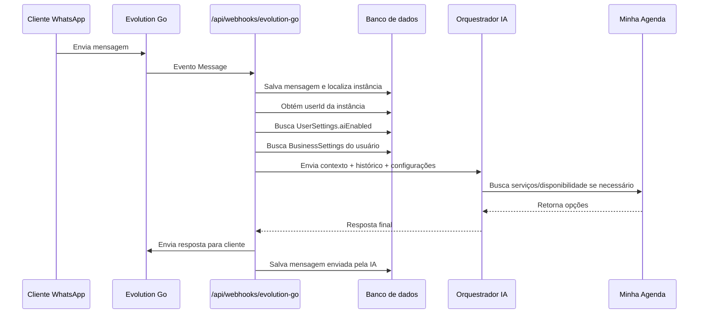

# SDD — Refatoração da seção de Automação e Configurações do Negócio V1

**Produto:** Plataforma de atendimento, IA e agendamentos via WhatsApp  
**Versão do documento:** V1  
**Objetivo:** Refatorar a seção de **Automação** para que configurações hoje fixas em variáveis de ambiente passem a ser configuráveis dentro da plataforma, vinculadas ao usuário logado e utilizadas pela IA no atendimento e no agendamento.  
**Escopo principal:** Frontend mobile-first + API interna + persistência por usuário + migração das configurações de negócio para banco de dados + integração com o prompt da IA.

---

## 1. Resumo executivo

Atualmente, várias configurações usadas pela IA e pela lógica de agenda estão centralizadas em variáveis de ambiente da API. Isso limita o produto, porque todos os usuários compartilham as mesmas regras, nome de negócio, profissional, endereço, políticas e parâmetros de disponibilidade.

A partir desta refatoração, essas configurações devem sair do ambiente global da aplicação e passar a existir dentro do perfil do usuário logado. Cada usuário poderá personalizar o próprio negócio sem exigir alteração de código, alteração de `.env` ou novo deploy.

A seção de **Automação**, que hoje possui somente a opção de ativar/desativar IA, deve evoluir para um menu relacionado às configurações operacionais do negócio. Na V1, o menu deve conter pelo menos:

1. **IA**  
   Tela simples para ativar ou desativar a IA.

2. **Negócio**  
   Tela para configurar nome do negócio, profissional, endereço, fuso horário, parâmetros de agenda e políticas usadas pela IA.

Essa mudança prepara a plataforma para multiusuário e para expansão futura para outros tipos de negócios, como salão de beleza, barbearia, estética, clínicas, pet shops, oficinas, consultórios e outros serviços locais.

---

## 2. Problema atual

As configurações abaixo estão atualmente em variáveis de ambiente:

```env
BUSINESS_TIMEZONE=America/Sao_Paulo
BUSINESS_MAX_SLOTS_TO_OFFER=3
BUSINESS_AVAILABILITY_DAYS=14
BUSINESS_SLOT_STEP_MINUTES=30
BUSINESS_APPOINTMENT_LOOKUP_DAYS=90
BUSINESS_NAME=Camili Krauser Beauty
BUSINESS_PROFESSIONAL_NAME=Camili Krauser
BUSINESS_ADDRESS=Rua Fioravante Manchini, 865 - Trentini, Panambi - RS
BUSINESS_DELAY_POLICY=A tolerancia e de 15 minutos. Depois disso pode ser necessario remarcar.
BUSINESS_CANCELLATION_POLICY=Cancelamentos devem ser avisados com pelo menos 24 horas de antecedencia.
BUSINESS_DEPOSIT_POLICY=Para reservar o horario pode ser solicitado sinal via Pix, conforme orientacao da profissional.
```

### 2.1 Limitações desse modelo

- Todos os usuários ficam presos às mesmas configurações.
- Para alterar nome, endereço ou política, é necessário alterar `.env` e redeployar a API.
- A IA não consegue se adaptar ao perfil de cada negócio.
- A plataforma não escala para múltiplos clientes.
- Novos segmentos ficam difíceis de configurar.
- O prompt da IA fica acoplado a configurações globais, não ao contexto do usuário.
- O suporte operacional aumenta, porque o usuário depende do time técnico para ajustes simples.

---

## 3. Objetivos da refatoração

### 3.1 Objetivos funcionais

- Criar uma nova tela de **Configurações do Negócio** dentro da seção de Automação.
- Permitir que cada usuário edite as configurações do seu próprio negócio.
- Persistir essas configurações em banco de dados, vinculadas ao `userId`.
- Remover dependência das variáveis `BUSINESS_*` como fonte principal de configuração.
- Utilizar as configurações do usuário na construção do prompt da IA.
- Utilizar os parâmetros de agenda do usuário na busca de disponibilidade e na criação de agendamentos.
- Manter a tela de IA simples nesta V1, com apenas ativar/desativar.
- Manter o header apenas com informações básicas: conexão do WhatsApp e status da IA.

### 3.2 Objetivos técnicos

- Criar uma tabela/modelo de configurações do negócio por usuário.
- Garantir uma configuração única por usuário.
- Criar seed/defaults seguros para novos usuários.
- Criar API interna para leitura e atualização das configurações.
- Validar todos os campos com Zod ou validação equivalente.
- Garantir isolamento multiusuário: um usuário nunca pode ler ou editar configurações de outro.
- Refatorar a camada da IA para buscar configurações pelo usuário/instância antes de responder.
- Refatorar a camada de agenda para usar os parâmetros do perfil do usuário.

### 3.3 Objetivos de produto

- Dar autonomia para o dono do negócio personalizar o atendimento.
- Reduzir dependência técnica para ajustes simples.
- Preparar a plataforma para onboarding de novos clientes.
- Melhorar a naturalidade da IA usando informações reais do negócio.
- Permitir expansão futura para regras por serviço, horário de funcionamento, políticas avançadas e tom de voz.

---

## 4. Não objetivos desta V1

Nesta refatoração, não é obrigatório implementar:

- Configuração avançada de prompt livre pelo usuário.
- Upload de base de conhecimento.
- Cadastro completo de serviços dentro da plataforma, se a fonte oficial ainda for a API Minha Agenda.
- Configuração de horário de funcionamento por dia da semana.
- Regras por serviço, por profissional ou por unidade.
- Multiunidade.
- Múltiplos profissionais por usuário.
- Múltiplos números de WhatsApp por usuário.
- Painel de métricas de conversão.
- Testes automatizados, mantendo a decisão atual de não criar testes neste momento.

Esses itens devem ser considerados para V1.1/V2.

---

## 5. Nova organização da seção de Automação

A seção **Automação** deixa de ser apenas um toggle de IA e passa a representar as configurações que afetam como o atendimento automático funciona.

### 5.1 Menu global sugerido

No menu lateral global da aplicação:

```text
Chat
Automação
Configurações
Sair
```

### 5.2 Submenu da seção Automação

Dentro de **Automação**:

```text
Automação
├── IA
└── Negócio
```

### 5.3 Responsabilidade de cada área

| Área | Responsabilidade |
|---|---|
| Chat | Atendimento diário e visualização de conversas. |
| Automação > IA | Ativar ou desativar a IA. |
| Automação > Negócio | Configurações usadas pela IA e pela agenda. |
| Configurações > Conta | Email, senha e dados do usuário. |
| Configurações > WhatsApp | Conexão, QR Code, status e reconexão da instância. |

### 5.4 Regra importante de UX

O usuário não deve precisar entrar em variáveis de ambiente, suporte técnico ou deploy para alterar dados operacionais do próprio negócio.

A tela de **Negócio** deve ser simples, orientada e com textos explicativos. O usuário precisa entender que essas informações serão usadas pela IA para responder clientes.

---

## 6. Header após a refatoração

O header deve continuar simplificado e não deve virar área de configuração.

### 6.1 Itens permitidos no header

- Nome/logo da plataforma.
- Status do WhatsApp:
  - Conectado.
  - Desconectado.
  - Aguardando QR Code.
  - Reconectando.
- Status da IA:
  - IA ativa.
  - IA pausada.
- Opcional: botão/menu compacto para abrir o menu lateral em mobile.

### 6.2 Itens que não devem ficar no header

- Formulários de configuração.
- Troca de senha.
- Configuração de políticas.
- Configuração de fuso horário.
- Configuração de prompt.
- Menu extenso de ações.

### 6.3 Comportamento do status da IA

O header pode mostrar o status da IA de forma visual, mas a edição principal deve estar em **Automação > IA**.

Sugestão:

- Em desktop: chip clicável pode levar para `/automation/ai`.
- Em mobile: chip clicável abre a tela de IA ou bottom sheet simples.
- Não misturar o status com um formulário completo no header.

---

## 7. Rotas sugeridas

```text
/app
├── /(auth)
│   ├── login
│   └── register
├── /(app)
│   ├── chat
│   ├── automation
│   │   ├── ai
│   │   └── business
│   └── settings
│       ├── account
│       └── whatsapp
└── api
    ├── automation
    │   ├── ai
    │   └── business-settings
    ├── auth
    ├── conversations
    ├── whatsapp
    └── webhooks
```

### 7.1 URLs finais esperadas

| Tela | Rota |
|---|---|
| Chat | `/chat` |
| IA | `/automation/ai` |
| Configurações do negócio | `/automation/business` |
| Conta | `/settings/account` |
| WhatsApp | `/settings/whatsapp` |

---

## 8. Modelo de dados proposto

Criar uma entidade dedicada para as configurações do negócio.

### 8.1 Nome sugerido do modelo

Preferência:

```text
BusinessSettings
```

Alternativas aceitáveis:

```text
UserBusinessSettings
BusinessProfile
AutomationBusinessSettings
```

A recomendação é usar `BusinessSettings`, porque é simples e claro.

---

## 9. Prisma schema sugerido

```prisma
model BusinessSettings {
  id                          String   @id @default(cuid())
  userId                      String   @unique

  // Identidade do negócio
  businessName                String
  professionalName            String?
  businessAddress             String?

  // Agenda e disponibilidade
  timezone                    String   @default("America/Sao_Paulo")
  maxSlotsToOffer             Int      @default(3)
  availabilityDays            Int      @default(14)
  slotStepMinutes             Int      @default(30)
  appointmentLookupDays       Int      @default(90)

  // Políticas usadas pela IA
  delayPolicy                 String?
  cancellationPolicy          String?
  depositPolicy               String?

  // Metadados
  createdAt                   DateTime @default(now())
  updatedAt                   DateTime @updatedAt

  user                        User     @relation(fields: [userId], references: [id], onDelete: Cascade)

  @@index([userId])
}
```

### 9.1 Atualização no modelo User

```prisma
model User {
  id                String            @id @default(cuid())
  email             String            @unique
  passwordHash      String
  createdAt         DateTime          @default(now())
  updatedAt         DateTime          @updatedAt

  businessSettings  BusinessSettings?
  userSettings      UserSettings?
  whatsappInstance  WhatsAppInstance?
  conversations     Conversation[]
  messages          Message[]
}
```

---

## 10. Campos da configuração do negócio

### 10.1 Identidade do negócio

| Campo | Tipo | Obrigatório | Default recomendado | Observação |
|---|---:|---:|---|---|
| `businessName` | string | Sim | Não usar genérico em produção | Nome usado pela IA para se apresentar. |
| `professionalName` | string | Não | vazio | Nome da profissional ou responsável. |
| `businessAddress` | string | Não | vazio | IA só deve informar se a cliente perguntar ou se o fluxo exigir. |

### 10.2 Agenda e disponibilidade

| Campo | Tipo | Obrigatório | Default | Regra |
|---|---:|---:|---:|---|
| `timezone` | string | Sim | `America/Sao_Paulo` | Deve ser um timezone válido. |
| `maxSlotsToOffer` | number | Sim | `3` | Mínimo 1, máximo sugerido 5. |
| `availabilityDays` | number | Sim | `14` | Mínimo 1, máximo sugerido 60. |
| `slotStepMinutes` | number | Sim | `30` | Valores permitidos: 10, 15, 20, 30, 45, 60. |
| `appointmentLookupDays` | number | Sim | `90` | Mínimo 1, máximo sugerido 365. |

### 10.3 Políticas do negócio

| Campo | Tipo | Obrigatório | Default sugerido | Uso pela IA |
|---|---:|---:|---|---|
| `delayPolicy` | string | Não | `A tolerância é de 15 minutos. Depois disso pode ser necessário remarcar.` | Quando cliente perguntar sobre atraso. |
| `cancellationPolicy` | string | Não | `Cancelamentos devem ser avisados com pelo menos 24 horas de antecedência.` | Quando cliente quiser cancelar/remarcar. |
| `depositPolicy` | string | Não | `Para reservar o horário pode ser solicitado sinal via Pix, conforme orientação da profissional.` | Quando houver dúvida sobre pagamento/sinal. |

---

## 11. Estratégia para defaults

### 11.1 Defaults técnicos recomendados

Estes defaults podem ser aplicados automaticamente para qualquer novo usuário:

```ts
const DEFAULT_BUSINESS_SETTINGS = {
  timezone: "America/Sao_Paulo",
  maxSlotsToOffer: 3,
  availabilityDays: 14,
  slotStepMinutes: 30,
  appointmentLookupDays: 90,
  delayPolicy: "A tolerância é de 15 minutos. Depois disso pode ser necessário remarcar.",
  cancellationPolicy: "Cancelamentos devem ser avisados com pelo menos 24 horas de antecedência.",
  depositPolicy: "Para reservar o horário pode ser solicitado sinal via Pix, conforme orientação da profissional.",
};
```

### 11.2 Defaults que exigem cuidado

Os campos abaixo não deveriam ser usados como default global para todos os novos usuários:

```env
BUSINESS_NAME=Camili Krauser Beauty
BUSINESS_PROFESSIONAL_NAME=Camili Krauser
BUSINESS_ADDRESS=Rua Fioravante Manchini, 865 - Trentini, Panambi - RS
```

Esses dados parecem pertencer a um negócio específico. Para uma plataforma multiusuário, existem duas opções melhores:

#### Opção A — recomendada para produto SaaS

Novos usuários precisam preencher esses campos no onboarding ou na primeira visita à tela **Automação > Negócio**.

Defaults:

```ts
businessName: ""
professionalName: ""
businessAddress: ""
```

A IA não deve ser ativada para atendimento automático completo enquanto `businessName` estiver vazio.

#### Opção B — recomendada para migração do cliente atual

Durante a migração, criar um registro `BusinessSettings` para o usuário atual existente usando os valores atuais da `.env`:

```ts
businessName: "Camili Krauser Beauty"
professionalName: "Camili Krauser"
businessAddress: "Rua Fioravante Manchini, 865 - Trentini, Panambi - RS"
```

Para novos usuários, seguir a Opção A.

### 11.3 Regra de fallback

A aplicação pode manter defaults internos em código para segurança, mas a fonte principal deve ser o banco de dados.

Ordem de resolução recomendada:

```text
1. Configuração salva no banco para o userId
2. Defaults internos da aplicação
3. Bloqueio/erro amigável se campo obrigatório estiver ausente
```

Não usar mais `process.env.BUSINESS_*` como fonte principal.

---

## 12. Migração das variáveis de ambiente

### 12.1 Antes

```text
IA/API lê process.env.BUSINESS_NAME
IA/API lê process.env.BUSINESS_TIMEZONE
IA/API lê process.env.BUSINESS_MAX_SLOTS_TO_OFFER
...
```

### 12.2 Depois

```text
Webhook recebe mensagem
↓
Localiza WhatsAppInstance
↓
Obtém userId dono da instância
↓
Busca BusinessSettings por userId
↓
Monta contexto de negócio da IA
↓
IA responde usando configurações daquele usuário
```

### 12.3 Variáveis que devem sair do `.env`

Remover gradualmente:

```env
BUSINESS_TIMEZONE
BUSINESS_MAX_SLOTS_TO_OFFER
BUSINESS_AVAILABILITY_DAYS
BUSINESS_SLOT_STEP_MINUTES
BUSINESS_APPOINTMENT_LOOKUP_DAYS
BUSINESS_NAME
BUSINESS_PROFESSIONAL_NAME
BUSINESS_ADDRESS
BUSINESS_DELAY_POLICY
BUSINESS_CANCELLATION_POLICY
BUSINESS_DEPOSIT_POLICY
```

### 12.4 Variáveis que continuam em `.env`

Continuam no ambiente por serem globais e sensíveis:

```env
DATABASE_URL
AUTH_SECRET
JWT_SECRET
NEXT_PUBLIC_APP_URL
APP_PUBLIC_URL
EVOLUTION_GO_BASE_URL
EVOLUTION_GO_API_KEY
MINHA_AGENDA_BASE_URL
MINHA_AGENDA_API_KEY
OPENAI_API_KEY ou outro provider de IA
```

---

## 13. API interna proposta

### 13.1 Buscar configurações do negócio

```http
GET /api/automation/business-settings
```

#### Resposta esperada

```json
{
  "id": "bs_123",
  "businessName": "Camili Krauser Beauty",
  "professionalName": "Camili Krauser",
  "businessAddress": "Rua Fioravante Manchini, 865 - Trentini, Panambi - RS",
  "timezone": "America/Sao_Paulo",
  "maxSlotsToOffer": 3,
  "availabilityDays": 14,
  "slotStepMinutes": 30,
  "appointmentLookupDays": 90,
  "delayPolicy": "A tolerância é de 15 minutos. Depois disso pode ser necessário remarcar.",
  "cancellationPolicy": "Cancelamentos devem ser avisados com pelo menos 24 horas de antecedência.",
  "depositPolicy": "Para reservar o horário pode ser solicitado sinal via Pix, conforme orientação da profissional.",
  "createdAt": "2026-06-04T12:00:00.000Z",
  "updatedAt": "2026-06-04T12:00:00.000Z"
}
```

### 13.2 Atualizar configurações do negócio

```http
PATCH /api/automation/business-settings
```

#### Body esperado

```json
{
  "businessName": "Camili Krauser Beauty",
  "professionalName": "Camili Krauser",
  "businessAddress": "Rua Fioravante Manchini, 865 - Trentini, Panambi - RS",
  "timezone": "America/Sao_Paulo",
  "maxSlotsToOffer": 3,
  "availabilityDays": 14,
  "slotStepMinutes": 30,
  "appointmentLookupDays": 90,
  "delayPolicy": "A tolerância é de 15 minutos. Depois disso pode ser necessário remarcar.",
  "cancellationPolicy": "Cancelamentos devem ser avisados com pelo menos 24 horas de antecedência.",
  "depositPolicy": "Para reservar o horário pode ser solicitado sinal via Pix, conforme orientação da profissional."
}
```

#### Comportamento

- Requer autenticação.
- Deve usar o `userId` da sessão, não do body.
- Deve validar todos os campos.
- Deve fazer `upsert` caso ainda não exista configuração.
- Deve retornar a configuração atualizada.

### 13.3 Buscar status da IA

```http
GET /api/automation/ai
```

Resposta:

```json
{
  "aiEnabled": true
}
```

### 13.4 Atualizar status da IA

```http
PATCH /api/automation/ai
```

Body:

```json
{
  "aiEnabled": false
}
```

---

## 14. Validação com Zod

Criar schema compartilhado para validação no backend e, se desejável, reaproveitar no frontend.

```ts
import { z } from "zod";

export const businessSettingsSchema = z.object({
  businessName: z
    .string()
    .trim()
    .min(2, "Informe o nome do negócio.")
    .max(120, "O nome do negócio deve ter no máximo 120 caracteres."),

  professionalName: z
    .string()
    .trim()
    .max(120, "O nome da profissional deve ter no máximo 120 caracteres.")
    .optional()
    .or(z.literal("")),

  businessAddress: z
    .string()
    .trim()
    .max(250, "O endereço deve ter no máximo 250 caracteres.")
    .optional()
    .or(z.literal("")),

  timezone: z
    .string()
    .trim()
    .min(1, "Informe o fuso horário."),

  maxSlotsToOffer: z
    .number()
    .int()
    .min(1, "Ofereça pelo menos 1 horário.")
    .max(5, "Para uma conversa natural, ofereça no máximo 5 horários."),

  availabilityDays: z
    .number()
    .int()
    .min(1, "O horizonte mínimo é de 1 dia.")
    .max(60, "O horizonte máximo recomendado é de 60 dias."),

  slotStepMinutes: z
    .number()
    .int()
    .refine((value) => [10, 15, 20, 30, 45, 60].includes(value), {
      message: "Escolha uma granularidade válida.",
    }),

  appointmentLookupDays: z
    .number()
    .int()
    .min(1, "O período mínimo é de 1 dia.")
    .max(365, "O período máximo recomendado é de 365 dias."),

  delayPolicy: z
    .string()
    .trim()
    .max(500, "A política de atraso deve ter no máximo 500 caracteres.")
    .optional()
    .or(z.literal("")),

  cancellationPolicy: z
    .string()
    .trim()
    .max(500, "A política de cancelamento deve ter no máximo 500 caracteres.")
    .optional()
    .or(z.literal("")),

  depositPolicy: z
    .string()
    .trim()
    .max(500, "A política de sinal deve ter no máximo 500 caracteres.")
    .optional()
    .or(z.literal("")),
});
```

### 14.1 Validação de timezone

Na V1, pode-se usar uma lista controlada de timezones comuns no Brasil:

```ts
const BRAZIL_TIMEZONES = [
  "America/Sao_Paulo",
  "America/Manaus",
  "America/Cuiaba",
  "America/Porto_Velho",
  "America/Boa_Vista",
  "America/Rio_Branco",
  "America/Noronha",
];
```

Para expansão internacional, usar `Intl.supportedValuesOf('timeZone')` quando disponível ou uma biblioteca confiável.

---

## 15. Serviço de configurações do negócio

Criar uma camada de serviço dedicada para centralizar leitura, defaults e upsert.

### 15.1 Arquivo sugerido

```text
/src/services/business-settings.ts
```

### 15.2 Interface sugerida

```ts
export type BusinessSettingsDTO = {
  businessName: string;
  professionalName?: string | null;
  businessAddress?: string | null;
  timezone: string;
  maxSlotsToOffer: number;
  availabilityDays: number;
  slotStepMinutes: number;
  appointmentLookupDays: number;
  delayPolicy?: string | null;
  cancellationPolicy?: string | null;
  depositPolicy?: string | null;
};
```

### 15.3 Função de resolução

```ts
export async function getBusinessSettingsForUser(userId: string) {
  const settings = await prisma.businessSettings.findUnique({
    where: { userId },
  });

  if (settings) return settings;

  return prisma.businessSettings.create({
    data: {
      userId,
      businessName: "",
      professionalName: "",
      businessAddress: "",
      timezone: "America/Sao_Paulo",
      maxSlotsToOffer: 3,
      availabilityDays: 14,
      slotStepMinutes: 30,
      appointmentLookupDays: 90,
      delayPolicy: "A tolerância é de 15 minutos. Depois disso pode ser necessário remarcar.",
      cancellationPolicy: "Cancelamentos devem ser avisados com pelo menos 24 horas de antecedência.",
      depositPolicy: "Para reservar o horário pode ser solicitado sinal via Pix, conforme orientação da profissional.",
    },
  });
}
```

### 15.4 Observação importante

Se a IA estiver ativa e `businessName` estiver vazio, o sistema deve impedir atendimento automático completo ou exibir alerta ao usuário:

```text
Complete as configurações do negócio para que a IA possa responder clientes com segurança.
```

---

## 16. Impacto no prompt da IA

A IA não deve mais depender de `process.env.BUSINESS_*`.

### 16.1 Antes

```ts
const businessName = process.env.BUSINESS_NAME;
const timezone = process.env.BUSINESS_TIMEZONE;
```

### 16.2 Depois

```ts
const businessSettings = await getBusinessSettingsForUser(userId);

const promptContext = buildPromptBusinessContext({
  businessSettings,
  services,
  conversationHistory,
  currentMessages,
});
```

### 16.3 Bloco de contexto do negócio no prompt

O prompt deve receber um bloco estruturado como este:

```text
## Contexto do negócio

Nome do negócio: {{businessName}}
Profissional responsável: {{professionalName}}
Endereço: {{businessAddress}}
Fuso horário: {{timezone}}

## Regras de agenda

- Oferecer no máximo {{maxSlotsToOffer}} horários por resposta.
- Buscar disponibilidade nos próximos {{availabilityDays}} dias.
- Gerar opções de horário em intervalos de {{slotStepMinutes}} minutos.
- Ao procurar agenda futura da cliente, considerar os próximos {{appointmentLookupDays}} dias.

## Políticas do negócio

Política de atraso:
{{delayPolicy}}

Política de cancelamento:
{{cancellationPolicy}}

Política de sinal/pagamento antecipado:
{{depositPolicy}}
```

### 16.4 Regra de naturalidade

A IA deve usar essas informações apenas quando fizer sentido no contexto.

Exemplo:

- Não enviar endereço em toda conversa.
- Não falar sobre política de cancelamento no primeiro “oi”.
- Não mencionar sinal/Pix se a cliente ainda nem escolheu serviço ou horário.
- Não despejar regras operacionais como se fosse contrato.

A IA deve responder de forma natural, trazendo essas informações quando forem úteis ou solicitadas.

---

## 17. Impacto na busca de disponibilidade

Os parâmetros abaixo passam a vir de `BusinessSettings`:

| Configuração | Uso |
|---|---|
| `timezone` | Converter datas/horários para o fuso correto do negócio. |
| `maxSlotsToOffer` | Limitar quantidade de horários oferecidos por resposta. |
| `availabilityDays` | Definir horizonte máximo de busca. |
| `slotStepMinutes` | Definir granularidade dos slots. |
| `appointmentLookupDays` | Buscar agendamento futuro da cliente ao remarcar/cancelar/confirmar. |

### 17.1 Exemplo de fluxo

```text
Cliente: Tem horário pra cílios e sobrancelha essa semana?
↓
Sistema identifica userId pelo WhatsAppInstance
↓
Busca BusinessSettings do userId
↓
Busca serviços e duração na Minha Agenda
↓
Soma duração de cílios + sobrancelha
↓
Busca disponibilidade nos próximos availabilityDays
↓
Gera slots respeitando slotStepMinutes
↓
Limita opções em maxSlotsToOffer
↓
IA responde com opções naturais
```

---

## 18. Tela Automação > IA

### 18.1 Objetivo

Manter controle simples e claro do estado da IA.

### 18.2 Campos

- Toggle: `IA ativa` / `IA pausada`.

### 18.3 Microcopy sugerida

Quando ativa:

```text
A IA está respondendo automaticamente novas mensagens dos clientes, respeitando as configurações do negócio.
```

Quando pausada:

```text
A IA está pausada. As mensagens continuarão chegando no chat, mas nenhuma resposta automática será enviada.
```

### 18.4 Alertas contextuais

Se IA estiver ativa, mas o negócio não estiver configurado:

```text
Antes de ativar a IA, complete as configurações do negócio. Isso evita respostas incompletas para seus clientes.
```

Se WhatsApp estiver desconectado:

```text
A IA pode ficar ativa, mas só responderá quando o WhatsApp estiver conectado.
```

---

## 19. Tela Automação > Negócio

### 19.1 Objetivo

Permitir que o usuário configure os dados e regras que a IA usará para conversar e agendar.

### 19.2 Organização mobile-first

Em mobile, a tela deve ser dividida em cards empilhados:

```text
[Card] Identidade do negócio
[Card] Agenda e disponibilidade
[Card] Políticas de atendimento
[Card] Prévia da IA / resumo
```

Em desktop, pode-se usar layout com largura máxima e cards em grid de duas colunas.

### 19.3 Card: Identidade do negócio

Campos:

- Nome do negócio.
- Nome da profissional/responsável.
- Endereço do atendimento.

Microcopy:

```text
Essas informações ajudam a IA a responder de forma personalizada e passar confiança para a cliente.
```

### 19.4 Card: Agenda e disponibilidade

Campos:

- Fuso horário.
- Quantidade máxima de horários oferecidos por resposta.
- Horizonte de busca de disponibilidade.
- Intervalo entre horários gerados.
- Período para localizar agendamentos futuros da cliente.

Microcopy:

```text
Essas regras controlam como a IA procura e oferece horários disponíveis para suas clientes.
```

### 19.5 Card: Políticas de atendimento

Campos:

- Política de atraso.
- Política de cancelamento.
- Política de sinal/pagamento antecipado.

Microcopy:

```text
A IA usará essas políticas somente quando o assunto aparecer na conversa, sem deixar o atendimento engessado.
```

### 19.6 Card: Prévia da IA

Mostrar um resumo simples do que a IA entende sobre o negócio.

Exemplo:

```text
A IA vai atender em nome de Camili Krauser Beauty, considerando o fuso America/Sao_Paulo, oferecendo até 3 horários por resposta e buscando disponibilidade nos próximos 14 dias.
```

### 19.7 Botões

- `Salvar alterações`.
- `Restaurar padrões`, opcional.
- `Cancelar`, se houver alterações não salvas.

### 19.8 Estado de salvamento

- Mostrar loading no botão.
- Desabilitar submit enquanto salva.
- Mostrar feedback de sucesso:

```text
Configurações do negócio salvas com sucesso.
```

- Mostrar erro amigável:

```text
Não conseguimos salvar agora. Confira os campos e tente novamente.
```

---

## 20. Experiência mobile-first

### 20.1 Navegação mobile

Em telas pequenas:

- Header compacto com status do WhatsApp e IA.
- Botão hambúrguer para abrir menu lateral.
- Menu lateral como drawer full-height.
- Formulários com campos grandes, labels claras e botões fixos no final do card ou tela.

### 20.2 Formulários mobile

Regras:

- Labels sempre visíveis, não depender apenas de placeholder.
- Inputs com altura confortável.
- Textareas para políticas.
- Selects para valores numéricos quando houver opções limitadas.
- Evitar tabelas em mobile.
- Dividir configurações em cards para reduzir sensação de formulário gigante.

### 20.3 Padrão visual sugerido

- Cards com borda leve e fundo branco.
- Títulos curtos.
- Texto auxiliar abaixo do título.
- Campos agrupados por contexto.
- Botão principal destacado no rodapé da tela ou do formulário.
- Feedback claro de salvamento.

---

## 21. Componentes sugeridos

```text
/components
├── automation
│   ├── AutomationLayout.tsx
│   ├── AutomationSidebar.tsx
│   ├── AiToggleCard.tsx
│   ├── BusinessIdentityForm.tsx
│   ├── BusinessScheduleRulesForm.tsx
│   ├── BusinessPoliciesForm.tsx
│   ├── BusinessSettingsPreview.tsx
│   └── BusinessSettingsForm.tsx
├── layout
│   ├── AppHeader.tsx
│   ├── MobileDrawer.tsx
│   └── AppShell.tsx
└── ui
    ├── Button.tsx
    ├── Card.tsx
    ├── Input.tsx
    ├── Select.tsx
    ├── Textarea.tsx
    ├── Switch.tsx
    └── Toast.tsx
```

---

## 22. Estrutura de serviços sugerida

```text
/src/services
├── ai
│   ├── build-prompt-context.ts
│   ├── conversation-orchestrator.ts
│   └── should-ai-respond.ts
├── business-settings.ts
├── availability.ts
├── minha-agenda.ts
└── evolution-go.ts
```

### 22.1 Responsabilidade de `business-settings.ts`

- Buscar configurações por usuário.
- Criar defaults quando não existir.
- Atualizar configurações.
- Validar completude mínima para IA.
- Entregar objeto normalizado para prompt e agenda.

### 22.2 Responsabilidade de `build-prompt-context.ts`

- Receber `BusinessSettings`.
- Receber histórico da conversa.
- Receber serviços disponíveis.
- Gerar bloco de contexto limpo e confiável para o modelo.

---

## 23. Fluxo técnico completo



---

## 24. Regras de negócio

### 24.1 Configuração única por usuário

Cada usuário deve ter no máximo um registro em `BusinessSettings`.

```prisma
userId String @unique
```

### 24.2 Criação automática

Ao cadastrar usuário ou ao acessar Automação > Negócio pela primeira vez, criar `BusinessSettings` com defaults.

### 24.3 IA ativa exige negócio minimamente configurado

Para evitar respostas genéricas ou incorretas, a IA só deve responder automaticamente se:

- `aiEnabled = true`.
- WhatsApp está conectado.
- `businessName` preenchido.
- Configurações de agenda válidas.

Se faltar algo, a IA deve ficar operacionalmente pausada para resposta automática e o usuário deve ver um aviso no painel.

### 24.4 Parâmetros numéricos devem ter limites

Não permitir valores absurdos como:

- oferecer 50 horários por resposta;
- buscar disponibilidade em 900 dias;
- gerar slots a cada 1 minuto;
- procurar agenda futura por 10 anos.

### 24.5 Políticas vazias

Se uma política estiver vazia, a IA não deve inventar regra.

Exemplo:

```text
Cliente: Precisa pagar sinal?
IA: Posso confirmar isso pra você direitinho com a profissional 😊
```

Ou, se o produto permitir handoff:

```text
Não encontrei uma regra cadastrada sobre sinal. Vou deixar essa parte para a profissional confirmar, tá? 😊
```

---

## 25. Como as configurações afetam o comportamento da IA

### 25.1 Nome do negócio

Usado para personalização e contexto interno.

A IA pode dizer:

```text
Aqui é da Camili Krauser Beauty 😊
```

Mas não deve repetir o nome em toda resposta.

### 25.2 Nome da profissional

Usado quando a cliente perguntar com quem será o atendimento ou quando for natural.

```text
Quem realiza o atendimento é a Camili 😊
```

### 25.3 Endereço

Usado quando a cliente perguntar onde fica ou quando o agendamento for confirmado, se fizer sentido.

```text
O atendimento é na Rua Fioravante Manchini, 865 - Trentini, Panambi - RS.
```

### 25.4 Política de atraso

Usada em perguntas como:

- “E se eu atrasar?”
- “Tem tolerância?”
- “Chego uns minutinhos depois, pode?”

### 25.5 Política de cancelamento

Usada em perguntas como:

- “Posso cancelar?”
- “Como faço pra remarcar?”
- “Preciso avisar antes?”

### 25.6 Política de sinal

Usada somente quando:

- cliente perguntar sobre pagamento;
- fluxo do negócio exigir sinal;
- profissional configurar isso explicitamente.

A IA não deve transformar a política de sinal em pressão excessiva.

---

## 26. Migração/backfill para usuários existentes

### 26.1 Cenário atual com um usuário/negócio principal

Se hoje a plataforma atende apenas o negócio Camili Krauser Beauty, criar uma migração ou script de backfill para gerar `BusinessSettings` para os usuários existentes com os valores atuais.

Exemplo:

```ts
await prisma.businessSettings.upsert({
  where: { userId },
  update: {},
  create: {
    userId,
    businessName: "Camili Krauser Beauty",
    professionalName: "Camili Krauser",
    businessAddress: "Rua Fioravante Manchini, 865 - Trentini, Panambi - RS",
    timezone: "America/Sao_Paulo",
    maxSlotsToOffer: 3,
    availabilityDays: 14,
    slotStepMinutes: 30,
    appointmentLookupDays: 90,
    delayPolicy: "A tolerância é de 15 minutos. Depois disso pode ser necessário remarcar.",
    cancellationPolicy: "Cancelamentos devem ser avisados com pelo menos 24 horas de antecedência.",
    depositPolicy: "Para reservar o horário pode ser solicitado sinal via Pix, conforme orientação da profissional.",
  },
});
```

### 26.2 Novos usuários

Para novos usuários, recomenda-se criar configurações com campos de identidade vazios e mostrar onboarding.

```text
Complete os dados do negócio para ativar a IA com segurança.
```

---

## 27. Prompt complementar para agente de desenvolvimento

```text
Refatore a seção de Automação da plataforma.

Contexto:
Atualmente a tela de Automação possui apenas a opção de ativar/desativar IA. Além disso, várias configurações usadas pela IA e pela lógica de agendamento estão em variáveis de ambiente BUSINESS_*. Essas configurações precisam ser migradas para dentro da plataforma e vinculadas ao usuário logado, permitindo personalização por negócio.

Objetivo:
Criar uma nova estrutura em Automação com duas telas:
1. Automação > IA
2. Automação > Negócio

A tela Automação > IA deve manter apenas o controle de IA ativa/pausada.
A tela Automação > Negócio deve permitir editar configurações do negócio que hoje estão em env.

Configurações a migrar:
- BUSINESS_TIMEZONE -> timezone, default America/Sao_Paulo
- BUSINESS_MAX_SLOTS_TO_OFFER -> maxSlotsToOffer, default 3
- BUSINESS_AVAILABILITY_DAYS -> availabilityDays, default 14
- BUSINESS_SLOT_STEP_MINUTES -> slotStepMinutes, default 30
- BUSINESS_APPOINTMENT_LOOKUP_DAYS -> appointmentLookupDays, default 90
- BUSINESS_NAME -> businessName
- BUSINESS_PROFESSIONAL_NAME -> professionalName
- BUSINESS_ADDRESS -> businessAddress
- BUSINESS_DELAY_POLICY -> delayPolicy
- BUSINESS_CANCELLATION_POLICY -> cancellationPolicy
- BUSINESS_DEPOSIT_POLICY -> depositPolicy

Importante:
Não usar mais process.env.BUSINESS_* como fonte principal. A fonte principal deve ser BusinessSettings no banco, vinculada ao userId autenticado.

Criar modelo Prisma:
BusinessSettings com userId único, campos de identidade do negócio, regras de agenda e políticas.

Criar APIs internas:
GET /api/automation/business-settings
PATCH /api/automation/business-settings
GET /api/automation/ai
PATCH /api/automation/ai

Regras:
- Todas as rotas exigem autenticação.
- Nunca aceitar userId no body. Usar userId da sessão.
- Um usuário só pode ver/editar suas próprias configurações.
- Criar BusinessSettings automaticamente se não existir.
- Validar payload com Zod.
- Usar defaults seguros.
- Bloquear ou alertar quando a IA estiver ativa sem businessName configurado.

Frontend:
- Redesign mobile-first.
- Menu lateral global deve conter Chat, Automação, Configurações e Sair.
- Dentro de Automação, criar submenu IA e Negócio.
- Header deve mostrar apenas status do WhatsApp e status da IA.
- A tela de Negócio deve ser dividida em cards:
  1. Identidade do negócio
  2. Agenda e disponibilidade
  3. Políticas de atendimento
  4. Prévia/resumo da IA

Impacto na IA:
Refatorar a construção do prompt para buscar BusinessSettings pelo userId antes de responder. O prompt deve receber nome do negócio, profissional, endereço, timezone, regras de agenda e políticas do negócio. A IA deve usar essas informações de forma natural, apenas quando fizer sentido.

Impacto na agenda:
Refatorar busca de disponibilidade para usar timezone, maxSlotsToOffer, availabilityDays, slotStepMinutes e appointmentLookupDays vindos do BusinessSettings do usuário.

Não criar testes automatizados neste momento.
Manter código organizado, tipado e preparado para multiusuário.
```

---

## 28. Critérios de aceite

### 28.1 Banco e backend

- Existe modelo `BusinessSettings` vinculado ao `User`.
- `BusinessSettings.userId` é único.
- Ao acessar configurações do negócio, um registro é criado se não existir.
- As antigas variáveis `BUSINESS_*` não são mais usadas como fonte principal.
- API `GET /api/automation/business-settings` retorna configurações do usuário autenticado.
- API `PATCH /api/automation/business-settings` atualiza apenas configurações do usuário autenticado.
- Validação impede valores fora dos limites definidos.
- Campos sensíveis ou de outros usuários não são expostos.

### 28.2 Frontend

- Menu lateral global possui acesso para Automação.
- Automação possui submenu/telas IA e Negócio.
- Tela IA permite ativar/desativar a IA.
- Tela Negócio permite editar todos os campos migrados das ENVs.
- UI é mobile-first e organizada em cards.
- Header mostra somente estados básicos de WhatsApp e IA.
- Ao salvar configurações, usuário recebe feedback claro.
- Ao ocorrer erro, usuário recebe mensagem amigável.

### 28.3 IA e agenda

- IA busca `BusinessSettings` pelo usuário antes de responder.
- Prompt usa nome do negócio, profissional, endereço e políticas vindos do banco.
- Busca de disponibilidade usa `timezone`, `maxSlotsToOffer`, `availabilityDays` e `slotStepMinutes` do usuário.
- Busca de agendamento futuro usa `appointmentLookupDays` do usuário.
- Se política estiver vazia, IA não inventa regra.
- Se `businessName` estiver vazio, IA não deve operar como se estivesse totalmente configurada.

---

## 29. Checklist de implementação

### 29.1 Banco

- [ ] Criar modelo `BusinessSettings` no Prisma.
- [ ] Relacionar `BusinessSettings` com `User`.
- [ ] Criar migration.
- [ ] Criar script de backfill para usuário/negócio atual, se necessário.
- [ ] Garantir `userId` único.

### 29.2 Backend/API

- [ ] Criar `business-settings.ts` em services.
- [ ] Criar defaults internos.
- [ ] Criar schema de validação com Zod.
- [ ] Criar `GET /api/automation/business-settings`.
- [ ] Criar `PATCH /api/automation/business-settings`.
- [ ] Revisar `GET/PATCH /api/automation/ai`.
- [ ] Refatorar orquestrador da IA para buscar configurações por usuário.
- [ ] Refatorar agenda para usar configurações por usuário.
- [ ] Remover leituras antigas de `process.env.BUSINESS_*`.

### 29.3 Frontend

- [ ] Criar layout de Automação.
- [ ] Criar submenu IA/Negócio.
- [ ] Criar tela `/automation/ai`.
- [ ] Criar tela `/automation/business`.
- [ ] Criar formulário de identidade do negócio.
- [ ] Criar formulário de agenda/disponibilidade.
- [ ] Criar formulário de políticas.
- [ ] Criar preview/resumo da IA.
- [ ] Criar estados de loading, erro, vazio e sucesso.
- [ ] Garantir mobile-first.
- [ ] Ajustar header para exibir apenas status do WhatsApp e IA.

### 29.4 Deploy

- [ ] Aplicar migration no banco de produção.
- [ ] Verificar se `.env` de produção não depende mais de `BUSINESS_*`.
- [ ] Garantir que variáveis globais sensíveis continuem configuradas.
- [ ] Validar criação automática de settings para usuário existente.
- [ ] Testar fluxo completo em produção.

---

## 30. Sugestões importantes para melhorar o produto

### 30.1 Onboarding guiado do negócio

Ao primeiro login, antes de ativar a IA, mostrar um passo simples:

```text
Vamos configurar seu negócio para a IA atender do jeito certo.
```

Campos mínimos:

- Nome do negócio.
- Nome da profissional/responsável.
- Segmento.
- Endereço, se houver atendimento presencial.

Isso evita que novos usuários ativem a IA sem contexto.

### 30.2 Campo de segmento do negócio

Adicionar em V1.1:

```ts
businessSegment: "beauty" | "barber" | "clinic" | "pet" | "auto" | "other"
```

Isso ajudará a IA a adaptar tom, exemplos e perguntas.

### 30.3 Tom de voz da IA

Adicionar em V1.1:

```ts
aiTone: "acolhedor" | "profissional" | "divertido" | "objetivo" | "premium"
```

Na V1, manter tom fixo natural e acolhedor.

### 30.4 Horário de funcionamento

Adicionar em V1.1:

- Dias de atendimento.
- Horário inicial/final por dia.
- Pausa de almoço.
- Feriados/exceções.

Mesmo que a Minha Agenda já controle disponibilidade, mostrar isso na plataforma ajuda o usuário a entender o comportamento da IA.

### 30.5 Prévia de resposta da IA

Adicionar uma simulação simples:

```text
Cliente: Oi, tem horário essa semana?
IA: Oii 😊 Tenho sim! Vou ver os melhores horários pra você...
```

Isso aumenta confiança e reduz medo de deixar IA ativa.

### 30.6 Histórico de alterações

Registrar quando configurações importantes mudarem:

- Quem alterou.
- O que mudou.
- Data/hora.

Isso será útil quando houver multiatendentes ou suporte.

### 30.7 Campos de política mais estruturados no futuro

Hoje as políticas podem ser texto livre. No futuro, vale estruturar:

```ts
lateToleranceMinutes: 15
cancellationNoticeHours: 24
requiresDeposit: true
pixKey: "..."
depositAmountType: "fixed" | "percentage"
depositAmount: 30
```

A IA fica mais segura quando regras críticas são estruturadas, não apenas texto livre.

---

## 31. Riscos e cuidados

### 31.1 Risco: usar dados da Camili como default para todos

Não configurar `Camili Krauser Beauty` como default global para novos usuários. Isso causaria respostas erradas para outros negócios.

Solução:

- Usar esses valores apenas no backfill do usuário atual.
- Para novos usuários, exigir preenchimento.

### 31.2 Risco: IA inventar política

Se a política estiver vazia, a IA não deve preencher lacunas com suposição.

Solução:

- Prompt deve instruir claramente: não inventar política ausente.
- Quando não souber, assumir handoff ou resposta segura.

### 31.3 Risco: configurações conflitantes com Minha Agenda

A plataforma pode ter `availabilityDays = 14`, mas a Minha Agenda pode ter regras próprias.

Solução:

- A plataforma define horizonte e apresentação.
- A Minha Agenda continua sendo fonte da verdade para disponibilidade real.

### 31.4 Risco: formulário grande demais em mobile

Solução:

- Dividir em cards.
- Salvar tudo em uma ação principal.
- Mostrar preview/resumo.
- Usar selects para números e timezone.

---

## 32. Decisão recomendada

Implementar a refatoração em três etapas:

### Etapa 1 — Base de dados e API

- Criar `BusinessSettings`.
- Criar defaults.
- Criar APIs de leitura/edição.
- Criar backfill.

### Etapa 2 — Frontend mobile-first

- Criar Automação > IA.
- Criar Automação > Negócio.
- Reorganizar menu lateral.
- Simplificar header.

### Etapa 3 — Integração com IA e agenda

- Refatorar prompt para receber configurações do banco.
- Refatorar busca de disponibilidade.
- Remover dependência das ENVs antigas.
- Validar conversa real de ponta a ponta.

---

## 33. Resultado esperado da V1

Ao final desta refatoração:

- Cada usuário terá configurações próprias do negócio.
- A IA usará dados personalizados por usuário.
- O produto estará mais preparado para multiusuário.
- O usuário poderá ajustar regras operacionais sem suporte técnico.
- A tela de Automação terá uma estrutura mais clara e escalável.
- O header permanecerá simples e informativo.
- O sistema estará pronto para evoluir para configurações mais avançadas de serviços, profissionais, horários e tom de voz.
