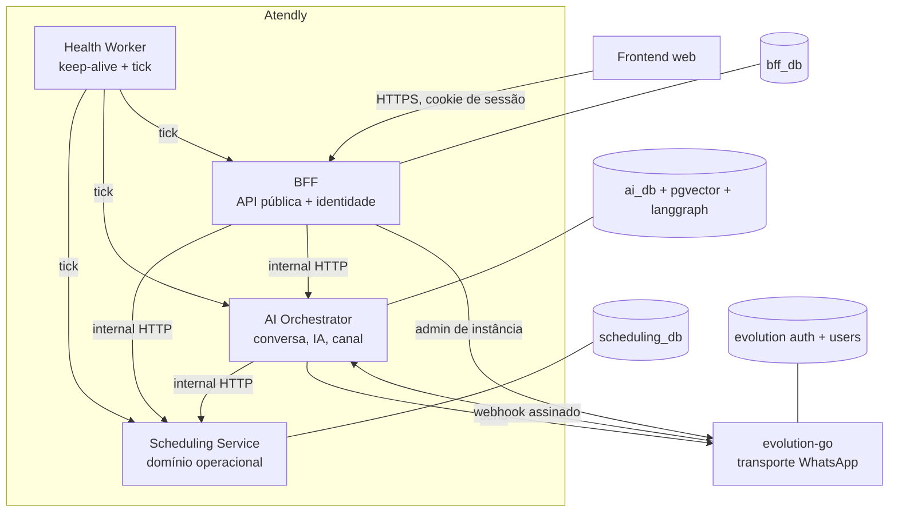
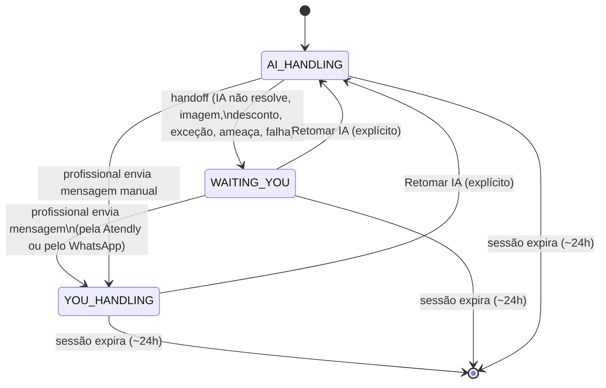
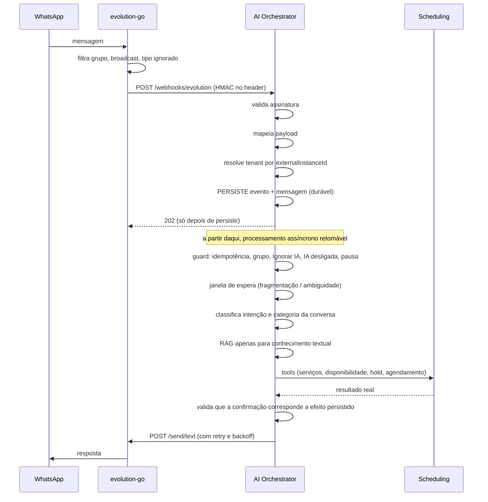

# 03 — Arquitetura backend alvo

Derivada da arquitetura existente (`00-CURRENT-STATE.md`) e das decisões de reaproveitamento (`02-REUSE-MATRIX.md`).

**Nenhum serviço novo. Nenhum broker, banco, ORM, framework ou vector DB novo.** As fronteiras atuais permanecem porque nenhuma lacuna do product vault é causada por fronteira errada.

A única capacidade genuinamente nova é **execução temporal durável** (jobs), resolvida dentro dos serviços existentes — ver `DECISIONS.md` D-01 e D-02.

---

## 1. Topologia



### Chamadas permitidas

| De | Para | Permitido | Observação |
| --- | --- | --- | --- |
| Frontend | BFF | ✅ | **única** superfície pública |
| Frontend | SCH / AIO / EVO | ❌ | nunca |
| BFF | SCH | ✅ | fachada |
| BFF | AIO | ✅ | fachada |
| BFF | EVO | ✅ | **apenas administração de instância** (create/connect/qr/pair/status/logout/delete) |
| AIO | SCH | ✅ | tools da IA |
| AIO | EVO | ✅ | **apenas envio de mensagem** |
| EVO | AIO | ✅ | webhook de mensagem e de conexão |
| SCH | qualquer serviço Atendly | ❌ | o scheduling **não chama ninguém**; é folha |
| SCH | Minha Agenda | ✅ | **somente leitura, somente durante uma importação não concluída** |
| AIO | BFF | ❌ | inversão de dependência |
| Health Worker | BFF / SCH / AIO | ✅ | health check + tick de automações |

Regra estrutural: **o grafo de chamadas é acíclico**. O scheduling é folha; o BFF é raiz; o AIO fica no meio e nunca chama de volta o BFF.

---

## 2. Responsabilidades e source of truth

| Domínio | Dono único | Onde vive |
| --- | --- | --- |
| Identidade, senha, sessão, aceite legal | **BFF** | `bff_db` |
| Tenant, membership, perfil do negócio | **BFF** | `bff_db` |
| Instância WhatsApp (credenciais e ciclo de vida) | **BFF** | `bff_db` |
| Preferências de IA (estilo, ativação) | **BFF** (fonte) → projetadas no AIO | `bff_db` |
| Serviços, preços, durações, buffers, recorrência | **Scheduling** | `scheduling_db` |
| Clientes, tags, observações, preferências, relações, autorizações | **Scheduling** | `scheduling_db` |
| Disponibilidade, exceções, bloqueios, compromissos pessoais | **Scheduling** | `scheduling_db` |
| Agendamentos, itens, holds, ciclo de vida, histórico, valor final | **Scheduling** | `scheduling_db` |
| Importação única (sessão, conflitos, conclusão, histórico) | **Scheduling** | `scheduling_db` |
| Contatos WhatsApp, Ignorar IA, categoria do contato | **AI Orchestrator** | `ai_db` |
| Conversas, mensagens, sessões, estado de atendimento | **AI Orchestrator** | `ai_db` |
| Execuções e tool calls da IA, handoff | **AI Orchestrator** | `ai_db` |
| Conhecimento textual do negócio (RAG) | **AI Orchestrator** | `ai_db` (pgvector) |
| Sessão de transporte WhatsApp | **evolution-go** | bancos próprios |

### Regra de source of truth

> **Nenhum dado tem dois donos.** Onde há projeção (preferências de IA do BFF para o AIO), a projeção é explicitamente marcada como cópia derivada, com reconciliação, e **nunca** é editável no destino.

`Customer` (scheduling) e `Contact` (ai-orchestrator) **não são o mesmo conceito e não devem ser unificados**:

- `Contact` é uma **identidade de WhatsApp** — um número. É onde vive `Ignorar IA` e a categoria predominante.
- `Customer` é uma **pessoa atendida pelo negócio** — pode não ter telefone, e **vários clientes podem compartilhar o mesmo telefone** (a mãe agenda para o filho).

A relação entre eles é **1 contato → N clientes**, resolvida por telefone normalizado no momento em que a IA precisa decidir para quem é o agendamento. Unificá-los tornaria a regra central do vault impossível — que é exatamente o erro do modelo atual.

---

## 3. Papel de cada banco

| Banco | Conteúdo | Retenção |
| --- | --- | --- |
| `bff_db` | identidade, tenant, negócio, instância WhatsApp, aceites legais, tokens de reset, notificações do usuário | tokens de reset expurgados; conta em exclusão purgada após 7 dias |
| `scheduling_db` | catálogo, clientes, agenda, agendamentos, holds, importação, idempotência de mutação | holds expirados e chaves de idempotência expurgados por job |
| `ai_db` | contatos, conversas, mensagens, sessões, handoff, `AiRun`/`AiToolCall`, eventos processados | **retenção por categoria** (Comercial 90 d, Pessoal 30 d, configurável 30/90/180/365); auditoria de IA e eventos processados com retenção própria |
| `ai_db` schema `pgvector` | documentos e chunks de conhecimento textual | vive enquanto o documento estiver ativo |
| `ai_db` schema `langgraph` | checkpoints do grafo | **expurgados junto com a sessão** (fecha em ~24 h de inatividade) |
| evolution auth/users | device store do whatsmeow e instâncias | fora do escopo da Atendly |

Os checkpoints do LangGraph passam a ser gerenciados: hoje crescem indefinidamente porque `thread_id` = `conversationId` para sempre. No alvo, `thread_id` = **id de sessão**, e a sessão encerra.

---

## 4. BFF

**Papel: única API pública, dona da identidade, fachada fina para todo o resto.**

O BFF **não ganha domínio novo**. Nenhuma regra de agenda, conversa ou IA passa a ser decidida nele.

Superfície alvo, em relação à atual:

| Mudança | Detalhe |
| --- | --- |
| **Remove** | `GET /v1/calendar`; `POST /v1/calendar/integration/{connect,reconnect}`; `DELETE /v1/calendar/integration`; todo o vocabulário `ATENDLY \| EXTERNAL`, `capabilities`, `managedExternally` |
| **Move** | `/v1/calendar/migrations/*` → `/v1/import/*`, sem parâmetro `target` |
| **Adiciona** | agenda: exceções, holds, ciclo de vida do atendimento, valor final, recorrência, sobreposição forçada |
| **Adiciona** | clientes: update, delete, tags, observações, preferências, relações, autorizações de IA |
| **Adiciona** | conversas: categorias, contatos ignorados, retenção |
| **Adiciona** | WhatsApp: teste real de ativação e seu progresso |
| **Adiciona** | notificações e alertas persistentes |
| **Corrige** | `priceType` para 4 valores; `tone` → `style` com 3 valores; `phone` opcional em cliente; timezone propagado ao scheduling |

### Sessão e segurança

- Revogação de sessão (`tokenVersion` no usuário, invalidado ao trocar senha e no logout).
- `WhatsAppInstance` passa a ser chaveada por `tenantId`, não `userId`.
- O `evolutionInstanceToken` **para de trafegar** para o AIO: o AIO o resolve a partir do próprio `ChannelConnection`.

---

## 5. Scheduling Service

**Papel: domínio operacional do negócio — catálogo, clientes, agenda, agendamentos e a importação única. Serviço folha: não chama nenhum outro serviço Atendly.**

### Estrutura alvo

A abstração `CalendarProvider` desaparece. `integrations/atendly/provider.ts` deixa de ser um adaptador e passa a ser o domínio:

```
modules/
  services/        catálogo, preço (4 tipos), duração, buffers, recorrência, status
  customers/       identidade, tags, observações, preferências, relações, autorizações
  availability/    regras semanais, exceções (CRUD), antecedência, granularidade, motor de slots
  time-blocks/     bloqueios pontuais e recorrentes, compromissos pessoais
  appointments/    agendamentos, itens, ciclo de vida, histórico, valor final
  holds/           reserva temporária de 5 minutos
  import/          sessão de importação única (cliente Minha Agenda somente leitura)
  jobs/            auto-complete, expiração de hold, expurgo de idempotência
  internal-api/    superfície HTTP interna
```

### Modelo alvo — mudanças estruturais

| Entidade | Mudança |
| --- | --- |
| `Service` | `priceType {FIXED, STARTING_AT, ON_REQUEST, UNKNOWN}`; `durationMinutes` nullable; `status {ACTIVE, NEEDS_REVIEW, INACTIVE}`; `bufferBeforeMinutes`, `bufferAfterMinutes`; `recurrenceIntervalDays` |
| `Customer` | `phone` **nullable**; **remove** unique por telefone; `notes`, `notesAiAuthorized`; relação `primaryGuardianId` |
| `CustomerTag`, `CustomerPreference` | novas — preferência com `origin {CUSTOMER, AI_INFERRED, PROFESSIONAL}`, `aiAuthorized`, `observedAt` |
| `AvailabilityException` | ganha CRUD (a tabela e a leitura já existem) |
| `AvailabilitySettings` | `minLeadTimeMinutes`, `maxLeadTimeDays`, `slotStepMinutes` por tenant |
| `TimeBlock` | `kind {BLOCK, PERSONAL}`, `title`, `recurrenceRule` |
| `Appointment` | `status` vira **enum** `{HELD, SCHEDULED, COMPLETED, CANCELLED, NO_SHOW}`; `attendanceConfirmation {PENDING, CONFIRMED, DECLINED, NONE}` **separada** do status; `finalAmount` nullable; `noShowNote` |
| `AppointmentEvent` | nova — histórico append-only (`CREATED`, `RESCHEDULED` com origem e destino, `CANCELLED`, `COMPLETED`, `NO_SHOW`, `PRICE_ADJUSTED`), com `actor {AI, USER, SYSTEM}` |
| `AppointmentHold` | nova — `expiresAt`, `conversationId?`, `slots[]` para recorrência |
| `ImportSession` | nova — substitui a semântica de `MigrationJob`; `completedAt` define a **importação única consumida** |
| `ImportItem` | nova — decisão por registro (`IMPORTED`, `SKIPPED`, `CONFLICT`, `RESOLVED`) para permitir importação parcial |
| Colunas de instante | `TIMESTAMP` → `TIMESTAMPTZ` |
| `Appointment` | **exclusion constraint** `EXCLUDE USING gist` sobre `(tenantId, tsrange(startAt, endAt))` para status ocupantes, como rede de segurança estrutural |

### Regras de política por origem

A distinção IA × humano deixa de ser um rótulo e passa a ser política aplicada no domínio:

| Operação | `actor = AI` | `actor = USER` |
| --- | --- | --- |
| Criar fora da disponibilidade | **proibido** | permitido **com `allowOverlap: true` explícito** |
| Sobrepor agendamento existente | **proibido** | permitido com flag explícita, e o evento fica registrado |
| Agendar serviço `NEEDS_REVIEW` ou `INACTIVE` | **proibido** | permitido |
| Criar atendimento sem serviço cadastrado (título + duração) | **proibido** | permitido |

### Holds

- Criados no `prepare`, TTL de 5 minutos, ligados à conversa.
- **Subtraídos do motor de slots** — sem isso o hold não protege nada.
- Aparecem na agenda como estado `HELD` ("Em confirmação").
- Expiram por duas vias: **lazy** (filtro por `expiresAt > now` em toda leitura) e **job** (limpeza e liberação).
- Recorrência aplica hold em **múltiplos slots** numa única reserva atômica.

### Minha Agenda

Deixa de existir como provider. Passa a ser `MinhaAgendaImportClient`, **somente leitura**, usado exclusivamente por `modules/import/`. As credenciais são apagadas ao concluir a importação.

---

## 6. AI Orchestrator

**Papel: conversa, decisão da IA, execução de ferramentas, canal WhatsApp e conhecimento textual.**

### Modelo alvo — mudanças estruturais

| Entidade | Mudança |
| --- | --- |
| `Contact` | **nova** — identidade de WhatsApp por tenant: `normalizedPhone`, `displayName`, `defaultCategory {COMMERCIAL, PERSONAL, UNCLASSIFIED}`, **`ignoreAi: boolean`**, `ignoreAiSince` |
| `Conversation` | ganha `category` (com `categorySource {AUTO, MANUAL}` — manual prevalece) e `attendanceState {AI_HANDLING, WAITING_YOU, YOU_HANDLING}`; `contactId` |
| `ConversationSession` | **nova** — janela de ~24 h. É ela, não a conversa, que vira o `thread_id` do checkpointer |
| `AiTenantConfig` | `tone AiTone` → `style AiStyle {PROFESSIONAL, BALANCED, CASUAL}`, default `BALANCED` |
| `PendingReply` | **nova** — janela de espera durável (fragmentação ~2–3 s e ambiguidade 2–5 min), substituindo o `setTimeout` em memória |
| `Message` | passa a persistir **toda** mensagem recebida, inclusive mídia não suportada |
| `ProcessedEvent` | deixa de gravar `rawPayload` cru com segredo; ganha retenção |

### Máquina de estados de atendimento



Regras que hoje não existem e passam a existir:

- **Abrir a conversa não muda estado**; enviar mensagem muda. (Já é verdade hoje — preservar.)
- **Qualquer mensagem manual do profissional pausa a IA naquela conversa**, venha da Atendly ou do celular. Corrige o comportamento atual, e os testes que hoje asseguram o oposto são invertidos.
- **Nova sessão após ~24 h volta à IA automaticamente**, salvo contato em `Ignorar IA`.
- **Contato em `Ignorar IA` nunca é processado**: a checagem entra no `operationalGuard`, **antes** de qualquer persistência de conteúdo e antes do RAG.

### Guardrail transacional

"Nunca confirmar antes de concluir" deixa de ser só prompt:

- `composeResponse` **rejeita** a resposta se ela contiver linguagem de confirmação sem que exista uma tool call de mutação com resultado `ok: true` no turno.
- `toolResultsValid` passa a **bloquear** a aresta, em vez de ser calculado e ignorado.
- O nó de erro **não envia mensagem automática ao cliente**; apenas faz handoff e notifica o profissional.

### Janelas de espera

Dois mecanismos distintos, hoje colapsados num só:

| Janela | Gatilho | Duração | Implementação |
| --- | --- | --- | --- |
| Fragmentação | mensagens rápidas em sequência | ~2–3 s | `PendingReply` com `runAt` curto |
| Ambiguidade | mensagem sem intenção clara de contato desconhecido | ~2 min, estendendo até ~5 min desde a primeira | `PendingReply` reagendável, com teto |

Ambas são **duráveis** (linha em banco + tick), não `setTimeout` em memória. Isso resolve simultaneamente a perda em restart e a incorreção com múltiplas réplicas.

---

## 7. RAG — papel exato

O papel do RAG no alvo é **igual ao que o código já faz corretamente hoje**, com três correções.

### Fronteira, explícita

| Categoria | Fonte obrigatória | Nunca |
| --- | --- | --- |
| Serviços, preços, duração, buffers | **API do Scheduling** | RAG |
| Disponibilidade, slots, holds | **API do Scheduling** | RAG |
| Clientes, histórico, agendamentos | **API do Scheduling** | RAG |
| Políticas operacionais (antecedência, cancelamento, recorrência) | **API do Scheduling** | RAG |
| Estado de agenda, WhatsApp ou integração | **API interna** | RAG |
| FAQ, descrição do negócio, formas de pagamento, estacionamento, acessibilidade, instruções, informações complementares | **RAG** | — |

### Proteções (manter e completar)

1. `isOperationalKnowledgeQuery` — guard determinístico por regex. **Manter**, e passar a aplicá-lo também no nó `retrieveKnowledge`, não só na tool.
2. Descrição da tool proibindo uso operacional. **Manter.**
3. Instruções de prompt. **Manter.**
4. Defesa anti prompt-injection nos chunks. **Manter.**

### Correções

- **Índice ANN** (`ivfflat` ou `hnsw` com `vector_cosine_ops`) — a busca hoje é sequential scan.
- **Rota HTTP de ingestão** e chunking automático — o vault exige FAQ e informações do negócio editáveis pelo usuário; hoje só há um script CLI.
- Reindexação disparada quando o documento muda (o checksum já existe).

**O RAG não é ampliado de escopo.** Não indexar catálogo, agenda ou cliente é uma decisão de correção, não de performance.

---

## 8. Caminho inbound do WhatsApp — alvo



### Diferenças em relação ao caminho atual

| Hoje | Alvo |
| --- | --- |
| Token do webhook em **query string**, comparação simples | **HMAC no header**, comparação timing-safe |
| `instanceToken` do **corpo** usado como credencial de envio | credencial resolvida do `ChannelConnection` do tenant |
| **202 antes de processar**, `void` fire-and-forget | **persiste, depois 202**; processamento retomável |
| Sem checagem de `Ignorar IA` | checagem no `operationalGuard`, antes de qualquer persistência de conteúdo |
| Debounce em memória, inoperante | janela durável em banco |
| Mídia descartada sem persistir | toda mensagem persistida; áudio transcrito; imagem gera handoff; documento visível |
| Outbound sem retry/timeout | retry com backoff e timeout |
| Eventos `CONNECTION`/`QRCODE` rejeitados com 400 | consumidos: fim do polling de status, base para alerta de desconexão |

---

## 9. Execução temporal (jobs)

Capacidade nova, sem infraestrutura nova. Ver `DECISIONS.md` D-01.

- Cada serviço ganha uma tabela `ScheduledJob` (tipo, `runAt`, payload, tentativas, `lockedAt`, status) no **próprio banco**.
- Cada serviço expõe `POST /internal/jobs/tick`, protegido pelo token interno.
- O **health-worker existente**, que já roda um loop de 40 s e já conhece as URLs de todos os serviços, passa a chamar o tick além do health check.
- A execução é protegida por `pg_advisory_lock` por tipo de job — o mesmo mecanismo que o scheduling já usa para agenda. Múltiplas réplicas ou ticks concorrentes são seguros.
- Todo handler de job é **idempotente** e tem limite de tentativas com backoff.

Jobs previstos:

| Serviço | Jobs |
| --- | --- |
| Scheduling | expiração de hold; auto-complete 30 min após o término; expurgo de `CalendarMutationIdempotency`; execução em lotes da importação |
| AI Orchestrator | flush de janela de espera; encerramento de sessão de 24 h; envio de lembretes; retenção/expurgo por categoria; expurgo de checkpoints; orquestração do teste de ativação; retry de outbound |
| BFF | alertas críticos (e-mail); reconciliação de configuração projetada; purga de conta em exclusão após 7 dias |

---

## 10. Teste real de ativação

É o único requisito do vault que exige **infraestrutura nova**: um número de WhatsApp da própria Atendly.

Desenho alvo:

- Uma instância `evolution-go` **da plataforma** (não do tenant), com número oficial.
- Máquina de estados por tentativa de teste (`ActivationTest`), com progresso observável: mensagem enviada → serviço identificado → preço informado → agenda consultada → horário selecionado → agendamento confirmado.
- O agendamento e o cliente de teste são **reais e temporários**, removidos ao final.
- Interferência do profissional pausa o teste e oferece reiniciar.
- Sucesso ativa a IA automaticamente; falha não ativa e indica a etapa que falhou.
- Orquestrado por job, para sobreviver a restart e a troca de aplicativo pelo usuário.

Nada disso é implementável sem os jobs e sem o número da plataforma — o que posiciona esta capacidade tarde na sequência.

---

## 11. Contratos

`packages/contracts` deixa de ser esqueleto órfão e passa a ser a **fonte única dos enums e DTOs compartilhados**, consumido por `file:` (padrão já usado por `@atendly-ia/legal-contract`), sem introduzir npm workspaces.

Conteúdo alvo:

- `common/` — mantido como está.
- Enums de domínio: `AiStyle`, `PriceType`, `ServiceStatus`, `AppointmentStatus`, `AttendanceConfirmation`, `AppointmentActor`, `ConversationCategory`, `AttendanceState`, `HandoffReason`, `ImportStatus`, `NotificationLevel`, `WhatsAppInstanceStatus`, `TimeBlockKind`, `PreferenceOrigin`.
- Contratos **internos** (BFF↔SCH, AIO↔SCH) e **públicos** (frontend↔BFF) separados por namespace.

Regra: um enum de domínio existe **uma vez** em contracts e é derivado nos schemas Prisma — nunca redefinido em dois lugares, como acontece hoje com `AiTone`.

---

## 12. Segurança e observabilidade no alvo

| Item | Alvo |
| --- | --- |
| Webhook Evolution | HMAC no header, timing-safe, sem segredo em URL |
| Token interno | `timingSafeEqual` em **todos** os serviços; remoção do fallback de inferência de tenant no AIO |
| Segredos | `evolutionInstanceToken` não trafega entre serviços; `rawPayload` de webhook não persiste segredo |
| Sessão | revogável; invalidada ao trocar senha |
| Request ID | mantido (já correto ponta a ponta) |
| Health check | AIO passa a verificar o banco, como o scheduling já faz |
| Retenção | política explícita por tabela, executada por job |
| Métricas/tracing | **fora do escopo do MVP**; registrar como decisão adiada consciente, não como esquecimento |

---

## 13. O que explicitamente não muda

- Continuam 4 serviços de aplicação + health-worker. Nenhum novo.
- Continua um banco por serviço. Nenhum banco novo, nenhum banco compartilhado.
- Continua Postgres + Prisma + Fastify + zod. Sem ORM novo, sem framework novo.
- Continua LangChain + LangGraph + pgvector + OpenAI. Sem framework de LLM novo, sem vector DB novo.
- Continua o fork `evolution-go` como transporte, sem lógica de negócio dentro dele.
- Não entra Kafka, RabbitMQ, Redis, BullMQ nem qualquer broker.
- O frontend não é tocado nesta refatoração.
