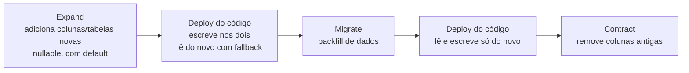

# 04 — Migração de dados

Nenhuma migration é executada nesta fase. Este documento identifica o que precisa mudar, o que precisa ser preservado e como fazer a transição com segurança.

---

## 0. Premissa a confirmar antes da Fase 1

O blueprint de produção existe e está deployado (`render.yaml`, commits `goal-18`), mas o product vault estabelece que **a validação prática começa somente com o MVP completo** e que os primeiros usuários são o criador e uma pessoa próxima.

> **Decisão pendente do usuário — bloqueia a estratégia de rollout, não a Fase 1.**
>
> Existe hoje, em produção, dado real que precisa ser preservado?
>
> - **Não** (esperado): as migrations podem ser destrutivas e diretas. Prazo e risco caem drasticamente.
> - **Sim**: aplicar a estratégia expand → migrate → contract descrita na §5, com janelas de compatibilidade.

O restante deste documento assume o **caso conservador (existe dado)**. Se a resposta for "não", cada seção indica o atalho seguro.

---

## 1. Legado já quarentenado

Duas migrations anteriores deixaram marcadores que precisam de decisão explícita — não podem ser ignorados nem removidos por acidente.

| Marcador | Onde | Situação |
| --- | --- | --- |
| `legacy_tenant_<userId>`, `legacy_member_<userId>`, `legacy_business_profile_<tenantId>` | `apps/bff/prisma/migrations/20260828000000_add_multi_tenancy_foundation` | Backfill idempotente que criou tenants a partir de usuários pré-multi-tenant. São tenants **válidos e ativos** — não são lixo |
| `ChannelConnection` sintética `legacy-evolution-channel`, tenant `legacy-unassigned`, com status inativo | `apps/ai-orchestrator/prisma/migrations/20260829000000_ai_orchestrator_multi_tenant` | Quarentena de conversas e mensagens **pré-tenant**, deliberadamente preservadas em vez de apagadas |

**Ação:** antes de qualquer migration nova, contar as linhas sob `tenant = 'legacy-unassigned'`. Se forem dados de teste, apagá-los explicitamente numa migration própria e documentada. Se não, decidir a qual tenant pertencem. **Não arrastar quarentena indefinidamente** — ela contamina toda contagem e todo job de retenção.

---

## 2. Modelos incompatíveis com o produto alvo

### Scheduling — incompatibilidades estruturais

| Modelo | Incompatibilidade | Consequência |
| --- | --- | --- |
| `Customer` | `phone` NOT NULL | Regra "cliente sem telefone" impossível |
| `Customer` | `@@unique([tenantId, normalizedPhone])` | Regra "telefone compartilhado" impossível |
| `Customer` | `create()` implementado como **upsert por telefone** | **Corrompe dados hoje**: criar cliente com telefone existente sobrescreve o nome do cliente existente e devolve o antigo |
| `Service` | `durationMinutes` NOT NULL | Serviço importado sem duração não pode nem existir como pendência |
| `Service` | `PriceType` com 2 valores | Faltam "a partir de" e "não informado" |
| `Appointment` | `status String` livre com 2 valores mágicos | Sem `COMPLETED`, `NO_SHOW`, `HELD` |
| `Appointment` | sem `attendanceConfirmation`, `finalAmount` | Regras do vault sem lugar onde morar |
| `Appointment` | remarcação é `update` in place | Horário anterior perdido; não há como reconstruir histórico retroativamente |
| `CalendarSettings.source` + `IntegrationProvider` + `CalendarSource` | premissa substituída | Enums a remover |
| Colunas de instante | `TIMESTAMP(3)` sem timezone | Frágil fora do driver |
| `Appointment` | sem exclusion constraint | Overlap só é impedido pela aplicação |

### AI Orchestrator — incompatibilidades estruturais

| Modelo | Incompatibilidade |
| --- | --- |
| `AiTenantConfig.tone AiTone` (2 valores) | Produto exige 3 estilos |
| `Conversation` | sem `category`, sem `attendanceState`, sem `contactId` |
| ausência de `Contact` | `Ignorar IA` não tem onde existir |
| ausência de `ConversationSession` | sessão de 24 h não tem onde existir; `thread_id` do checkpointer é eterno |
| `ProcessedEvent.rawPayload` | persiste o webhook cru **incluindo `instanceToken`** |
| Checkpoints `langgraph` | crescem indefinidamente, fora do controle de migrations |

### BFF — incompatibilidades estruturais

| Modelo | Incompatibilidade |
| --- | --- |
| `AiSettings.tone AiTone` (2 valores) | Idem AIO; e o enum está **duplicado** entre dois schemas Prisma |
| `WhatsAppInstance.userId @unique` | Todo o resto é tenant-scoped |
| `WhatsAppInstance.evolutionInstanceToken` | Segredo em texto claro que ainda trafega no body para o AIO |
| `User` | sem `tokenVersion` — sessão não é revogável |

---

## 3. Dados que precisam ser preservados

Ordem de criticidade.

| Dado | Onde | Por quê |
| --- | --- | --- |
| **Agendamentos e seus itens com snapshot** | `scheduling_db` | Compromissos reais com clientes reais. Perder é perder atendimento marcado |
| **Clientes** | `scheduling_db` | Identidade e histórico do negócio |
| **Serviços com preço e duração** | `scheduling_db` | Catálogo operacional |
| **Regras de disponibilidade e bloqueios** | `scheduling_db` | Sem elas a agenda para |
| **Conversas e mensagens** | `ai_db` | Histórico de atendimento; base da memória do cliente |
| **Identidade, tenant, perfil do negócio, aceites legais** | `bff_db` | Aceite legal tem valor jurídico — **nunca** recriar com data nova |
| **Instância WhatsApp conectada** | `bff_db` + evolution | Apagar força reconexão e novo teste de ativação |
| **Documentos e chunks de conhecimento** | `ai_db` | Reindexar exige reembedding (custo de API); os chunks originais são recuperáveis, os embeddings não |
| `MigrationJob` concluído | `scheduling_db` | Vira o histórico de importação que o vault exige exibir |
| `AiRun` / `AiToolCall` | `ai_db` | Auditoria — desejável, não crítico |
| `ProcessedEvent` | `ai_db` | Guarda de idempotência; perder pode causar reprocessamento de webhook |

---

## 4. Transformações de campo e enum

### `AiTone` → `AiStyle`

Enum duplicado em dois bancos. A transformação precisa ser **idêntica** nos dois, na mesma janela.

| Valor atual | Valor alvo | Justificativa |
| --- | --- | --- |
| `PROFESSIONAL_OBJECTIVE` | `PROFESSIONAL` | Correspondência semântica direta |
| `LIGHT_CLOSE` | `BALANCED` | `LIGHT_CLOSE` já é o **default** atual e o vault define `Equilibrada` como default. Mapear para `CASUAL` mudaria o comportamento de todo tenant existente sem que ninguém tenha pedido |
| — | `CASUAL` | Novo valor, sem origem no legado |
| `NULL` (`AiSettings.tone` é nullable no BFF) | `BALANCED` | Default do produto |

Precedente que confirma o mapeamento: a migration `20260831220000_goal17_legacy_cleanup` já converteu `personaType` para `AiTone` mapeando `CORPORATE → PROFESSIONAL_OBJECTIVE` e `WARM|CUSTOM → LIGHT_CLOSE`.

### `Appointment.status`

| Atual | Alvo | Observação |
| --- | --- | --- |
| `"SCHEDULED"` **e `startAt` no futuro** | `SCHEDULED` | — |
| `"SCHEDULED"` **e `startAt` no passado** | **decisão necessária** | Não há informação para saber se foi concluído ou se o cliente faltou. Recomendado: `COMPLETED` para os que já passaram (é o comportamento que o auto-complete produziria), registrando `AppointmentEvent` com `actor: SYSTEM` e nota de que a origem é backfill |
| `"CANCELLED"` | `CANCELLED` | — |
| qualquer outro valor | **falhar a migration** | `status` é `String` livre; não presumir |

`attendanceConfirmation` recebe `NONE` para todo registro existente — nunca `CONFIRMED`, que seria inventar um fato.
`finalAmount` recebe `NULL` — o vault é explícito: preço previsto **não** é receita realizada.

### `PriceType`

| Atual | Alvo |
| --- | --- |
| `FIXED` com `price` não nulo | `FIXED` |
| `ON_REQUEST` | `ON_REQUEST` |
| — | `STARTING_AT`, `UNKNOWN` (novos, sem origem no legado) |

Nenhum serviço existente é reclassificado automaticamente. `UNKNOWN` só aparece via importação futura ou edição do usuário.

### `Customer` — remoção do unique

Esta é a transformação de maior risco, porque **relaxa** uma constraint.

1. Tornar `phone` nullable.
2. **Remover** `@@unique([tenantId, normalizedPhone])`, substituindo por índice não-único.
3. Separar `create()` de `findOrCreateByPhone()`: o upsert atual passa a existir **só** no caminho da IA, que precisa reconhecer cliente por telefone; a criação manual e a importação passam a criar de fato.
4. **Antes** de relaxar, exportar um relatório dos clientes cujo nome pode ter sido sobrescrito pelo upsert. Não há como recuperar automaticamente o nome perdido — mas há como listar os registros suspeitos (cliente com agendamentos de nomes diferentes no `serviceNameSnapshot`/`comments`, ou telefone com histórico longo e nome recente).

Relaxar unique é seguro em uma direção só: **depois de removido, não dá para recolocar** sem resolver duplicatas manualmente.

### `CalendarSettings.source` e integração externa

| Passo | Ação |
| --- | --- |
| 1 | Verificar se existe algum tenant com `source = 'MINHA_AGENDA'`. **Se existir, ele precisa concluir a importação antes**, porque a agenda dele vive fora e vai deixar de ser lida |
| 2 | Migrar `IntegrationConnection` para `ImportCredential`, ligada à `ImportSession`, ou apagar se a importação já foi concluída |
| 3 | Remover coluna `source`, enums `CalendarSource` e `IntegrationProvider` |

Este passo **não pode ser feito às cegas**. É a única migration deste plano capaz de deixar um negócio sem agenda.

### `MigrationJob` → `ImportSession`

Jobs `COMPLETED` viram `ImportSession` com `completedAt` preenchido — o que **consome a importação única** daquele negócio, corretamente. Jobs `FAILED` ou `PARTIAL` **não** consomem (regra explícita do vault: falha não consome a importação). Jobs presos em `RUNNING`/`ANALYZING` (possíveis, porque não há retomada) são marcados como `FAILED`.

### `WhatsAppInstance.userId` → `tenantId`

Backfill por `TenantMember`, que hoje é 1:1 forçado em runtime (`>1` membership retorna 409). Conversão determinística e segura.

---

## 5. Estratégia de rollout

### Princípio

**Expand → migrate → contract**, com a fase de contração numa release separada. Nenhuma migration remove coluna que algum código deployado ainda leia.

### Ordem obrigatória entre serviços

Como não há FK entre bancos, a segurança vem da **ordem de deploy**:

1. `packages/contracts` — enums novos publicados **antes** de qualquer consumidor.
2. **Scheduling** — é folha; ninguém depende dele para subir, mas todos dependem do contrato dele.
3. **AI Orchestrator** — consome o scheduling.
4. **BFF** — consome os dois.
5. Frontend — fora do escopo desta refatoração; até a integração, o BFF mantém compatibilidade nos campos que o frontend atual lê.

Para **remover** algo, a ordem é a inversa: BFF primeiro para de expor, depois o AIO, depois o scheduling.

### Compatibilidade temporária

| Superfície | Janela de compatibilidade |
| --- | --- |
| `tone` no contrato público do BFF | Aceitar `PROFESSIONAL_OBJECTIVE`/`LIGHT_CLOSE` na entrada e traduzir, enquanto o frontend atual não for substituído. Na saída, emitir o valor novo |
| `ATENDLY \| EXTERNAL` em `GET /v1/calendar` etc. | **Sem janela** — as rotas são removidas de uma vez. O frontend atual as consome, mas será reescrito e está fora do escopo. Documentar a quebra é suficiente |
| `Appointment.status` | O contrato interno já expõe `status` como `z.string()`, então o scheduling pode emitir valores novos sem quebrar o BFF hoje |
| `priceType` | Adicionar valores a um enum não quebra quem só lê os antigos; quebra quem valida com `z.enum` estrito — por isso o contrato precisa ser atualizado **antes** do produtor |

### Regras de segurança para cada migration

- Toda migration destrutiva é precedida de uma migration aditiva na release anterior.
- Toda migration de backfill roda **em lotes**, não em transação única. A importação atual é o contraexemplo: uma transação `Serializable` sobre 10 anos de dados.
- Toda migration que relaxa constraint gera antes um relatório do que seria afetado.
- Backup verificado antes das três migrations de alto risco (remoção de unique de `Customer`, remoção de `CalendarSettings.source`, conversão de `status`).
- Nenhuma migration nova mexe em migration já aplicada — o histórico é imutável.

### Se não houver dado de produção

O atalho seguro: uma migration por serviço, direta, com o schema alvo, e um reset dos bancos de desenvolvimento. Cai a necessidade de janelas de compatibilidade, de backfill em lotes e de deploy em duas etapas. Isso encurta materialmente a Fase 2 e a Fase 3 — razão pela qual a pergunta da §0 vale a pena ser respondida cedo.

---

## 6. Riscos específicos de dados

| Risco | Severidade | Mitigação |
| --- | --- | --- |
| Remover unique de telefone é irreversível na prática | Alta | Relatório prévio; a operação inversa exige resolução manual de duplicatas |
| Backfill de `status` inventa fato histórico (concluído vs. faltou) | Média | Registrar `AppointmentEvent` com `actor: SYSTEM` e origem `backfill`, para que a interface possa distinguir de um estado afirmado por alguém |
| Remover `CalendarSettings.source` com tenant ainda em `MINHA_AGENDA` deixa o negócio sem agenda | **Crítica** | Verificação bloqueante; migração de conteúdo obrigatória antes |
| Migração de importação em transação única sobre 10 anos | Alta | Já é um risco **do código atual**, não introduzido pela refatoração. Passa a rodar em lotes |
| Credenciais criptografadas viram lixo se `INTEGRATION_CREDENTIALS_KEY` rotacionar | Alta | A chave usa `generateValue: true` no Render, que não garante base64 de 32 bytes. Fixar antes de tocar em `IntegrationConnection` |
| Perda de embeddings força reembedding pago | Baixa | Preservar `KnowledgeChunk`; o checksum já permite detectar o que precisa reindexar |
| Aceite legal recriado com data nova | **Crítica** | `LegalAcceptance` é append-only e nunca é regravado |
| Divergência silenciosa BFF ↔ AIO na config projetada | Média | Job de reconciliação; hoje um POST falho deixa os bancos divergentes para sempre |
| Quarentena `legacy-unassigned` contaminar contagens e jobs de retenção | Média | Resolver antes de ligar retenção |
