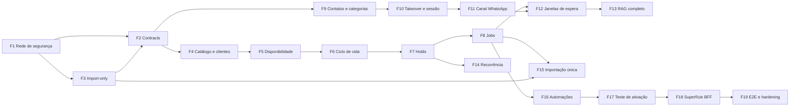

# 05 — Plano de execução

19 fases pequenas, sequenciais e testáveis. Cada uma termina com o backend funcionando e verificável sem frontend.

**Ordem proposta difere da ordem sugerida no escopo em dois pontos, com justificativa na §Ordem.**

Convenção: cada fase lista `o que explicitamente NÃO fazer` — isso é tão vinculante quanto o escopo positivo.

---

## Ordem e por que ela é esta

A ordem sugerida no escopo começa por `contracts/foundation`. Duas mudanças:

1. **A rede de segurança de testes vem antes de tudo.** O `scheduling-service` tem **zero testes**, nenhum script `test` e nenhum runner — e é o serviço que mais vai mudar, o que guarda a agenda e o que faz criptografia de credenciais. Alterar o modelo de agendamento, de cliente e de disponibilidade sem nenhuma verificação automatizada é a decisão de maior risco possível neste projeto.

2. **A remoção da abstração de fonte de agenda vem antes dos contratos.** Escrever os contratos primeiro significaria escrevê-los sobre um vocabulário (`ATENDLY | EXTERNAL`, `capabilities`, `managedExternally`, `integration.status`) que a fase seguinte apaga. Removendo primeiro, os contratos são escritos **uma vez**.

O restante segue a ordem conceitual do escopo: scheduling → IA → conhecimento → conversas/WhatsApp → automações → ativação → BFF → E2E.

---

## F1 — Rede de segurança

**Objetivo.** Tornar possível mudar o backend com verificação automatizada. Nenhuma mudança de comportamento.

**Dependências.** Nenhuma.

**Áreas.** `apps/scheduling-service` (novo setup de teste), `apps/bff/tests`, `apps/ai-orchestrator/vitest.config.ts`, `docker-compose`, `package.json` da raiz, `scripts/build-all.sh`.

**Mudanças.**
- Adicionar Vitest + script `test` ao `scheduling-service`.
- Ambiente de teste com Postgres real e isolado por suíte (pglite ou container dedicado — decisão em `DECISIONS.md` D-05). O motor de slots, as transações `Serializable`, os advisory locks e a idempotência **não são testáveis com mock de Prisma**.
- Testes de caracterização do comportamento atual do scheduling: motor de slots com regras/exceções/bloqueios, `assertAvailable`, criação/remarcação/cancelamento, idempotência (incluindo replay e reuso com payload diferente), conversão de timezone com DST.
- Corrigir o teste do BFF (`/v1/auth/register`) e removê-lo do `skipIf`.
- `docker-compose` na raiz subindo os 4 serviços + 3 bancos, sem colisão de porta.
- `npm test` na raiz agregando todos os serviços; incluí-lo no `build-all.sh`.

**Migrations.** Nenhuma.

**Testes.** Os testes **são** o entregável. Alvo: cobrir os caminhos que as fases 4–7 vão modificar.

**Critérios de aceite.**
- `npm test` na raiz roda e passa nos 3 serviços.
- `docker-compose up` sobe tudo e um smoke manual do fluxo atual funciona.
- Todo comportamento de agenda descrito em `00-CURRENT-STATE.md §4` tem teste que o fixa.

**NÃO fazer.** Nenhuma mudança de comportamento. Nenhuma correção de bug ainda — inclusive os já identificados. Se um teste de caracterização documentar um bug, ele fixa o bug **como está** e ganha um `TODO` apontando a fase que o corrige.

---

## F2 — Fundação de contratos

**Objetivo.** `packages/contracts` deixa de ser esqueleto órfão e passa a ser a fonte única dos enums de domínio.

**Dependências.** F1 (verificação), F3 (vocabulário final — ver §Ordem; se F3 escorregar, F2 pode começar pelos enums que F3 não toca).

**Áreas.** `packages/contracts/src/**`, `package.json` dos três serviços, `tsconfig` se necessário.

**Mudanças.**
- Preencher os namespaces com enums alvo: `AiStyle`, `PriceType`, `ServiceStatus`, `AppointmentStatus`, `AttendanceConfirmation`, `AppointmentActor`, `TimeBlockKind`, `PreferenceOrigin`, `ConversationCategory`, `AttendanceState`, `ImportStatus`, `NotificationLevel`, `WhatsAppInstanceStatus`.
- Separar `public/` (frontend↔BFF) de `internal/` (BFF↔SCH, AIO↔SCH).
- Ligar por `file:` nos três serviços, seguindo o padrão de `@atendly-ia/legal-contract`. **Sem npm workspaces.**
- Substituir os primitivos reimplementados inline no BFF (timezone, envelope de erro, paginação) pelos de `common/`.

**Migrations.** Nenhuma.

**Testes.** `typecheck` nos três serviços é o teste principal. Testes unitários dos schemas com casos de borda (timezone inválido, telefone E.164, moeda).

**Critérios de aceite.**
- Nenhum enum de domínio definido em dois lugares.
- Os três serviços importam de `@atendly-ia/contracts` e compilam.
- Mudar contracts continua redeployando tudo — mas agora com motivo.

**NÃO fazer.** Não introduzir npm workspaces. Não criar DTO para superfície que ainda não existe (holds, categorias, importação) — cada fase traz o seu. Não mudar comportamento.

---

## F3 — Minha Agenda como origem exclusiva de importação

**Objetivo.** Apagar a abstração de fonte de agenda. A Agenda Atendly passa a ser a única, estruturalmente.

**Dependências.** F1. **Bloqueante:** confirmar que nenhum tenant está em `source = 'MINHA_AGENDA'` (ver `04-DATA-MIGRATION.md §0`).

**Áreas.** `apps/scheduling-service/src/modules/calendar/**`, `integrations/**`, `internal-api/routes.ts`, `apps/bff/src/modules/{calendar,migrations,services,customers,onboarding,settings,dashboard}`, `apps/bff/src/clients/scheduling`.

**Mudanças.**
- Remover `CalendarProvider`, `provider-factory.ts` e a resolução de provider por request.
- `integrations/atendly/provider.ts` → `modules/appointments/` (é domínio, não adaptador).
- `MinhaAgendaCalendarProvider` → `MinhaAgendaImportClient`, **somente leitura**, consumido apenas pela importação. Remover `enableWrites` e todas as mutações externas.
- Remover o segundo motor de disponibilidade (`integrations/minha-agenda/availability.ts`) e os helpers de data duplicados.
- Remover `CalendarSource`, `CalendarSettings.source`, `capabilities`, `managedExternally`, `requireAtendlyCalendar()`, `CALENDAR_SOURCE_MISMATCH`, `CALENDAR_MIGRATION_REQUIRED`.
- No BFF: remover `GET /v1/calendar`, `POST /v1/calendar/integration/{connect,reconnect}`, `DELETE /v1/calendar/integration`, o parâmetro `target` da importação, e a tradução `ATENDLY|EXTERNAL` **nos 7 arquivos**.
- Mover `/v1/calendar/migrations/*` → `/v1/import/*`.
- Corrigir o gate de onboarding que exige `CALENDAR_INTEGRATION_NOT_CONNECTED`.

**Migrations.** Scheduling: remover coluna `source` e os dois enums; `IntegrationConnection` passa a ser credencial de importação. **Precedida da verificação bloqueante.**

**Testes.** Os testes de caracterização de F1 devem continuar passando sem alteração — o comportamento da Agenda Atendly não muda. Testes novos: rotas removidas retornam 404; importação continua funcionando.

**Critérios de aceite.**
- `grep -ri "EXTERNAL\|managedExternally\|capabilities\|CalendarSource"` no backend retorna zero fora do histórico de migrations.
- O scheduling perde ~20 % do código sem perder nenhuma funcionalidade da Agenda Atendly.
- A importação continua executável ponta a ponta.

**NÃO fazer.** Não mexer no fluxo de importação em si (é F15). Não remover a capacidade de ler o Minha Agenda — só a de escrever nele e a de usá-lo como fonte de verdade. Não tocar no frontend, mesmo sabendo que ele consome as rotas removidas.

---

## F4 — Catálogo e clientes

**Objetivo.** Modelo de serviço e de cliente compatível com o vault.

**Dependências.** F2, F3.

**Áreas.** `scheduling/modules/services`, `modules/customers`, `internal-api`, `apps/bff/src/modules/{services,customers}`.

**Mudanças.**
- `PriceType` para 4 valores; `durationMinutes` nullable; `ServiceStatus {ACTIVE, NEEDS_REVIEW, INACTIVE}`; `bufferBeforeMinutes`/`bufferAfterMinutes`; `recurrenceIntervalDays`.
- `Customer.phone` nullable; **remover** unique por telefone normalizado; separar `create()` de `findOrCreateByPhone()`.
- Novas: `CustomerTag`, `CustomerPreference` (com `origin` e `aiAuthorized`), `Customer.notes` + `notesAiAuthorized`, `Customer.primaryGuardianId`.
- Endpoints: update/delete de cliente, delete de serviço (soft), CRUD de tags e preferências.
- Corrigir a ordem em `createAppointment`: cliente criado **dentro** da transação, depois de `assertAvailable`.

**Migrations.** Scheduling — alto risco (ver `04-DATA-MIGRATION.md §4`). Relatório prévio de clientes possivelmente sobrescritos pelo upsert.

**Testes.** Cliente sem telefone; dois clientes com o mesmo telefone; criação manual não sobrescreve cliente existente; serviço `NEEDS_REVIEW` não agendável pela IA e agendável manualmente; preferência inferida separada de informada.

**Critérios de aceite.**
- É possível criar dois clientes com o mesmo telefone e agendar para cada um.
- É possível criar cliente sem telefone por caminho manual.
- Serviço sem duração existe como pendência.
- Nenhum caminho sobrescreve nome de cliente existente.

**NÃO fazer.** Não implementar memória, resumo por IA ou métricas do cliente (dependem do ciclo de vida — F6 e F16). Não implementar recorrência de agendamento (é F14) — só o campo de configuração no serviço.

---

## F5 — Disponibilidade, exceções e bloqueios

**Objetivo.** Todas as regras de disponibilidade do vault alcançáveis por API.

**Dependências.** F4 (buffers vêm do serviço).

**Áreas.** `scheduling/modules/availability`, `modules/time-blocks`, `internal-api`, `apps/bff/src/modules/calendar`.

**Mudanças.**
- **CRUD de `AvailabilityException`** — a tabela e a leitura já existem; falta só a escrita. Cobre bloqueio por data e disponibilidade extra.
- `AvailabilitySettings`: `minLeadTimeMinutes`, `maxLeadTimeDays`, `slotStepMinutes` por tenant (deixa de vir no request).
- `TimeBlock`: `kind {BLOCK, PERSONAL}`, `title`, `recurrenceRule`; expansão de série na consulta de slots.
- Motor de slots passa a aplicar **buffers** do serviço e **antecedência mínima/máxima**.
- Buffers intermediários não somam entre serviços do mesmo atendimento.
- Unique em `AvailabilityRule` para impedir duplicatas.
- Transação + lock na criação de `TimeBlock` (hoje é check-then-act).

**Migrations.** Scheduling — aditivas, baixo risco.

**Testes.** Disponibilidade extra em dia fechado; bloqueio recorrente semanal; almoço como bloqueio; antecedência mínima recusando slot próximo; buffer reduzindo slots adjacentes; multi-serviço com buffer só nas pontas; DST.

**Critérios de aceite.** Todas as regras de `01-PRODUCT-BACKEND-MATRIX.md §Agenda/disponibilidade` alcançáveis por API interna e verificáveis por teste.

**NÃO fazer.** Não implementar holds (F7). Não implementar sobreposição forçada (F6). Não tratar feriados — o vault é explícito que ficam fora do MVP.

---

## F6 — Ciclo de vida do atendimento e histórico

**Objetivo.** Estados, histórico e valor final. Remarcação deixa de destruir informação.

**Dependências.** F4, F5.

**Áreas.** `scheduling/modules/appointments`, `internal-api`, `apps/bff/src/modules/calendar`.

**Mudanças.**
- `AppointmentStatus` como **enum**: `HELD`, `SCHEDULED`, `COMPLETED`, `CANCELLED`, `NO_SHOW`.
- `attendanceConfirmation` **separada** do status.
- `finalAmount` nullable.
- `AppointmentEvent` append-only com `actor {AI, USER, SYSTEM}`, registrando remarcação com horário de origem e destino.
- Remarcação preserva o horário anterior no histórico; cancelamento registra quem e quando, em vez de concatenar no `comments` livre.
- **Política por ator**: `actor: AI` nunca sobrepõe nem agenda serviço `NEEDS_REVIEW`; `actor: USER` pode sobrepor com `allowOverlap: true` explícito.
- Atendimento excepcional manual sem serviço cadastrado (título + duração).
- Lock e transação no cancelamento.
- **Exclusion constraint** `EXCLUDE USING gist` como rede estrutural, admitindo a exceção de sobreposição deliberada.
- Corrigir a marcação de idempotência para dentro da transação do efeito.

**Migrations.** Scheduling — conversão de `status` (ver `04-DATA-MIGRATION.md §4`), `AppointmentEvent`, constraint.

**Testes.** Transições válidas e inválidas; remarcação reconstruível pelo histórico; sobreposição recusada para IA e aceita para usuário com flag; `finalAmount` opcional não vira receita; cancelar cancelado é no-op; replay de idempotência não duplica efeito.

**Critérios de aceite.** É possível reconstruir a história de um agendamento a partir de `AppointmentEvent`. A IA não consegue sobrepor por nenhum caminho.

**NÃO fazer.** Não implementar auto-complete nem no-show automático (dependem de jobs — F8). Não implementar confirmação por lembrete (F16).

---

## F7 — Holds

**Objetivo.** Reserva temporária de 5 minutos, sem a qual "consolidar antes de confirmar" não protege nada.

**Dependências.** F5 (motor de slots), F6 (estados).

**Áreas.** `scheduling/modules/holds`, `availability`, `appointments`, `internal-api`; `ai-orchestrator/modules/tools`.

**Mudanças.**
- `AppointmentHold`: `expiresAt`, `conversationId?`, múltiplos slots numa reserva atômica.
- Holds **subtraídos do motor de slots** — requisito não negociável.
- Estado `HELD` visível na agenda ("Em confirmação").
- Expiração **lazy** em toda leitura (`expiresAt > now`), complementada por job em F8.
- Tools `prepare` passam a criar hold; `confirm` converte hold em agendamento **na mesma transação**, com lock.
- Hold expirado → `confirm` falha com erro específico e a IA reconsulta.

**Migrations.** Scheduling — `AppointmentHold`; ajuste da constraint de overlap para considerar holds.

**Testes.** Dois clientes não confirmam o mesmo horário; hold expira e libera; hold não aparece como slot livre; hold de recorrência é atômico (todos ou nenhum); `confirm` após expiração falha corretamente.

**Critérios de aceite.** Teste de concorrência: duas confirmações simultâneas no mesmo slot — uma vence, a outra recebe erro claro. Nenhuma sobreposição criada.

**NÃO fazer.** Não implementar recorrência de negócio (F14) — apenas a capacidade de hold multi-slot. Não depender de job para correção: a expiração lazy é a garantia; o job é limpeza.

---

## F8 — Infraestrutura de jobs

**Objetivo.** Introduzir execução temporal durável sem introduzir infraestrutura nova.

**Dependências.** F7.

**Áreas.** `scheduling/modules/jobs`, `ai-orchestrator/modules/jobs`, `bff/modules/jobs`, `apps/health-worker/src/index.js`, `render.yaml`.

**Mudanças.**
- Tabela `ScheduledJob` no banco de **cada** serviço (tipo, `runAt`, payload, tentativas, `lockedAt`, status, `lastError`).
- `POST /internal/jobs/tick` em cada serviço, protegido pelo token interno.
- Execução protegida por `pg_advisory_lock` por tipo de job — mesmo mecanismo já usado pela agenda.
- Handlers idempotentes, com limite de tentativas e backoff.
- `health-worker` passa a chamar o tick além do health check; ganha `INTERNAL_SERVICE_TOKEN`.
- Primeiros jobs (scheduling): expiração de hold, **auto-complete 30 min após o término**, expurgo de `CalendarMutationIdempotency`.

**Migrations.** `ScheduledJob` nos três bancos.

**Testes.** Job executa uma vez sob tick concorrente; falha respeita backoff e teto de tentativas; auto-complete não altera cancelado nem no-show; hold expirado é liberado.

**Critérios de aceite.** Dois ticks simultâneos não executam o mesmo job duas vezes. Auto-complete verificável avançando o relógio no teste.

**NÃO fazer.** Não introduzir BullMQ, pg-boss, Redis ou qualquer broker. Não usar `setInterval` dentro dos serviços de aplicação. Não implementar lembretes ainda (F16).

---

## F9 — Contatos, categorias e Ignorar IA

**Objetivo.** Dar existência aos conceitos de inbox do vault, hoje inexistentes.

**Dependências.** F2.

**Áreas.** `ai-orchestrator/prisma`, `modules/channel`, `modules/graph`, `modules/internal`; `apps/bff/src/modules/conversations`.

**Mudanças.**
- Entidade `Contact` por tenant: `normalizedPhone`, `displayName`, `defaultCategory`, **`ignoreAi`**, `ignoreAiSince`.
- `Conversation.category` + `categorySource {AUTO, MANUAL}` — manual prevalece sobre automático.
- `attendanceState {AI_HANDLING, WAITING_YOU, YOU_HANDLING}` explícito.
- Checagem de `ignoreAi` no `operationalGuard`, **antes** de persistir conteúdo e antes do RAG. Histórico do contato deixa de ser contexto da IA.
- Classificação automática de intenção comercial/pessoal por sessão.
- Tempo de espera e prioridade na aba Comercial; `unreadCount` real (hoje é `0` hardcoded).
- Endpoints no BFF para gerenciar contatos ignorados e reclassificar conversa.

**Migrations.** AIO — `Contact`, colunas em `Conversation`, backfill de contatos a partir de `externalContactId` distintos.

**Testes.** Contato ignorado nunca recebe resposta e não tem conteúdo processado; classificação manual prevalece; conversa pessoal desativa IA na sessão; contato pessoal pode abrir conversa comercial depois.

**Critérios de aceite.** `grep -ri "ignoreAi"` passa a ter implementação, não só documentação. As três abas têm backend.

**NÃO fazer.** Não unificar `Contact` com `Customer` do scheduling — são conceitos diferentes e unificar quebra "telefone compartilhado". Não implementar retenção (F16).

---

## F10 — Takeover, sessão de 24 h e guardrail transacional

**Objetivo.** Corrigir as três regras de IA mais violadas hoje.

**Dependências.** F9.

**Áreas.** `ai-orchestrator/modules/graph/message-graph.ts`, `modules/handoff`, `modules/assistant`, `tests/channel`.

**Mudanças.**
- **Mensagem manual do profissional pausa a IA naquela conversa**, venha da Atendly ou do celular. Os testes que hoje asseguram o contrário são invertidos.
- `upsertActiveConversation` **deixa de resetar** `humanHandoff: false` a cada mensagem do cliente.
- `ConversationSession` com janela de ~24 h; `thread_id` do checkpointer passa a ser a **sessão**, não a conversa. Sessão nova volta à IA automaticamente, salvo contato ignorado.
- Consolidar as 4 representações de handoff numa máquina de estados única.
- **Guardrail transacional**: `toolResultsValid` passa a bloquear a aresta; `composeResponse` rejeita resposta com linguagem de confirmação sem tool de mutação com `ok: true` no turno.
- Guardrail explícito contra **negociação de desconto** → handoff (hoje inexistente).
- Handoff por **threshold de confiança** (o `confidence` já é parseado e nunca comparado).
- Nó de erro **para de enviar mensagem automática ao cliente**; faz handoff e notifica o profissional.
- Remover lógica órfã: `intent: "handoff"` que não roteia, `isUnsupportedMessagePause`, a persona no `prompts/response.ts`.
- `AiTone` → `AiStyle` com 3 valores, default `BALANCED`.

**Migrations.** AIO — `ConversationSession`, `AiTenantConfig.style`. BFF — `AiSettings.style`. Ambas na mesma janela.

**Testes.** Mensagem manual pausa; visualizar não pausa; `Retomar IA` retoma; sessão expira e volta à IA; pedido de desconto gera handoff; resposta com "confirmado" sem tool bem-sucedida é rejeitada; erro não gera mensagem ao cliente.

**Critérios de aceite.** Todas as regras de `01-PRODUCT-BACKEND-MATRIX.md §IA` marcadas ADAPT passam a ter teste. Nenhum teste assegura comportamento contrário ao vault.

**NÃO fazer.** Não implementar janelas de espera (F12) — são mecanismo separado. Não tocar em mídia (F11).

---

## F11 — Canal WhatsApp: segurança, durabilidade e mídia

**Objetivo.** Fechar as falhas do caminho inbound e tratar áudio, imagem e documento.

**Dependências.** F10.

**Áreas.** `ai-orchestrator/modules/channel/**`, `apps/bff/src/{clients/evolution,modules/whatsapp}`, `apps/evolution-go` (só configuração/eventos).

**Mudanças.**
- Webhook: **HMAC no header**, comparação timing-safe; segredo sai da query string.
- Credencial de envio resolvida do `ChannelConnection` — **para de vir do corpo do webhook**.
- **Persistir antes do 202**; processamento assíncrono retomável em vez de `void` fire-and-forget.
- `ProcessedEvent` deixa de gravar `rawPayload` cru com segredo.
- Outbound com timeout, retry e backoff.
- Consumir eventos `CONNECTION` e `QRCODE` (hoje assinados e rejeitados com 400) — fim do polling de status; base para alerta de desconexão.
- **Áudio**: download de mídia + transcrição; confirmação clara em áudio é válida.
- **Imagem**: gera handoff (hoje só resposta canned); legenda preservada.
- **Documento**: visível na conversa, sem interpretação.
- Toda mensagem recebida passa a ser **persistida**, inclusive mídia não suportada.
- `WhatsAppInstance` chaveada por `tenantId`; `DELETE /v1/whatsapp` desativa o `ChannelConnection` e para de engolir erros do Evolution.
- `timingSafeEqual` no AIO; **remover** o fallback de inferência de tenant.

**Migrations.** BFF — `WhatsAppInstance.tenantId`. AIO — ajuste de `ProcessedEvent`.

**Testes.** Fixture de webhook com assinatura válida e inválida; duplicata idempotente; crash simulado após persistência é retomado; áudio transcrito confirma agendamento; imagem gera handoff; grupo continua ignorado.

**Critérios de aceite.** Nenhum segredo em URL. Nenhuma mensagem perdida em restart simulado. Os três tipos de mídia se comportam conforme o vault.

**NÃO fazer.** Não adicionar lógica de negócio ao `evolution-go` — a regra local do app proíbe. Não implementar o teste de ativação (F17).

---

## F12 — Janelas de espera duráveis

**Objetivo.** Fazer funcionar o agrupamento de mensagens fragmentadas — que hoje **não funciona em produção** — e criar a janela de mensagem ambígua.

**Dependências.** F8 (jobs), F11.

**Áreas.** `ai-orchestrator/modules/channel/InboundMessageProcessor.ts`, `modules/graph`, `modules/jobs`.

**Mudanças.**
- Hoistar o processador para escopo de aplicação; contexto de tenant passa a ser argumento por chamada. O `Map` de buffers deixa de nascer e morrer a cada webhook.
- Substituir `setTimeout` em memória por `PendingReply` durável, disparada pelo tick.
- **Dois mecanismos distintos**: fragmentação (~2–3 s) e ambiguidade (~2 min, estendendo até ~5 min desde a primeira).
- Remover o atalho pré-modelo que responde `"Oi"` **imediatamente** — comportamento oposto ao vault.
- Mensagem nova durante preparo de resposta força reavaliação.
- Mensagem manual do profissional cancela resposta pendente.

**Migrations.** AIO — `PendingReply`.

**Testes.** Três mensagens em 1 s geram **uma** resposta; `"Oi"` isolado não recebe resposta antes da janela; mensagem esclarecedora dentro da janela muda a resposta; restart do processo não perde a janela; takeover cancela a resposta pendente.

**Critérios de aceite.** O agrupamento funciona com o processador real, não só em teste com instância reutilizada. Comportamento correto com duas réplicas.

**NÃO fazer.** Não usar `setInterval`/`setTimeout` como mecanismo de agendamento. Não enviar follow-up automático quando o cliente some — o vault proíbe.

---

## F13 — Conhecimento e RAG completos

**Objetivo.** Tornar o conhecimento do negócio editável pelo usuário e corrigir performance. A separação RAG × dado determinístico **já está correta** e é preservada.

**Dependências.** F2.

**Áreas.** `ai-orchestrator/modules/knowledge`, `modules/graph`, `modules/internal`; `apps/bff/src/modules/settings`.

**Mudanças.**
- Rota HTTP de ingestão e edição (hoje só existe script CLI).
- Chunking automático (hoje os chunks precisam vir prontos).
- **Índice ANN** (`ivfflat` ou `hnsw`, `vector_cosine_ops`) — hoje a busca é sequential scan.
- Aplicar `isOperationalKnowledgeQuery` também no nó `retrieveKnowledge`, não só na tool.
- Reindexação disparada por mudança de checksum.
- Superfície no BFF para FAQ e informações do negócio.

**Migrations.** AIO — índice vetorial.

**Testes.** Consulta operacional bloqueada pelos **dois** caminhos; conhecimento textual recuperado com score acima do mínimo; documento editado é reindexado; injeção de prompt dentro de um chunk não altera comportamento.

**Critérios de aceite.** Nenhum dado determinístico acessível por RAG. Latência de busca aceitável com volume realista.

**NÃO fazer.** **Não indexar catálogo, agenda, clientes ou disponibilidade** — a fronteira é decisão de correção, não de performance. Não aceitar upload de PDF (fora do MVP).

---

## F14 — Recorrência

**Objetivo.** Frequência configurada no serviço, usada para criar múltiplos agendamentos após confirmação global.

**Dependências.** F7 (hold multi-slot), F4 (campo no serviço).

**Áreas.** `scheduling/modules/appointments`, `holds`; `ai-orchestrator/modules/tools`, `prompts`.

**Mudanças.**
- Tool que calcula N próximas ocorrências a partir de `recurrenceIntervalDays`, busca disponibilidade em cada período e ajusta para horários próximos quando o ideal está ocupado.
- Apresentação de **todas** as opções antes de criar; hold em todas; criação apenas após confirmação global.
- Agendamentos criados são **independentes** — sem entidade de série.
- Remarcação que altera muito a cadência pergunta se o cliente quer ajustar os seguintes. Esse aviso **não** se aplica à edição manual pelo profissional.

**Migrations.** Nenhuma (o campo veio em F4, o hold multi-slot em F7).

**Testes.** Três manutenções quinzenais com um período ocupado; recusa parcial não cria nenhuma; criação só após confirmação global; agendamentos resultantes são independentes.

**Critérios de aceite.** O exemplo do vault ("quero marcar minhas próximas 3 manutenções") funciona ponta a ponta por API.

**NÃO fazer.** Não criar série infinita nem entidade de recorrência de agendamento — decisão substituída explicitamente.

---

## F15 — Importação única completa

**Objetivo.** Transformar a migração atual, que é tudo-ou-nada e automática, na importação assistida do vault.

**Dependências.** F3, F4, F6, F8.

**Áreas.** `scheduling/modules/import`, `internal-api`; `apps/bff/src/modules/import`.

**Mudanças.**
- `ImportSession` + `ImportItem` (decisão por registro), substituindo a semântica de `MigrationJob`.
- **`Concluir importação` como decisão explícita do usuário** — o flip automático desaparece.
- **Uma única importação concluída por negócio**, com a regra de que falha não consome.
- Conflito **deixa de abortar a importação inteira**; passa a ser resolvível item a item.
- Importação parcial permanece aberta até conclusão.
- Seleção de categorias (`Importar tudo` como principal).
- Preview ampliado: histórico, cancelamentos, faltas, bloqueios.
- Regras do vault para dados incompletos: cliente sem telefone importado normalmente; sem nome, como cadastro incompleto; **mesmo telefone com nomes diferentes não é mesclado**; serviço sem preço vira `UNKNOWN`; sem duração vira `NEEDS_REVIEW`.
- Execução **em lotes** por job, substituindo a transação `Serializable` sobre 10 anos.
- Credenciais apagadas ao concluir.
- Histórico consultável, sem CTA de nova importação.

**Migrations.** Scheduling — `ImportSession`, `ImportItem`, conversão de `MigrationJob` (ver `04-DATA-MIGRATION.md §4`).

**Testes.** Importação com conflitos conclui com itens fora; segunda importação recusada após conclusão; falha total não consome; telefones iguais com nomes diferentes geram dois clientes; retomada após restart.

**Critérios de aceite.** O fluxo de `02-Fluxos/05-Importacao-Unica.md` é executável por API do começo ao fim.

**NÃO fazer.** Não implementar reimportação nem sincronização. Não mesclar automaticamente por semelhança de nome.

---

## F16 — Automações de negócio

**Objetivo.** Lembretes, confirmação de presença, retenção, notificações e alertas.

**Dependências.** F8, F10, F12.

**Áreas.** `scheduling/modules/jobs`, `ai-orchestrator/modules/jobs`, `bff/modules/{notifications,jobs}`, `render.yaml`.

**Mudanças.**
- Até 2 lembretes por agendamento; default 1 a 24 h; presets e valor personalizado.
- Conteúdo adaptado ao estilo da IA; preço configurável (default **nunca**); endereço não repetido automaticamente.
- Confirmação de presença pelo lembrete: sim / não / vago / sem resposta, **separada** do status.
- `Notificar cliente` em alteração manual, marcado por padrão; alteração só interna não notifica.
- Central de notificações com níveis informativa / atenção / crítica.
- Banner persistente para problema que impede a operação.
- **Alerta por e-mail** em problema crítico — exige escolher um provider (`DECISIONS.md` D-06) e corrigir o `render.yaml`, onde o reset de senha está **quebrado hoje**.
- **Retenção por categoria** (Comercial 90 d, Pessoal 30 d, configurável 30/90/180/365); conversa expirada continua na lista com informação mínima.
- Expurgo de `AiRun`, `AiToolCall`, `ProcessedEvent` e **checkpoints LangGraph**.
- No-show manual com observação opcional.

**Migrations.** Scheduling — `Reminder`. AIO — política de retenção. BFF — `Notification`.

**Testes.** Lembrete disparado uma vez; resposta "sim" registra confirmação sem alterar status; retenção apaga mensagem antiga e preserva a conversa; alteração interna não notifica; alerta crítico é enviado uma vez.

**Critérios de aceite.** Nenhuma tabela do backend cresce sem limite. Reset de senha funciona em produção.

**NÃO fazer.** Não enviar follow-up porque o cliente parou de responder. Não implementar push mobile (fora do MVP).

---

## F17 — Teste real de ativação e backend de onboarding

**Objetivo.** A última etapa obrigatória do onboarding, hoje inexistente.

**Dependências.** F16. **Requisito de infraestrutura:** um número de WhatsApp da plataforma.

**Áreas.** `ai-orchestrator/modules/activation`, `modules/jobs`; `apps/bff/src/modules/{whatsapp,onboarding}`; `render.yaml`.

**Mudanças.**
- Instância `evolution-go` **da plataforma**, separada da do tenant.
- `ActivationTest` como máquina de estados com progresso observável: mensagem enviada → serviço identificado → preço informado → agenda consultada → horário selecionado → agendamento confirmado.
- Aviso "Esta é uma conversa de teste da Atendly" antes do cliente simulado.
- Serviço escolhido automaticamente, preferindo um agendável normalmente. Sem disponibilidade válida, o teste **não inicia**.
- Agendamento e cliente de teste **reais e temporários**, removidos ao final.
- Interferência do profissional pausa o teste e oferece reiniciar.
- Falha transitória gera nova tentativa; falha persistente não ativa a IA e indica a etapa.
- Sucesso ativa a IA automaticamente.
- Novo teste exigido ao trocar/revincular o número.
- Gates de `onboarding/complete` alinhados ao vault; checklist de ativação na Home.

**Migrations.** AIO — `ActivationTest`.

**Testes.** Caminho feliz completo; falha em cada etapa; interferência do usuário; dados de teste removidos; teste bloqueado sem disponibilidade.

**Critérios de aceite.** Nenhum resíduo de teste no banco após sucesso. IA só ativa após teste bem-sucedido.

**NÃO fazer.** Não expor o teste como ferramenta recorrente nas configurações — decisão substituída. Não simular o teste: ele é real por definição.

---

## F18 — Superfície final do BFF

**Objetivo.** Consolidar o contrato público sobre o backend já pronto.

**Dependências.** F15, F16, F17.

**Áreas.** `apps/bff/src/**`, `packages/contracts/src/public`, `PUBLIC_API_V1.md`.

**Mudanças.**
- Expor tudo que as fases anteriores criaram, com DTOs derivados de `contracts`.
- Remover as janelas de compatibilidade temporária de `tone`.
- Revogação de sessão (`tokenVersion`), invalidação ao trocar senha.
- Timezone propagado ao scheduling no `PATCH /settings/business`.
- Reconciliação da configuração projetada BFF → AIO, substituindo o push sem verificação.
- `evolutionInstanceToken` para de trafegar entre serviços.
- Paginação real onde hoje só há `limit`.
- Reescrever `PUBLIC_API_V1.md` como contrato, não como inventário de dívida.
- Exclusão de conta com 7 dias de recuperação.

**Migrations.** BFF — `User.tokenVersion`, `accountDeletionRequestedAt`.

**Testes.** Contract tests do BFF contra os schemas públicos; sessão revogada rejeitada; timezone propagado; reconciliação corrige divergência induzida.

**Critérios de aceite.** `PUBLIC_API_V1.md` não contém nenhuma seção de "contratos legados ainda ativos". Todo endpoint público tem contrato em `packages/contracts`.

**NÃO fazer.** Não integrar o frontend. Não adicionar domínio ao BFF.

---

## F19 — E2E de backend e hardening

**Objetivo.** Validar os fluxos completos do vault por API e eventos, sem UI.

**Dependências.** F18.

**Áreas.** suíte E2E nova, `docker-compose`, `render.yaml`.

**Mudanças.**
- E2E cobrindo os fluxos do vault ponta a ponta:
  - `inbound WhatsApp → IA → disponibilidade → hold → confirmação → agendamento → resposta outbound`;
  - cancelamento e remarcação pelo WhatsApp;
  - recorrência múltipla;
  - handoff, takeover manual e `Retomar IA`;
  - contato ignorado nunca respondido;
  - importação única com conflitos até `Concluir importação`;
  - lembrete e confirmação de presença;
  - teste real de ativação.
- Testes de concorrência sob carga (confirmações simultâneas, webhooks duplicados, ticks concorrentes).
- Verificação de que nenhuma tabela cresce sem limite.
- Correção dos defeitos de `render.yaml` (hostname legado, variáveis ausentes, `INTEGRATION_CREDENTIALS_KEY`).
- Health check do AIO passa a verificar o banco.
- Revisão final de segredos e redaction.

**Migrations.** Nenhuma.

**Critérios de aceite.** Todos os fluxos executáveis por API/eventos com o `docker-compose`, sem nenhuma interação de UI. Suíte verde e reprodutível.

**NÃO fazer.** Não iniciar a integração do frontend — é a fase seguinte, fora deste plano.

---

## Estratégia de testes por camada

| Camada | O que cobre | Onde |
| --- | --- | --- |
| **Unit de domínio** | motor de slots, resolução de intervalos, buffers, antecedência, timezone/DST, máquina de estados de agendamento e de atendimento, cálculo de recorrência, classificação de intenção | SCH e AIO |
| **Contract tests** | schemas de `packages/contracts` contra produtores e consumidores; contrato interno BFF↔SCH e AIO↔SCH | todos |
| **Integração com banco real** | transações `Serializable`, advisory locks, idempotência, exclusion constraint, holds, migrations | SCH principalmente |
| **Integração entre serviços** | BFF→SCH, BFF→AIO, AIO→SCH com serviço real ou stub fiel ao contrato | todos |
| **Fixtures de webhook** | payloads Evolution (texto, áudio, imagem, documento, grupo, `fromMe`, duplicata, assinatura inválida) | AIO |
| **Persistência** | retenção, expurgo, crescimento limitado | AIO e SCH |
| **E2E de backend** | os fluxos do vault por API/eventos, sem UI | suíte própria |

Regra permanente: **nenhum teste pode assegurar comportamento contrário ao product vault.** Hoje existem quatro que o fazem (`tests/channel/inbound-message-processor.test.ts` asseverando que a mensagem manual não pausa a IA) — F10 os inverte.
