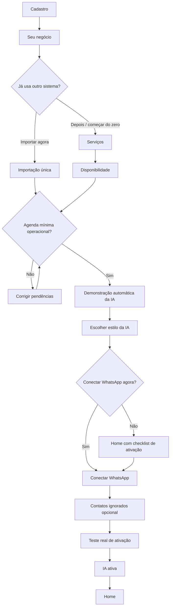

# Atendly — Mapa da documentação

## Produto

1. [[00-Produto/01-Visao-do-Produto]]
2. [[00-Produto/02-Escopo-do-MVP]]
3. [[00-Produto/03-Publico-e-Proposta-de-Valor]]
4. [[00-Produto/04-Navegacao-e-Modulos]]

## Regras do produto

1. [[01-Regras/01-Regras-de-Negocio]]
2. [[01-Regras/02-Agenda-e-Agendamentos]]
3. [[01-Regras/03-IA-e-Conversas]]
4. [[01-Regras/04-Clientes-e-Memoria]]
5. [[01-Regras/05-WhatsApp]]
6. [[01-Regras/06-Importacao-Minha-Agenda]]
7. [[01-Regras/07-Lembretes-Notificacoes-e-Instabilidade]]
8. [[01-Regras/08-Privacidade-e-Retencao]]

## Fluxos

1. [[02-Fluxos/01-Onboarding]]
2. [[02-Fluxos/02-Ativacao-e-Teste-do-WhatsApp]]
3. [[02-Fluxos/03-Fluxos-de-Agendamento]]
4. [[02-Fluxos/04-Handoff-e-Atendimento-Humano]]
5. [[02-Fluxos/05-Importacao-Unica]]

## UX/UI

1. [[03-UX-UI/01-Principios-de-UX-UI]]
2. [[03-UX-UI/02-Responsividade-Mobile-First]]
3. [[03-UX-UI/03-Onboarding-UX]]
4. [[03-UX-UI/04-Especificacao-das-Telas]]
5. [[03-UX-UI/05-Design-System-Conceitual]]
6. [[03-UX-UI/06-Copy-e-Linguagem]]

## Referência

- [[04-Referencia/01-Glossario]]
- [[04-Referencia/02-Decisoes-Substituidas]]
- [[04-Referencia/99-Perguntas-e-Respostas]]

## Fluxo macro

## Direções futuras e limites

- [[00-Produto/05-Internacionalizacao-Futura]]
- [[04-Referencia/03-Temas-Adiados]]
