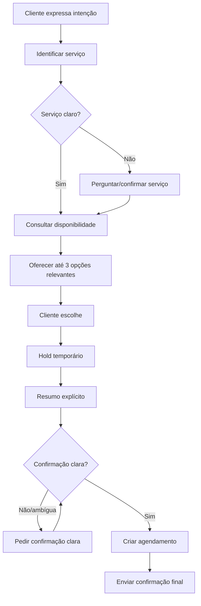

# Fluxos de Agendamento

## Fluxo feliz via IA

## Serviço provável pelo histórico

Se cliente possui padrão forte:

> Seria para o corte novamente?

Após “sim”, serviço fica confirmado e fluxo segue.

## Sem serviço informado

Sem contexto suficiente, a IA não deve mostrar disponibilidade genérica porque duração do atendimento é necessária.

## Multi-serviço

Cliente pode pedir vários serviços na mesma conversa e no mesmo agendamento.

A IA interpreta linguagem natural, confirma conjunto e calcula duração total.

## Várias pessoas na mesma conversa

Exemplo:

> Quero marcar meu corte e depois unha para minha filha.

A IA pode gerenciar vários objetivos, um de cada vez, sempre deixando claro para quem cada agendamento está sendo feito.

Antes da confirmação final, incluir nome do cliente quando houver mais de uma pessoa envolvida.

## Horário indisponível

Se o horário pedido não existir:

- oferecer opções próximas válidas;
- se não houver no mesmo dia, buscar próximos dias dentro da janela configurada;
- não fazer encaixe automaticamente.

## Cliente insiste em exceção

Explicar que a IA só consegue utilizar horários disponíveis e oferecer atendimento humano.

## Cancelamento

1. identificar agendamento correto;
2. verificar política;
3. confirmar intenção;
4. cancelar;
5. enviar resumo;
6. perguntar se deseja remarcar.

## Remarcação

1. preservar horário atual;
2. buscar novas opções;
3. aplicar hold na nova opção;
4. confirmar com cliente;
5. somente então substituir horário antigo;
6. enviar resumo final.

## Recorrência

Para serviço recorrente e pedido de múltiplos próximos atendimentos:

1. identificar quantidade;
2. aplicar intervalo padrão do serviço;
3. buscar disponibilidade em cada período;
4. ajustar para horários próximos quando necessário;
5. apresentar todas as ocorrências juntas;
6. realizar hold nas opções;
7. criar somente após confirmação global.

## Cliente some

Não fazer follow-up automático.

Quando retorna depois do hold:

- consultar novamente;
- se horário ainda estiver livre, confirmar;
- se não estiver, oferecer alternativas.

## Relacionado

- [[01-Regras/02-Agenda-e-Agendamentos]]
- [[01-Regras/03-IA-e-Conversas]]
- [[02-Fluxos/04-Handoff-e-Atendimento-Humano]]
