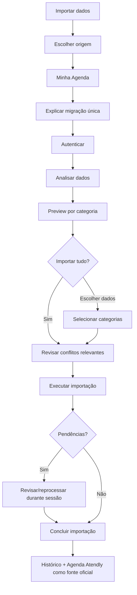

# Fluxo de Importação Única

## Regras de experiência

- análise não deve alterar dados antes da confirmação;
- mostrar quantidade por categoria;
- `Importar tudo` é CTA principal;
- conflitos claros são explicados em linguagem leiga;
- poucos conflitos não bloqueiam milhares de registros válidos;
- importação pode terminar com itens descartados, desde que usuário seja alertado;
- conclusão é uma decisão definitiva.

## Confirmação final

Se houver itens não importados:

> **Esta é sua única importação.**  
> Depois de concluir, não será possível importar novamente do Minha Agenda. Alguns registros não serão importados. Deseja concluir mesmo assim?

## Depois

Configurações → Importação mostra somente o histórico da migração concluída.

## Relacionado

- [[01-Regras/06-Importacao-Minha-Agenda]]
- [[02-Fluxos/01-Onboarding]]
