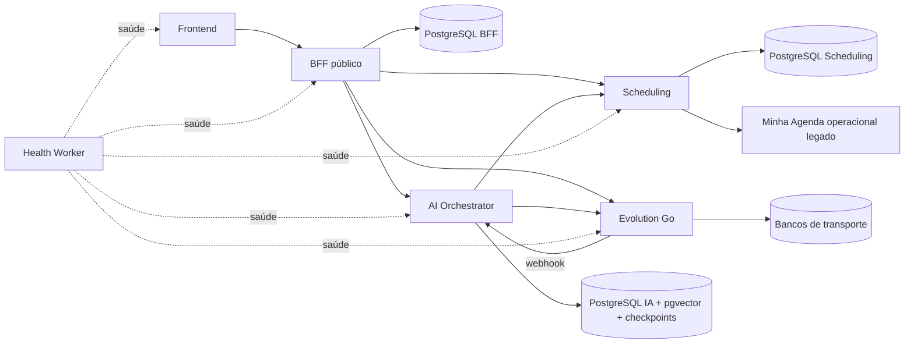

# Estado atual — baseline verificável

Auditado em 2026-09-05 no commit `5fb5d51abc1de58cb24718e7349d7a68ccaa7356`. A fotografia histórica abaixo é preservada; o delta aceito do Goal001 e o achado adicional estão ao final deste documento. Não é atestado de produção. Estado da retomada e alterações preexistentes: [AUDIT_PROGRESS](AUDIT_PROGRESS.md).

**Convenções:** FATO = observado em código/configuração; INFERÊNCIA = conclusão técnica limitada à evidência; NÃO VERIFICADO = exige execução/ambiente adicional. Divergências ficam em [GAP_ANALYSIS](GAP_ANALYSIS.md); propostas, em [TARGET_ARCHITECTURE](TARGET_ARCHITECTURE.md).

## Monorepo e fronteiras

| Unidade | Fato: responsabilidade e tecnologia declarada | Persistência / consumidores |
| --- | --- | --- |
| `apps/frontend` | Next `^16.3.3`, React `19.2.4`, TypeScript; App Router; browser acessa BFF | Sessão/API BFF; package legal |
| `apps/bff` | Fastify `^5.6.2`, Prisma `7.10.0`, Zod, jose, bcryptjs; API pública `/v1`, autenticação e composição | PostgreSQL BFF; chama AI, Scheduling e Evolution |
| `apps/scheduling-service` | Fastify/Prisma/PostgreSQL; agenda, catálogo, clientes e integração de calendário | API interna consumida por BFF e IA |
| `apps/ai-orchestrator` | Fastify/Prisma; LangGraph `1.4.13`, LangChain OpenAI `1.5.8`, checkpointer PostgreSQL `1.0.5` | Conversas/IA e pgvector; chama Scheduling e Evolution |
| `apps/evolution-go` | Go `1.25.0`, Gin `1.10.0`, GORM `1.25.10`; transporte WhatsApp e whatsmeow vendorizado | Autenticação/sessões de dispositivo e instâncias; BFF e IA |
| `apps/health-worker` | Node, sem dependências npm; sonda saúde dos serviços | Não é proprietário de dados de produto |
| `packages/contracts` | Zod/TypeScript, saída `dist`; exporta raiz e common | Nenhum import de runtime encontrado nos apps pela busca dirigida |
| `packages/legal-contract` | Constantes JS + declarações TS para versões legais | Importado efetivamente por frontend e BFF |

Versões acima são declarações dos `package.json` e `go.mod`, não verificação de compatibilidade com versões mais recentes. Há locks npm por aplicação; a raiz não declara npm workspaces nem gerenciador de tarefas de monorepo. O script raiz delega comandos por diretório.

A relação HTTP IA → Evolution → webhook IA é um circuito de mensagens, não evidência de import circular. Não há import entre apps identificado na busca dirigida; não foi feita prova exaustiva de ausência de ciclos entre todos os módulos. O grafo ajuda a localizar dependências, mas seu escopo não inclui vault, design e whatsmeow vendorizado.

## BFF e autenticação

- **FATO:** `apps/bff/src/lib/auth.ts:14` assina JWT HS256 com subject do usuário; `requireAuth` aceita Bearer ou cookie HttpOnly. Logout remove cookie; tokens já emitidos não têm revogação por sessão ou mudança de senha no código examinado.
- **FATO:** `apps/bff/src/lib/tenant-context.ts:13` resolve associação pelo usuário autenticado, rejeita ausência, múltiplas associações ou papel incompatível. O MVP não apresenta seletor de tenant. A restrição do banco é somente `(tenantId,userId)`; cardinalidade de um negócio por usuário e um usuário por negócio não é garantida por índices exclusivos separados.
- **FATO:** cadastro em `apps/bff/src/modules/auth/routes.ts:81` cria usuário, tenant, membership, perfil, AI settings e aceite legal na mesma transação. Senha é hash; recuperação usa token aleatório armazenado como hash e claim transacional de uso único.
- **FATO:** BFF possui recuperação real de senha quando configurado delivery. O escopo atual do MVP exige somente representação visual desse fluxo, o que não é autorização para ampliar a feature.
- **FATO:** `app.ts:59` configura CORS com origem específica e credenciais; `x-csrf-token` está apenas na lista de headers permitidos. Não foi localizado validador CSRF/origin/referer nas mutações. `render.yaml` configura cookie SameSite=None/Secure. Exploração real não foi testada; isso é superfície a endurecer, não incidente comprovado.
- **FATO:** `InternalHttpClient` envia segredo interno, `x-tenant-id`, `x-user-id`, `x-request-id` e audience; valida resposta via Zod. GET pode repetir até três tentativas, sem backoff explícito; mutação faz uma tentativa. Scheduling valida segredo em tempo constante e exige contexto, mas não valida audience (`shared/auth/internal-auth.ts:31`). O segredo autentica serviço confiável; não é prova independente da associação user/tenant.

## API e composição

Inventário registrado: [PUBLIC_API_V1](../../apps/bff/PUBLIC_API_V1.md). Montagem confirmada em `apps/bff/src/app.ts:78` e arquivos `src/modules/*/routes.ts`.

| Família pública | Dono da operação / observação |
| --- | --- |
| `/v1/auth/*` | BFF, sessão e conta |
| `/v1/onboarding` + `/complete` | BFF compõe perfil, catálogo, disponibilidade, IA e WhatsApp |
| `/v1/dashboard` | Composição com estado degradado por dependência, sem zerar silenciosamente erro como sucesso |
| `/v1/appointments`, `/availability`, `/time-blocks` | Proxy validado para Scheduling; create/reschedule/cancel transportam idempotency key |
| `/v1/customers`, `/v1/services` | CRUD parcial via Scheduling; telefone obrigatório no create cliente BFF |
| `/v1/conversations/*` | IA guarda conversas; BFF passa token da instância no envio humano |
| `/v1/settings/*` | BFF grava perfil/configuração e sincroniza IA em chamadas posteriores |
| `/v1/whatsapp/*` | BFF controla provisionamento/QR/pairing/status/disconnect em Evolution e provisiona vínculo na IA |
| `/v1/calendar/integration/*`, `/calendar/migrations/*` | Contratos legados ainda montados e consumidos |

`onboarding/routes.ts:166–195` exige fonte escolhida, dois tons antigos e WhatsApp conectado; fonte externa dispensa disponibilidade interna, exigindo integração conectada. `settings/routes.ts:88–100` persiste AI settings antes de sincronizar IA: falha remota deixa duas cópias divergentes. Atualização de negócio também precede sincronização. Não há transação distribuída ou reconciliação durável nesse caminho.

WhatsApp é criado remotamente antes da inserção local (`whatsapp/routes.ts:144–160`), e depois provisionado na IA. Concorrência/falha parcial pode deixar instância órfã; não foi observado incidente real. GET status atualiza a projeção local, podendo reduzir estados intermediários a CONNECTED/DISCONNECTED.

## Dados pertencentes ao BFF

Schema: `apps/bff/prisma/schema.prisma`.

| Entidade | Identidade, ownership e semântica atual |
| --- | --- |
| User | CUID, email global único, passwordHash, created/updated |
| Tenant / TenantMember | Tenant ID canônico; membership com papel OWNER; FKs locais |
| BusinessProfile | tenantId único; nome, categoria, timezone, idioma, moeda, onboardingCompletedAt |
| AiSettings | tenantId único; enabled e enum de dois tons; cópia funcional na IA |
| WhatsAppInstance | userId único; id/name/token externo, número/status/QR/timestamps; token armazenado como String sem cifra neste schema/rota |
| LegalAcceptance | User + versões termos/privacidade únicas; acceptedAt |
| PasswordResetToken | User, tokenHash único, expiresAt/usedAt; sem mecanismo de revogação JWT |

Não há entidades BFF para central de notificações, exclusão recuperável da conta, consentimento específico de conexão WhatsApp ou retenção configurável. `onDelete: Cascade` local não apaga bancos de outros serviços. BusinessProfile, CalendarSettings e contexto da IA possuem cópias de timezone que requerem governança conjunta.

Migrations antigas fazem backfill estável de tenant com prefixo `legacy_tenant_`. A migration `20260831220000_goal17_legacy_cleanup` remove `IgnoredContact`, perfis/persona e settings anteriores; comentário que trata dois tons como aprovados é histórico substituído. Não se pode inferir que dados removidos sejam recuperáveis nem que a migration tenha sido aplicada em produção. Essa incerteza é parte do inventário antes de qualquer novo backfill.

## Infraestrutura, execução e qualidade

- `render.yaml`: seis serviços web, planos declarados free, três Node APIs, frontend, Go via Docker e health-worker; somente banco Scheduling declarado no blueprint. URLs hardcoded e segredos externalizados. Estado real das contas/serviços não verificado.
- Prisma com três histories independentes. BFF pode usar `DIRECT_DATABASE_URL` nas migrations. Não foi estabelecido se cada URL aponta a banco físico diferente; o ownership lógico é separado, e colisão em schema/tabelas deve ser impedida na implantação.
- Compose da IA sobe PostgreSQL/pgvector e Evolution com dois bancos de transporte; não é uma execução local completa do monorepo. Não há `.github` na baseline. Docker IA usa Node 22 enquanto blueprint fixa Node 24.13.0; alinhar execução, sem troca de framework.
- Blueprint executa `prisma:deploy` durante build antes de build TS; um build que falha pode já ter alterado banco. `scripts/build-all.sh` compila contracts, IA, BFF, frontend, verifica health e roda Go, mas omite Scheduling.
- Logs estruturados/redação de credenciais e correlação existem; saúde liveness não comprova banco, entrega WhatsApp, teste real ou aptidão da IA. Propagação de request-id não constitui tracing completo.

| Verificação | Evidência e limite |
| --- | --- |
| IA unitários, recuperado da primeira execução | 6 arquivos, 39 testes passaram, 1 falhou; expectativa antiga sem requestId em `inbound-message-processor.test.ts:423`; nenhuma correção feita |
| BFF integração | Único teste encontrado condicionado a `BFF_RUN_INTEGRATION_TESTS`; usa `/auth/register` antigo. Inspecionado, não executado contra banco |
| Scheduling | Sem script npm test na baseline; detalhes do domínio em DATA_MIGRATION |
| Frontend | Sem script de testes na baseline; inspeção detalhada em REUSE_ANALYSIS |
| Auditoria estática existente | Executada na retomada com `PRODUCTION_HEALTH_TARGETS` vazio: 14 verificações estáticas passaram, 1 health de produção pulado. O resumo do script conta o skipped como passed (15); não reportar como 15 testes reais |
| Builds/lint/Go/DB/E2E | Não executados neste checkpoint; comandos existentes não equivalem a checks aprovados |

As verificações estáticas procuram texto e estrutura; não demonstram isolamento real, correção de negócio, atomicidade, concorrência, retenção ou disponibilidade em produção.

## Evidência Graphify utilizada

Grafo existente de 3.039 nós. Consulta por vocabulário `auth tenant session business` encontrou 178 nós, com corte de orçamento explícito; refinada por `explain resolveTenantContext` e `explain InternalHttpClient`. Relações extraídas: `requireTenantContext → resolveTenantContext`; clients Scheduling, IA e Evolution importam InternalHttpClient. Código confirmou essas relações. Consultas dos domínios estão nos documentos de domínio. Sem rebuild, alteração do manifesto ou feedback escrito no grafo.

## Scheduling, catálogo, clientes e importação

**FATOS consolidados:** núcleo operacional independente da IA, com CalendarService, factory e dois providers. O provider Atendly já oferece soma de multi-serviço, snapshots em AppointmentItem, cancelamento sem apagar appointment e remarcação por atualização transacional. Create e reschedule usam Serializable e advisory lock por tenant/data. Não é uma base a descartar.

O motor de disponibilidade considera intervalos semanais, exceções por data, blocos e agendamentos não cancelados. A gestão HTTP não completa todas essas estruturas: exceções não têm rota de gestão localizada; hold, compromisso pessoal distinto, séries recorrentes, presença, falta e valor final não aparecem como capacidades completas. Serviço tem somente FIXED/ON_REQUEST, duração obrigatória e ativo. **Superado no Goal007** — ver o delta ao final deste documento. Cliente é identificado por telefone normalizado único no tenant; upsert pode renomeá-lo antes da transação de agendamento. **Superado no Goal006** — ver o delta ao final deste documento.

Minha Agenda continua recebendo leitura e escrita operacional. O snapshot de migração atual consulta hoje até dez anos à frente, deriva clientes desses agendamentos, filtra deleted e reduz estados. Migração exige destino vazio, bloqueia todos os itens se houver conflito e conclui/troca fonte automaticamente. Há tabela de job e claim condicional, mas execução usa Set/queueMicrotask locais e recuperação global no boot sem lease. Isso não implementa importação única do produto.

Inventário de entidades, constraints SQL adicionais ao Prisma, caminhos com locks, dados temporais, consumers e matriz de importação: [DATA_MIGRATION §§1–3](DATA_MIGRATION.md#1-persistência-atual-de-scheduling). Tabelas de domínio: CalendarSettings, IntegrationConnection, Customer, Service, AvailabilityRule, AvailabilityException, TimeBlock, Appointment, AppointmentItem, ExternalEntityMap, MigrationJob, MigrationConflict e CalendarMutationIdempotency. FKs compostas de cliente/serviço/appointment preservam tenant local; não há FK para o banco BFF.

## AI Orchestrator e conversas

**Fluxo confirmado:** Evolution webhook → autenticação por token → mapper → resolução de ChannelConnection por instance ID → processor → LangGraph (contexto/guard/classificação/RAG/buffer/ferramentas/resposta) → Scheduling quando necessário → Evolution sendText. `MessageGraphWorkflow` é importado e construído por InboundMessageProcessor (Graphify explain confirmou; código em `modules/graph/message-graph.ts:65` e `channel/InboundMessageProcessor.ts:168`).

- `channel/routes/evolutionWebhook.routes.ts:60–99`: processor novo por request; HTTP 202 precede `handleInboundMessage`. O buffer é Map por processor (`InboundMessageProcessor.ts:154`). Consequência inferida: debounce/cancelamento não coordena requests distintos e queda após ACK pode perder trabalho. **Superado no Goal004** — ver o delta ao final deste documento.
- `graph/message-graph.ts:206`: ProcessedEvent é criado antes do processamento. A tabela tem dedupe único, mas não estados de execução/retry. Guard de IA desligada/handoff pode encerrar antes de Message. Deduplicação não equivale a processamento concluído.
- `message-graph.ts:273` e `assistant.service.ts:622`: `fromMe` comum grava OWNER, sem acionar a pausa; comandos especiais de pausa existem. Mensagem humana no chat interno exige takeover prévio (`internal/routes.ts:167`), enquanto o produto pede que o envio assuma. Abrir conversa não deve assumir. **Superado no Goal005** — ver o delta ao final deste documento.
- `message-graph.ts:269/401`: conteúdo não textual vai para resposta genérica unsupported. Não foi localizado pipeline de transcrição; áudio, imagem e documento ainda não têm tratamentos distintos do MVP.
- `message-graph.ts:581–631`: registro de outbound é marcado com ID local antes de send e depois atualizado; não há estado separado de entrega. Envio humano remove mensagem pendente se send falha (`internal/routes.ts:174–208`), inclusive quando timeout não prova ausência de entrega. **Superado no Goal004** — ver o delta ao final deste documento.
- Classificação existente em `assistant.service.ts` usa `potential_customer`, `supplier_or_partner`, `personal_contact`, `unknown` dentro de JSON do agente. Não equivale às três abas, override manual, Contact ignorado e sessão de aproximadamente 24h do produto. Não há esses modelos explícitos no schema. **Superado no Goal005** — ver o delta ao final deste documento.

### Dados e memória da IA

`apps/ai-orchestrator/prisma/schema.prisma`: ChannelConnection (único provider/instance e tenant/provider), Conversation (único tenant/channel/contact), Message (dedupe tenant/channel/externalMessageId), ProcessedEvent, AiRun, AiToolCall, Handoff, AiTenantConfig, KnowledgeDocument e KnowledgeChunk. FKs compostas protegem tenant/channel nas relações internas. Não há FK cross-database para User, Customer ou Appointment.

AiRun/AiToolCall guardam modelo, promptVersion, status, argumentos, resultados e erros: base útil de auditabilidade, também conteúdo potencialmente pessoal. Message/ProcessedEvent guardam rawPayload. Handoff tem status e pausa; não é entidade de sessão de contato. AiTenantConfig replica enabled/tone/contexto do BFF. Conhecimento guarda versão/checksum/status e embedding `vector(1536)`. `pgvector-knowledge-store.ts:142–149` filtra tenant do chunk e do documento e somente documentos ACTIVE: proteção concreta, sem prova de RLS ou teste de invasão.

Checkpointer usa schema PostgreSQL `langgraph` e executa setup no boot (`graph/checkpointer.ts:3–12`); thread_id é conversationId (`message-graph.ts:78`). Tabelas de checkpoints são persistência adicional fora do schema Prisma. Não há rotina de retenção de conteúdo/checkpoints/runs localizada. O seed de conhecimento não representa CRUD de FAQ pronto no produto.

## WhatsApp / Evolution Go

BFF usa API admin para criar instância e token da instância para conectar/status/QR/pair/send. IA deriva tenant do vínculo cadastrado, rejeitando instância não vinculada/ativa (`ChannelConnectionService.ts:106`). Provisionamento rejeita vínculo da mesma instância a outro tenant e há índice único correspondente. Grupos são desabilitados na criação pelo BFF; essa proteção também precisa de guard de produto, sem presumir que configuração remota seja suficiente.

Evolution permanece transporte, Gin/Go e whatsmeow, com bancos configuráveis de autenticação e usuários/sessões (`POSTGRES_AUTH_DB`, `POSTGRES_USERS_DB`). Pode persistir mensagens do transporte por configuração; Compose auditado desativa `DATABASE_SAVE_MESSAGES`. A configuração efetiva de produção não foi inspecionada. Esse armazenamento pode duplicar conteúdo guardado pela IA e precisa entrar na retenção.

**FATO de autorização:** `pkg/routes/routes.go:120–133` monta GET/PUT advanced-settings sob Auth de instância. `auth_middleware.go:21` resolve token e põe a instância em contexto; handlers `instance_handler.go:589/619` passam `instanceId` da URL ao service sem comparação com esse contexto; service `instance_service.go:825/837` usa o ID recebido. Um token de uma instância não fica vinculado ao alvo nessas duas rotas. Falha confirmada por análise estática do caminho; não explorada remotamente.

`webhook_producer.go:43–72`: entrega em goroutine, cinco tentativas, intervalo de 30s, cliente HTTP sem timeout; 2xx termina retry. Logs imprimem URL inteira, incluindo query token configurada pelo BFF. Payload de evento carrega instanceToken em `pkg/whatsmeow/service/whatsmeow.go` (confirmado na auditoria recuperada); IdempotencyStore guarda raw integral. Há testes Go de transporte/configuração/instância, mas não foram executados nesta auditoria nem comprovam cobertura do defeito acima.

## Health Worker e jobs

`apps/health-worker/src/index.js`: sonda cinco alvos a cada 40 segundos, timeout de 10 segundos, request-id e logs; expõe `/health` e `/targets`. Não possui fila, banco, agendamento de lembretes, retenção, conclusão automática ou expiração de holds. Sua responsabilidade atual é coerente e reaproveitável. Jobs de domínio são uma necessidade nova a resolver no dono do dado, não uma extensão automática deste serviço.

## Frontend, referência visual e contratos

Frontend usa Context/hooks locais (`ProductRuntime.tsx`), gate de sessão e redirect; serviços BFF centralizados em `data/services/registry.ts`, client HTTP e Zod local. Há telas Product* reais e telas/scenarios de demonstração em preview: presença de um frame ou mock não demonstra feature integrada. Não há dependência de store externo/form library no manifest. Forms são implementados nas features; componentes Dialog/States/Button/RouteAnnouncer oferecem base para foco, feedback e navegação, a revalidar na substituição visual.

`AppShell.tsx:68` assume WhatsApp connected se o caller omite estado; `:269/310` mostra apenas três destinos + Mais e esconde Clientes. São divergências concretas. CSS usa Inter/IBM Plex Mono; referência Recepção usa Literata/Hanken Grotesk, superfícies quentes/petróleo, ícones e motion com reduced-motion. O HTML aprovado especifica resultado visual, não arquitetura React. A análise foi seletiva por índice/módulos e código; não foi validação visual de todos os frames ou sessão de browser.

O protótipo possui conflito localizado: Movimento.dc.html:396 restringe Semana/Mês a landscape/desktop; Agenda.dc.html e vault preservam Dia/Semana/Mês no mobile. O vault prevalece. Matriz completa de módulos e tokens: [REUSE_ANALYSIS](REUSE_ANALYSIS.md).

`packages/contracts` exporta utilitários common; índices auth/calendar/conversations/customers/dashboard/internal/migrations/onboarding/services/settings/tenant/whatsapp são placeholders. Parsers reais estão duplicados no frontend, nos clients BFF e IA e nas rotas Scheduling. Centralizar deve migrar consumidores efetivos, sem anunciar que o pacote já fornece o contrato público.

## Fechamento factual e limites

Os domínios obrigatórios foram inspecionados em profundidade suficiente para decisões arquiteturais. Permanecem **NÃO VERIFICADOS**: população/migrations implantadas, backups restauráveis, capacidades completas da API Minha Agenda, disponibilidade e custo do deploy efetivo, entrega WhatsApp real, comportamento visual em aparelhos e testes reais cross-tenant/concorrência. São gates explícitos da execução futura; não justificam aprofundamento indiscriminado nesta fase.

## Delta aceito — Goal001, 2026-09-05

HEAD documental `4ca130128cafd620ea316c3ed9c51a46b34f8541`; implementação ainda em working tree, identificada pelos hashes do [review001](reviews/001-review.md). Não há alteração de código entre esse HEAD e a baseline; a mudança funcional é o diff001.

- **FATO atual:** GET/PUT advanced-settings chamam `authorizeInstanceTarget` antes do bind/service. Contexto ausente, tipo inválido, ponteiro/interface nil ou ID vazio retornam401; alvo diferente retorna403 genérico sem consultar sua existência; alvo próprio usa o ID autenticado. A falha G-01 descrita na fotografia histórica está corrigida nesse diff aceito.
- Auth/AuthAdmin, endpoints, payloads legítimos, services, schemas e dependências permanecem iguais. BFF/IA não chamam essas rotas; manager combina ID/token próprios. Teste administrativo espelha o registro real, que foi inspecionado e não mudou.
- **EXECUÇÃO:** 31 nós de autorização passaram; testes cruzados novos retornaram RED sobre baseline com somente a fixture copiada. Build/vet Go passaram. Suite Go completa:95 nós passaram/2 testes falharam por cleanup de arquivo aberto em service/webhook, reproduzido no baseline isolado. Dependências desses pacotes não incluem o handler. Detalhes/limites no review; o teste não comprova deploy ou isolamento integral do produto.
- **PRECISÃO:** gofmt é equivalente sobre conteúdo LF; checkout CRLF faz `gofmt -l` listar os três arquivos. Isso foi verificado separadamente, sem formatar o código do executor.

## Descoberta adicional — metadados de mensagem no transporte

**FATO estático G-35, não corrigido pelo Goal001:** `POST /message/status` recebe ID de mensagem, verifica client conectado da instância autenticada e consulta `GetMessageByID(data.Id)` sem scoping por instância (`message_service.go:349`, `message_repository.go:27`). Repository é compartilhado; Message guarda id/message_id/timestamp/status/source, sem instanceId. `source` deriva do identificador de chat/telefone (`whatsmeow.go:1645/1662`), não do dono da instância.

Com registro de B existente, seu ID conhecido e token/client A válidos, o caminho não impede leitura desses metadados de B. Não há texto da mensagem nesse modelo. Gravação examinada depende de `DATABASE_SAVE_MESSAGES=true`; exemplo versionado usa false. Configuração/linhas de produção não foram verificadas, e desligar escrita não prova ausência de histórico. Isso refina o inventário da persistência opcional de transporte: a tabela examinada contém metadados, sem pressupor conteúdo integral.

Foram contados72 MustGet em dez arquivos de handlers; o uso em si indica fragilidade para contexto ausente/nil, não comprova IDOR. Auth repository retorna ponteiro válido quando encontra token. O achado de objeto acima é distinto e permanece como requisito de segurança do Goal003 antes de004. **Corrigido no Goal003** — ver o delta ao final deste documento.

## Delta implementado — Goal002, 2026-09-05 (ACCEPTED na rodada 3)

A fotografia histórica acima permanece como registro da baseline. O que mudou
com o Goal002 é infraestrutura de validação, não comportamento de produto.

- **FATO atual:** `scripts/build-all.sh` também compila o Scheduling Service, e
  os comandos canônicos passaram a ser `npm run validate:core` e
  `npm run validate:integration` ([VALIDATION_GATE](VALIDATION_GATE.md)).
- **FATO atual:** o teste de integração do BFF usa `POST /v1/auth/register` e
  exige `BFF_TEST_DATABASE_URL` apontando para PostgreSQL descartável em
  loopback; sem essa URL o runner recusa com exit2, sem tocar o banco default.
- **FATO atual:** `final-production-audit.mjs` reporta `skipped` em contagem
  própria (14 passed /0 failed /1 skipped); o resumo antigo de "15 passed" não
  existe mais. O script continua sendo auditoria estática por regex.
- **FATO atual:** as duas fixtures Go de cleanup fecham o logger da instância
  antes da remoção do `t.TempDir()`. A suíte Go completa passa no Windows
  (7 pacotes `ok`), incluindo os 31 nós de autorização do Goal001. A asserção de
  `requestId` da IA foi corrigida e passa.
- **FATO atual:** `tests/channel/evolution.routes.test.ts` prepara o ambiente e
  importa o módulo de rotas uma única vez, na avaliação do arquivo. O custo de
  carregar a cadeia LangGraph/Prisma/embeddings deixou de ser pago dentro de
  cada caso e o `testTimeout` padrão de5000ms deixou de estourar. Fastify,
  guard de token, mapper e as respostas401/400/404 continuam reais. A suíte da
  IA passa40/40 e `validate:core` retorna exit0.
- **FATO atual:** `BFF_TEST_DATABASE_URL` só é aceita com uma allowlist de
  query parameters e com o destino efetivo conferido pelo parser do driver do
  BFF; `validate:integration` gera o client Prisma antes de migrar e testar.
- **FATO atual:** existe `.github/workflows/validate.yml` — a baseline não tinha
  `.github`. **NÃO VERIFICADO:** execução hospedada desse workflow.
- Continuam **NÃO VERIFICADOS** todos os limites listados no fechamento
  factual: deploy, restore, E2E, concorrência, entrega WhatsApp real e
  persistência dos demais domínios.

## Delta implementado — Goal003, 2026-09-07 (ACCEPTED na rodada 2)

A fotografia histórica acima permanece como registro da baseline. Os FATOs de
"BFF e autenticação", "WhatsApp / Evolution Go" e "Descoberta adicional" que
descrevem JWT sem revogação, CSRF ausente, segredo interno único,
`instanceToken` do corpo como autoridade e `/message/status` sem dono estão
superados pelos fatos abaixo, verificados no [review003](reviews/003-review.md)
sobre a base `99a7210`.

- **FATO atual:** `apps/bff/src/lib/auth.ts` assina o JWT com `sid`;
  `requireAuth` carrega `UserSession` a cada requisição e recusa sessão
  inexistente, expirada, revogada ou de outro usuário com 401; JWT sem `sid`
  recebe 401 `SESSION_REAUTH_REQUIRED` sem criar sessão. `POST /v1/auth/logout`
  revoga a sessão corrente; `PATCH /v1/auth/password` e
  `POST /v1/auth/reset-password` revogam todas, cookie e Bearer.
- **FATO atual:** mutações autenticadas por cookie exigem `Origin`/`Referer` na
  allowlist de `FRONTEND_ORIGIN` e header `x-csrf-token` conferido contra o
  hash guardado na sessão; Bearer não exige CSRF e header declaratório não
  autentica. O token é derivado por sessão e entregue no cookie legível
  `atendly_csrf` e no header de resposta `x-csrf-token`, exposto pelo CORS só
  à origem permitida, porque em produção frontend e BFF estão em hosts distintos
  sob `onrender.com`. `BffHttpClient` guarda o token em memória e o reenvia;
  `test:frontend` cobre esse adapter sem cookie jar.
- **FATO atual:** `WhatsAppInstance.tenantId` é único com FK para `Tenant`;
  `userId` único foi conservado. `apps/bff/src/modules/whatsapp/instance-link.ts`
  resolve o vínculo pelo tenant autenticado e recusa com 409 os estados pendente
  (linha do usuário sem tenant) e divergente (duas linhas, ou dono de negócio
  diferente do usuário); só `DELETE /v1/whatsapp` descarta a linha pendente, e
  apenas para o dono. **Nota:** a classificação de pendente não exige `tenantId`
  nulo na linha do usuário; inalcançável com a associação única vigente,
  endurecimento registrado no review.
- **FATO atual:** credenciais internas são derivadas por
  `HMAC(INTERNAL_SERVICE_TOKEN, chamador:audiência:uso)` ou definidas
  explicitamente por variável; o valor bruto do segredo raiz não é aceito por
  BFF→IA, BFF→Scheduling nem IA→Scheduling. A IA autoriza por escopo mapeado por
  método e caminho (`internal:unmapped` negado) e exige `x-tenant-id`/`x-user-id`
  explícitos depois da credencial; o fallback de primeira `ChannelConnection`
  ativa foi removido. Scheduling identifica o chamador pela credencial e recusa
  `x-service-audience` divergente com 403.
- **FATO atual:** o token da instância é guardado no BFF como envelope
  AES-256-GCM `v1.<keyId>.<iv>.<ct>` com AAD `tenantId|evolutionInstanceName`,
  versionado por `credentialVersion`/`credentialKeyId`; envelope de chave antiga
  é regravado na leitura e estoque legado em texto puro é selado na primeira
  leitura autorizada. Falha de chave, envelope ou vínculo levanta
  `CREDENTIAL_UNAVAILABLE` e impede a operação. `WHATSAPP_CREDENTIAL_KEYS` é
  obrigatório em produção.
- **FATO atual:** a IA recebe a credencial como projeção em
  `PUT /internal/channel-connections/evolution`, guarda-a cifrada com chaves
  próprias (`CHANNEL_CREDENTIAL_KEYS`) e resolve-a pelo vínculo de forma
  preguiçosa no envio; `readInstanceToken(request.body)` não existe mais, o
  payload do webhook é saneado por `redactSensitive` antes do mapeamento e
  `EvolutionProvider` não cai em `EVOLUTION_API_KEY`. Vínculo em
  `credentialVersion` 0 recebe e persiste o inbound e só falha ao responder;
  `GET /v1/whatsapp` reprojeta a credencial de forma idempotente.
- **FATO atual:** `apps/evolution-go/pkg/message/model/message_model.go` tem
  `instance_id` e índice único `(instance_id, message_id)`; `InsertMessage`
  recusa dono vazio e faz upsert nesse par; `GetMessageByID`,
  `GetLatestMessageID`, `DeleteMessagesByInstance` e a limpeza de
  `instance_repository.Delete` são escopadas por instância (a limpeza anterior
  filtrava por `source`, telefone, e não removia nada). `POST /message/status`
  devolve 401 antes de ler o body sem sujeito autenticado e `result` nulo
  idêntico para ID alheio e desconhecido. Writers de recibo em `whatsmeow.go`
  gravam `InstanceID = mycli.Instance.Id`. Expand roda no boot com inventário
  logado; `EVOLUTION_MESSAGE_OWNERSHIP_CUTOVER=true` remove a unicidade global de
  `message_id` só com o índice composto presente. Linhas legadas sem dono ficam
  preservadas e inalcançáveis.
- **FATO atual, não alterado:** o produtor Go ainda inclui `instanceToken` no
  payload dos eventos (`whatsmeow.go`, cinco pontos) e `webhook_producer.go`
  ainda loga a URL completa com o token de query. O consumer descarta e sanea; a
  retirada no produtor é do Goal004.
- **FATO atual:** `validate:core` executa `test:frontend` (deixou de ser skip) e
  `validate:integration` tem seis passos, incluindo o ensaio da migration de
  vínculo e a suíte de ownership do Go em bancos derivados do alvo descartável
  ([VALIDATION_GATE](VALIDATION_GATE.md)). Swagger e wiki do Evolution foram
  alinhados cirurgicamente para `/message/status` e `advanced-settings`.
- Continuam **NÃO VERIFICADOS:** prova em navegador real do CSRF cross-host,
  execução hospedada da CI, corte do Go em banco implantado, drift da migration
  da IA contra o schema (o cluster local não tem pgvector), deploy, WhatsApp
  real e os demais limites do fechamento factual.

## Delta implementado — Goal004, 2026-09-07 (ACCEPTED na rodada 2)

A fotografia histórica acima permanece como registro da baseline. Os FATOs de
"AI Orchestrator e conversas" e "WhatsApp / Evolution Go" que descrevem ACK
antes do processamento, buffer em `Map`, outbound marcado antes do envio,
`delete` da tentativa do dono, `instanceToken` no payload e produtor sem
persistência estão superados pelos fatos abaixo, verificados no
[review004](reviews/004-review.md) sobre a base `b3a019c`.

- **FATO atual:** `channel/routes/evolutionWebhook.routes.ts` saneia,
  classifica e persiste o evento em `ProcessedEvent` antes de responder 202;
  falha ao persistir devolve 5xx; duplicata devolve 202 sem novo efeito;
  eventos técnicos recebem 2xx (presença descartada, ciclo de vida da conexão
  registrado como IGNORED); `Receipt` vira trabalho de reconciliação; vínculo
  não resolvido devolve 503. Não há mais processamento em promise solta depois
  do ACK.
- **FATO atual:** `ProcessedEvent` carrega `eventType`, `conversationKey`
  (`tenant:canal:contato`), `status` RECEIVED/PROCESSING/DONE/FAILED/IGNORED/
  LEGACY, tentativas, `nextAttemptAt`, lease (`leaseOwner`, `leaseToken`,
  `leaseExpiresAt`), `supersedeRequestedAt`, resultado e erro sanitizado.
  `InboxStore.claimNext` varre candidatos excluindo conversas com PROCESSING
  de lease vivo, fixa a linha com `FOR UPDATE SKIP LOCKED`, usa
  `pg_try_advisory_xact_lock` por conversa e agrupa os fragmentos pendentes
  dentro da janela; só lease expirado é recuperado; `complete`/`fail` exigem
  o `leaseToken` do claim; dead-letter após `INBOX_MAX_ATTEMPTS` fica visível
  em `inboxDeadLetters` no painel interno, sem reenvio em massa.
- **FATO atual:** `InboxWorker` roda no processo da IA (`INBOX_WORKER_ENABLED`,
  `INBOX_POLL_INTERVAL_MS`, `INBOX_LEASE_SECONDS` 120,
  `INBOX_MAX_CONCURRENT_CONVERSATIONS`), acordado pelo webhook sem bloquear o
  ACK; `InboundEventDispatcher` executa o lote com `eventAlreadyGuarded`, então
  o guard do grafo não repete `remember` sobre a própria linha da inbox. O
  lease não é renovado durante a execução.
- **FATO atual:** a janela de fragmentos e a espera da primeira mensagem
  ambígua de contato sem histórico são recalculadas por
  `InboxStore.applyConversationWindow` em `nextAttemptAt` sobre os pendentes
  da conversa (`inbox-policy.ts`: mínimo `AI_DEBOUNCE_MIN_SECONDS`, degraus
  por texto longo ou vários fragmentos, seguimento urgente, teto
  `AI_DEBOUNCE_MAX_SECONDS`, limite `AI_DEBOUNCE_MAX_WAIT_SECONDS` desde o
  primeiro evento; `AI_AMBIGUOUS_WAIT_SECONDS` 120 e
  `AI_AMBIGUOUS_MAX_WAIT_SECONDS` 300). O `Map` do processador ficou só como
  gatilho local e está desligado no caminho do worker. Mensagem nova durante a
  execução marca supersede e `sendResponse` cancela a resposta ainda não
  enviada (`superseded`).
- **FATO atual:** toda saída existe em `Message` antes do transporte, com
  `correlationId` estável (que viaja como id da mensagem no envio) e
  `deliveryState` PENDING/SENT/FAILED/UNKNOWN mais `deliveryDetail`,
  `deliveryAttempts` e `deliveryUpdatedAt`. `EvolutionProvider` tem timeout
  (`EVOLUTION_SEND_TIMEOUT_MS` 15000) mapeado para `EVOLUTION_SEND_TIMEOUT`;
  `outbox-policy.classifySendFailure` faz 4xx = FAILED definitivo, timeout/5xx/
  erro pós-envio = UNKNOWN sem retry, conexão nunca estabelecida = FAILED
  retentável, credencial não projetada = FAILED com motivo; `markOutboundDelivery`
  substitui a marcação antecipada de envio. `POST /internal/conversations/:id/messages`
  não apaga mais a tentativa: devolve 201 quando SENT e 202 com o estado real
  quando FAILED/UNKNOWN. `OutboxStore.reconcileFromReceipt` leva PENDING/UNKNOWN
  a SENT por `correlationId` ou `externalMessageId`, escopado a tenant e canal.
- **FATO atual:** `messageDto` da IA, o client do BFF e `publicApiSchemas.ts`
  do frontend expõem `deliveryState`/`deliveryDetail` como opcionais e
  anuláveis ([PUBLIC_API_V1](../../apps/bff/PUBLIC_API_V1.md)); não há UI nova.
- **FATO atual:** no Evolution Go, `webhook_producer.go` persiste a tentativa em
  `webhook_deliveries` (`AutoMigrate` aditivo) antes da goroutine, com destino
  redigido; 2xx conclui, 4xx é recusa definitiva sem retry, 5xx/timeout/rede
  ficam pendentes com retry limitado; `ResumePending` no boot resolve o destino
  real pela instância. O payload de evento não carrega mais `instanceToken`
  (sete pontos em `whatsmeow.go` e dois em `send_service.go`); os logs não
  imprimem a URL com token. 429 e 408 são tratados como 4xx definitivo.
- **FATO atual:** `validate:integration` tem dez passos, incluindo o ensaio da
  migration 004 (que também cria tabelas de apoio sem linhas, porque o cluster
  descartável não tem pgvector), a geração do client Prisma da IA, a suíte de
  durabilidade/dispatch contra PostgreSQL e o outbox do Go
  ([VALIDATION_GATE](VALIDATION_GATE.md#transporte-durável-do-goal004)).
- Continuam **NÃO VERIFICADOS:** WhatsApp real (inclusive se o transporte honra
  `correlationId` como ID da mensagem), execução hospedada da CI, deploy,
  `migrate deploy`/`diff` da IA em banco com pgvector, capacidade de execução
  contínua do worker e os demais limites do fechamento factual.

## Delta implementado — Goal005, 2026-09-08 (ACCEPTED na rodada 2)

A fotografia histórica acima permanece como registro da baseline. Os FATOs de
"AI Orchestrator e conversas" que descrevem `fromMe` sem pausa, takeover
prévio obrigatório, classificação só no JSON do agente e ausência de Contact,
sessão e categoria persistidas estão superados pelos fatos abaixo, verificados
no [review005](reviews/005-review.md) sobre a base `8551717`.

- **FATO atual:** `apps/ai-orchestrator/prisma/schema.prisma` tem `Contact`
  (identidade externa única por tenant e canal, `ignored` com autor/origem/data,
  `aiPaused` com motivo, `categoryOverride` com autor/data) e
  `ConversationSession` (`startedAt`, `lastContactMessageAt`, `expiresAt`,
  `endedAt`, categoria vigente com `categorySource`, `suggestedCategory` com
  proveniência, `humanHandling` com origem e autor, `contextResetAt`,
  `inboundVersion`, `backfillNote`); `Conversation.contactId` é opcional.
- **FATO atual:** `src/modules/session/session-policy.ts` decide sem Prisma:
  expiração por inatividade do contato (`AI_SESSION_INACTIVITY_SECONDS`,
  86400), precedência override manual > sugestão > Não classificadas, tradução
  da classificação técnica sem inventar Comercial, elegibilidade na ordem
  ignorado → pessoal → canal → IA desligada → pausa do contato → atendimento
  humano, e guard de execução comparando a versão de entrada.
  `SessionService` resolve contato e sessão, rotaciona por expiração
  sincronizando o espelho legado da conversa (salvo contato pausado ou
  ignorado), assume o controle humano em transação, grava override, ignore e
  pausa do contato, e `releaseToAi` marca `contextResetAt` e reseta o rascunho.
- **FATO atual:** `message-graph.ts` executa `loadSession` antes de
  `operationalGuard`; o guard só anota a decisão e `sessionGate` encerra
  **depois** de `recordInbound`, então a mensagem do cliente é persistida com
  IA desligada, canal desconectado, handoff, sessão pessoal e contato ignorado,
  e o conteúdo bloqueado não chega a `understandMessage`, RAG, modelo nem
  memória. `executeTool` e `sendResponse` consultam `executionBlockReason`
  (versão de entrada, controle humano, elegibilidade, categoria, ignore).
- **FATO atual:** mensagem manual do dono pelo WhatsApp (`fromMe` que não é
  saída do bot) cai em `ownerActivity`, assume a sessão e pede supersede da
  resposta pendente; `/ia_pause` e `/bot off` gravam `Contact.aiPaused`;
  `/bot on` libera a sessão como Retomar IA. `POST /internal/conversations/:id/messages`
  e `takeover` assumem a sessão (o `409 HUMAN_HANDOFF_REQUIRED` saiu; o takeover
  não grava mais relógio 9999); `release` chama `releaseToAi`; `GET` não altera
  estado. `HandoffService.isBotPaused` consulta a sessão antes de retomar por
  relógio vencido.
- **FATO atual:** `AssistantService` recebe uma porta de sugestão: a
  classificação do agente é gravada como `suggestedCategory` com proveniência
  `agent:<promptVersion>` e nunca como override; `contextSince` limita o
  histórico do turno após Retomar IA.
- **FATO atual:** rotas internas `PUT /internal/conversations/:id/category`
  (`null` limpa) e `PUT .../ignore` sob `conversations:write`; filtros
  `category`/`handling`/`ignored`; DTO de conversa com `category`,
  `categorySource`, `suggestedCategory`, `handling`, `ignored`/`ignoredAt`,
  `aiPaused` e `session`. BFF expõe `PUT /v1/conversations/:id/category` e
  `/ignore` com tenant da sessão e CSRF ([PUBLIC_API_V1](../../apps/bff/PUBLIC_API_V1.md));
  frontend aceita campos e operações novas sem tela.
- **FATO atual (resíduos do 004):** `InboxStore.renewLease` com fencing pelo
  token e heartbeat no `InboxWorker` (`INBOX_LEASE_HEARTBEAT_SECONDS`, 30); a
  espera da mensagem ambígua se estende enquanto os fragmentos seguintes forem
  saudação, até `AI_AMBIGUOUS_MAX_WAIT_SECONDS`.
- **FATO atual:** `validate:integration` tem onze passos, com o ensaio da
  migration 005 e as suítes de sessão e controle humano contra PostgreSQL;
  `tests/session/**` e `tests/internal/**` rodam no core sobre um Prisma em
  memória de teste.
- Continuam **NÃO VERIFICADOS:** WhatsApp real, execução hospedada da CI, deploy,
  `migrate deploy`/`diff` da IA em banco com pgvector e os demais limites do
  fechamento factual. Handoffs `OPEN` legados não são resolvidos pela rotação
  de sessão (resolvido no Goal006), e mensagens não textuais do contato não
  renovam a sessão.

## Delta implementado — Goal006, 2026-09-08 (ACCEPTED na rodada 1)

A fotografia histórica acima permanece como registro da baseline. Os FATOs de
"Scheduling, catálogo, clientes e importação" que descrevem cliente por
telefone único e upsert que renomeia, e o resíduo do Goal005 sobre handoffs
`OPEN`, estão superados pelos fatos abaixo, verificados no
[review006](reviews/006-review.md) sobre a base `8acd4c6`.

- **FATO atual:** `apps/scheduling-service/prisma/schema.prisma` tem `Customer`
  com `phone`/`normalizedPhone` opcionais e índice não exclusivo
  `(tenantId, normalizedPhone)`; `(tenantId, id)` continua a identidade
  referenciada pelas FKs. `CustomerRelation` (um responsável principal por
  cliente, `proposedBy`/`status`/`confirmedBy` com datas), `CustomerNote` e
  `CustomerTag` (ambas com `aiAuthorized`, padrão falso), com FK composta por
  tenant. Migrations `20260908160000_goal006_customer_identity_expand` e
  `20260908161000_goal006_customer_phone_not_unique` (corte da unicidade
  antiga, sem tocar em linha).
- **FATO atual:** `AtendlyCustomerService.create` exige nome ou telefone e
  nunca consulta por telefone; `update` é a única operação que altera nome e
  telefone; `findCandidatesByPhone`/`list({ phone })` devolvem candidatos;
  `primaryGuardian`/`setPrimaryGuardian`/`confirmPrimaryGuardian`/
  `clearPrimaryGuardian` (a IA só propõe); notas e tags com autorização;
  `aiAuthorizedContext` filtra na consulta e só inclui responsável
  `CONFIRMED`. O upsert por telefone e `findByPhone` não existem mais.
- **FATO atual:** no provider Atendly, `createAppointment` executa dentro da
  transação `lockCalendarDay` → validação do slot → `resolveCustomerForAppointment`
  (obter por `customerId` ou criar) → `appointment.create`; `listAppointments`
  aceita `customerId` ou candidatos por telefone. O provider Minha Agenda
  recusa agendamento por `customerId`. `CUSTOMER_PHONE_DUPLICATED` deixou de
  ser conflito do serviço de migração de calendário.
- **FATO atual:** rotas internas do Scheduling `GET/POST /internal/customers`,
  `GET/PATCH /internal/customers/:id`, `GET .../ai-context`, responsável
  principal, notas e tags (treze rotas). BFF expõe `/v1/customers` e
  sub-recursos equivalentes sob tenant da sessão e CSRF por cookie; `POST
  /v1/appointments` aceita `customerId` opcional
  ([PUBLIC_API_V1](../../apps/bff/PUBLIC_API_V1.md)); frontend aceita telefone
  nulo, `primaryGuardian`, `notes` e `tags` sem tela nova.
- **FATO atual:** na IA, `SchedulingClient` busca candidatos, contexto
  autorizado e compromissos por `customerId`; `assistant-tools.ts` tem
  `list_customer_candidates` e `get_customer_context`, `resolveScheduleCustomer`
  devolve `CUSTOMER_IDENTITY_AMBIGUOUS` com vários candidatos e
  `proposedCustomerId` com um só, `confirmSchedule` agenda por
  `pending.customerId ?? pending.proposedCustomerId` e
  `linkContactToCustomer` grava `Contact.customerId`/`customerLinkedAt` por
  tenant, canal e ID externo (migration `20260908170000_goal006_contact_customer_link`,
  sem backfill nem FK entre bancos).
- **FATO atual (resíduos do 005):** `syncLegacyPauseMirror` resolve o handoff
  `OPEN` da conversa ao limpar o espelho legado;
  `20260908171000_goal005_single_open_session` fecha sessões abertas excedentes
  e cria o índice único parcial `ConversationSession_one_open_per_conversation`
  (só em SQL); a criação da sessão absorve a violação (`isUniqueViolation`,
  `P2002`/`23505`) e adota a sessão vencedora.
- **FATO atual:** `scripts/final-production-audit.mjs` tem a regra
  `no_tenant_scoped_phone_unique_constraint`; o Scheduling tem suíte própria —
  `tests/unit` (13) no `validate:core`, que deixou de pular
  `test:scheduling-service`, e `tests/integration` (10) no
  `validate:integration`, agora com dezesseis passos, incluindo os ensaios
  `goal006-migration-rehearsal.mjs` e `goal006-ai-migration-rehearsal.mjs` e
  `provision-scheduling-test-database.mjs`.
- Continuam **NÃO VERIFICADOS:** WhatsApp real, execução hospedada da CI, deploy,
  `migrate deploy`/`diff` da IA em banco com pgvector e os demais limites do
  fechamento factual. Mensagens não textuais do contato não renovam a sessão;
  `findCustomerAppointments` na IA ainda lista por telefone sobre todos os
  candidatos do número; o identificador `actor` de proveniência vem do cliente
  do BFF (os dois últimos resolvidos no Goal007).

## Delta implementado — Goal007, 2026-09-09 (ACCEPTED na rodada 3)

A fotografia histórica acima permanece como registro da baseline. O FATO de
"Scheduling, catálogo, clientes e importação" que descreve serviço com dois
tipos de preço, duração obrigatória e sem atributos, e as observações 2, 3 e 4
do Goal006 (proveniência vinda do corpo, compromissos por telefone, `addTag`
reescrevendo autorização), estão superados pelos fatos abaixo, verificados no
[review007](reviews/007-review.md) sobre a base `9494eb6`.

- **FATO atual:** `apps/scheduling-service/prisma/schema.prisma` tem
  `PriceType` com `FIXED`, `STARTING_AT`, `ON_REQUEST` e `NOT_INFORMED`;
  `Service.durationMinutes` opcional com `needsReview` (lockstep por
  `Service_review_check`) e `reviewOrigin` (`IMPORT`/`MANUAL`, só com pendência);
  `description`, `colorToken` (enum `ServiceColorToken`),
  `bufferBeforeMinutes`/`bufferAfterMinutes` (default 0) e
  `recurrenceIntervalDays`; `AppointmentItem.durationMinutesSnapshot` opcional.
  Migrations `20260908170000_goal007_catalog_expand` e
  `20260908171000_goal007_catalog_constraints` (substituem
  `Service_price_check`, `Service_durationMinutes_check` e o par de
  `AppointmentItem`; separadas porque o valor novo do enum não pode ser
  referenciado na transação que o criou). Nenhum registro reclassificado.
- **FATO atual:** `AtendlyServiceService` valida preço por tipo (obrigatório
  em `FIXED`/`STARTING_AT`, proibido nos outros), aceita duração ausente como
  revisão, preserva a origem da revisão em `PATCH` que não toca a duração,
  valida descrição, cor, buffers e recorrência; `isOperationalService` é o
  predicado único (ativo, com duração, fora de revisão) usado por
  `listOperational`/`listForScheduling` e por `requireActive`, que recusa
  serviço em revisão com `SERVICE_NEEDS_REVIEW` e inativo com
  `SERVICE_INACTIVE`.
- **FATO atual:** `calendar-provider.ts` define `computeAgreementTotal` (soma
  quando todos fixos; `STARTING_AT` quando há algum a partir de e nenhum sem
  preço; `NONE` nos demais) e `CalendarAppointment.totalPriceType`; o provider
  Atendly grava snapshots com as quatro semânticas, aplica a regra ao listar e
  deriva a duração da remarcação de `endAt − startAt`; o schema de replay da
  idempotência aceita os quatro tipos e duração nula, com
  `totalPriceType` default `NONE`.
- **FATO atual:** `CalendarService.listServices` devolve o catálogo completo da
  fonte vigente (serviço em revisão incluído) para `/internal/service-catalog`;
  `listOperationalServices` filtra pelo predicado único para qualquer fonte e
  alimenta `GET /internal/services` e `countOperationalServices`, que define
  `capabilities.aiActivationReady` em `/internal/calendar` (falha da fonte
  externa conta como zero). O BFF recusa `PATCH /v1/settings/ai` com
  `enabled: true` sem serviço operacional (`409 CONFLICT`).
- **FATO atual:** o mapper do Minha Agenda (`toCalendarService`,
  `appointmentServices`, `toCalendarAppointment`) não fabrica `FIXED`/zero:
  preço desconhecido vira `NOT_INFORMED`, duração desconhecida vira ausência
  explícita, item multi-serviço não herda a duração total;
  `calendar-migration-service.ts` grava `reviewOrigin: IMPORT` para serviço
  sem duração e `diagnoseSnapshot` não bloqueia duração ausente.
- **FATO atual:** rotas `GET/POST /internal/service-catalog` e
  `PATCH /internal/service-catalog/:id` com os campos novos; BFF
  `GET/POST /v1/services` e `PATCH /v1/services/:id` idem
  ([PUBLIC_API_V1](../../apps/bff/PUBLIC_API_V1.md), seção do Goal007);
  frontend `serviceSchema`/`appointmentSchema` aceitam quatro tipos, duração
  nula, `needsReview` e atributos, o diretório exibe "A partir de", "Sob
  consulta", "Não informado" e "Precisa de revisão", e o onboarding normaliza
  tipos novos para o par binário sem gravar zero. Na IA, `list_services` expõe
  `priceType` sempre e o valor só quando existe; `calculateAgreementTotal` e
  `totalPriceType` viajam em `AvailabilityLookup`, no rascunho pendente e nos
  resultados; o comentário do agendamento tem quatro textos; serviço em revisão
  nunca chega à IA porque `/internal/services` só devolve operacional.
- **FATO atual (resíduos do 006):** `addTag` é idempotente por rótulo
  (`update: {}`); o BFF deriva `actor`/`proposedByActor`/`confirmedByActor` da
  sessão e não aceita mais do corpo; `list_customer_appointments` consulta por
  `customerId` quando `Contact.customerId` está preenchido e só cai em
  candidatos por telefone sem vínculo.
- **FATO atual:** `validate:integration` tem dezessete passos, com o ensaio
  `goal007-migration-rehearsal.mjs` (fixture legada com preço zero explícito,
  expansão e constraints em passos separados, sondas por tipo); a suíte de
  integração do Scheduling tem 19 testes (catálogo e acordo incluídos) e a
  unitária 40; frontend 15 (`service-schema.test.ts`).
- Continuam **NÃO VERIFICADOS:** WhatsApp real, Minha Agenda real, execução
  hospedada da CI, deploy, `migrate deploy`/`diff` da IA em banco com pgvector
  e os demais limites do fechamento factual. Mensagens não textuais do contato
  não renovam a sessão; a resposta do Minha Agenda não é validada por schema.
