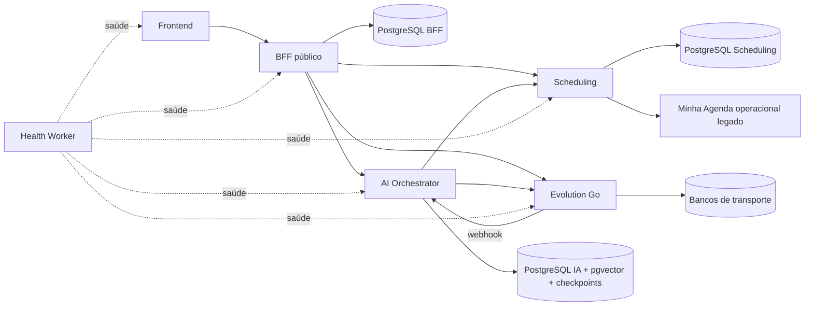

# Estado atual — baseline verificável

Auditado em 2026-09-05 no commit `5fb5d51abc1de58cb24718e7349d7a68ccaa7356`. A fotografia histórica abaixo é preservada; o delta aceito do Goal001 e o achado adicional estão ao final deste documento. Não é atestado de produção. Estado da retomada e alterações preexistentes: [AUDIT_PROGRESS](AUDIT_PROGRESS.md).

**Convenções:** FATO = observado em código/configuração; INFERÊNCIA = conclusão técnica limitada à evidência; NÃO VERIFICADO = exige execução/ambiente adicional. Divergências ficam em [GAP_ANALYSIS](GAP_ANALYSIS.md); propostas, em [TARGET_ARCHITECTURE](TARGET_ARCHITECTURE.md).

## Monorepo e fronteiras

| Unidade | Fato: responsabilidade e tecnologia declarada | Persistência / consumidores |
| --- | --- | --- |
| `apps/frontend` | Next `^16.3.3`, React `19.2.4`, TypeScript; App Router; browser acessa BFF | Sessão/API BFF; package legal |
| `apps/bff` | Fastify `^5.6.2`, Prisma `7.10.0`, Zod, jose, bcryptjs; API pública `/v1`, autenticação e composição | PostgreSQL BFF; chama AI, Scheduling e Evolution |
| `apps/scheduling-service` | Fastify/Prisma/PostgreSQL; agenda, catálogo, clientes e integração de calendário | API interna consumida por BFF e IA |
| `apps/ai-orchestrator` | Fastify/Prisma; LangGraph `1.4.13`, LangChain OpenAI `1.5.8`, checkpointer PostgreSQL `1.0.5` | Conversas/IA e pgvector; chama Scheduling e Evolution |
| `apps/evolution-go` | Go `1.25.0`, Gin `1.10.0`, GORM `1.25.10`; transporte WhatsApp e whatsmeow vendorizado | Autenticação/sessões de dispositivo e instâncias; BFF e IA |
| `apps/health-worker` | Node, sem dependências npm; sonda saúde dos serviços | Não é proprietário de dados de produto |
| `packages/contracts` | Zod/TypeScript, saída `dist`; exporta raiz e common | Nenhum import de runtime encontrado nos apps pela busca dirigida |
| `packages/legal-contract` | Constantes JS + declarações TS para versões legais | Importado efetivamente por frontend e BFF |

Versões acima são declarações dos `package.json` e `go.mod`, não verificação de compatibilidade com versões mais recentes. Há locks npm por aplicação; a raiz não declara npm workspaces nem gerenciador de tarefas de monorepo. O script raiz delega comandos por diretório.

A relação HTTP IA → Evolution → webhook IA é um circuito de mensagens, não evidência de import circular. Não há import entre apps identificado na busca dirigida; não foi feita prova exaustiva de ausência de ciclos entre todos os módulos. O grafo ajuda a localizar dependências, mas seu escopo não inclui vault, design e whatsmeow vendorizado.

## BFF e autenticação

- **FATO:** `apps/bff/src/lib/auth.ts:14` assina JWT HS256 com subject do usuário; `requireAuth` aceita Bearer ou cookie HttpOnly. Logout remove cookie; tokens já emitidos não têm revogação por sessão ou mudança de senha no código examinado.
- **FATO:** `apps/bff/src/lib/tenant-context.ts:13` resolve associação pelo usuário autenticado, rejeita ausência, múltiplas associações ou papel incompatível. O MVP não apresenta seletor de tenant. A restrição do banco é somente `(tenantId,userId)`; cardinalidade de um negócio por usuário e um usuário por negócio não é garantida por índices exclusivos separados.
- **FATO:** cadastro em `apps/bff/src/modules/auth/routes.ts:81` cria usuário, tenant, membership, perfil, AI settings e aceite legal na mesma transação. Senha é hash; recuperação usa token aleatório armazenado como hash e claim transacional de uso único.
- **FATO:** BFF possui recuperação real de senha quando configurado delivery. O escopo atual do MVP exige somente representação visual desse fluxo, o que não é autorização para ampliar a feature.
- **FATO:** `app.ts:59` configura CORS com origem específica e credenciais; `x-csrf-token` está apenas na lista de headers permitidos. Não foi localizado validador CSRF/origin/referer nas mutações. `render.yaml` configura cookie SameSite=None/Secure. Exploração real não foi testada; isso é superfície a endurecer, não incidente comprovado.
- **FATO:** `InternalHttpClient` envia segredo interno, `x-tenant-id`, `x-user-id`, `x-request-id` e audience; valida resposta via Zod. GET pode repetir até três tentativas, sem backoff explícito; mutação faz uma tentativa. Scheduling valida segredo em tempo constante e exige contexto, mas não valida audience (`shared/auth/internal-auth.ts:31`). O segredo autentica serviço confiável; não é prova independente da associação user/tenant.

## API e composição

Inventário registrado: [PUBLIC_API_V1](../../apps/bff/PUBLIC_API_V1.md). Montagem confirmada em `apps/bff/src/app.ts:78` e arquivos `src/modules/*/routes.ts`.

| Família pública | Dono da operação / observação |
| --- | --- |
| `/v1/auth/*` | BFF, sessão e conta |
| `/v1/onboarding` + `/complete` | BFF compõe perfil, catálogo, disponibilidade, IA e WhatsApp |
| `/v1/dashboard` | Composição com estado degradado por dependência, sem zerar silenciosamente erro como sucesso |
| `/v1/appointments`, `/availability`, `/time-blocks` | Proxy validado para Scheduling; create/reschedule/cancel transportam idempotency key |
| `/v1/customers`, `/v1/services` | CRUD parcial via Scheduling; telefone obrigatório no create cliente BFF |
| `/v1/conversations/*` | IA guarda conversas; BFF passa token da instância no envio humano |
| `/v1/settings/*` | BFF grava perfil/configuração e sincroniza IA em chamadas posteriores |
| `/v1/whatsapp/*` | BFF controla provisionamento/QR/pairing/status/disconnect em Evolution e provisiona vínculo na IA |
| `/v1/calendar/integration/*`, `/calendar/migrations/*` | Contratos legados ainda montados e consumidos |

`onboarding/routes.ts:166–195` exige fonte escolhida, dois tons antigos e WhatsApp conectado; fonte externa dispensa disponibilidade interna, exigindo integração conectada. `settings/routes.ts:88–100` persiste AI settings antes de sincronizar IA: falha remota deixa duas cópias divergentes. Atualização de negócio também precede sincronização. Não há transação distribuída ou reconciliação durável nesse caminho.

WhatsApp é criado remotamente antes da inserção local (`whatsapp/routes.ts:144–160`), e depois provisionado na IA. Concorrência/falha parcial pode deixar instância órfã; não foi observado incidente real. GET status atualiza a projeção local, podendo reduzir estados intermediários a CONNECTED/DISCONNECTED.

## Dados pertencentes ao BFF

Schema: `apps/bff/prisma/schema.prisma`.

| Entidade | Identidade, ownership e semântica atual |
| --- | --- |
| User | CUID, email global único, passwordHash, created/updated |
| Tenant / TenantMember | Tenant ID canônico; membership com papel OWNER; FKs locais |
| BusinessProfile | tenantId único; nome, categoria, timezone, idioma, moeda, onboardingCompletedAt |
| AiSettings | tenantId único; enabled e enum de dois tons; cópia funcional na IA |
| WhatsAppInstance | userId único; id/name/token externo, número/status/QR/timestamps; token armazenado como String sem cifra neste schema/rota |
| LegalAcceptance | User + versões termos/privacidade únicas; acceptedAt |
| PasswordResetToken | User, tokenHash único, expiresAt/usedAt; sem mecanismo de revogação JWT |

Não há entidades BFF para central de notificações, exclusão recuperável da conta, consentimento específico de conexão WhatsApp ou retenção configurável. `onDelete: Cascade` local não apaga bancos de outros serviços. BusinessProfile, CalendarSettings e contexto da IA possuem cópias de timezone que requerem governança conjunta.

Migrations antigas fazem backfill estável de tenant com prefixo `legacy_tenant_`. A migration `20260831220000_goal17_legacy_cleanup` remove `IgnoredContact`, perfis/persona e settings anteriores; comentário que trata dois tons como aprovados é histórico substituído. Não se pode inferir que dados removidos sejam recuperáveis nem que a migration tenha sido aplicada em produção. Essa incerteza é parte do inventário antes de qualquer novo backfill.

## Infraestrutura, execução e qualidade

- `render.yaml`: seis serviços web, planos declarados free, três Node APIs, frontend, Go via Docker e health-worker; somente banco Scheduling declarado no blueprint. URLs hardcoded e segredos externalizados. Estado real das contas/serviços não verificado.
- Prisma com três histories independentes. BFF pode usar `DIRECT_DATABASE_URL` nas migrations. Não foi estabelecido se cada URL aponta a banco físico diferente; o ownership lógico é separado, e colisão em schema/tabelas deve ser impedida na implantação.
- Compose da IA sobe PostgreSQL/pgvector e Evolution com dois bancos de transporte; não é uma execução local completa do monorepo. Não há `.github` na baseline. Docker IA usa Node 22 enquanto blueprint fixa Node 24.13.0; alinhar execução, sem troca de framework.
- Blueprint executa `prisma:deploy` durante build antes de build TS; um build que falha pode já ter alterado banco. `scripts/build-all.sh` compila contracts, IA, BFF, frontend, verifica health e roda Go, mas omite Scheduling.
- Logs estruturados/redação de credenciais e correlação existem; saúde liveness não comprova banco, entrega WhatsApp, teste real ou aptidão da IA. Propagação de request-id não constitui tracing completo.

| Verificação | Evidência e limite |
| --- | --- |
| IA unitários, recuperado da primeira execução | 6 arquivos, 39 testes passaram, 1 falhou; expectativa antiga sem requestId em `inbound-message-processor.test.ts:423`; nenhuma correção feita |
| BFF integração | Único teste encontrado condicionado a `BFF_RUN_INTEGRATION_TESTS`; usa `/auth/register` antigo. Inspecionado, não executado contra banco |
| Scheduling | Sem script npm test na baseline; detalhes do domínio em DATA_MIGRATION |
| Frontend | Sem script de testes na baseline; inspeção detalhada em REUSE_ANALYSIS |
| Auditoria estática existente | Executada na retomada com `PRODUCTION_HEALTH_TARGETS` vazio: 14 verificações estáticas passaram, 1 health de produção pulado. O resumo do script conta o skipped como passed (15); não reportar como 15 testes reais |
| Builds/lint/Go/DB/E2E | Não executados neste checkpoint; comandos existentes não equivalem a checks aprovados |

As verificações estáticas procuram texto e estrutura; não demonstram isolamento real, correção de negócio, atomicidade, concorrência, retenção ou disponibilidade em produção.

## Evidência Graphify utilizada

Grafo existente de 3.039 nós. Consulta por vocabulário `auth tenant session business` encontrou 178 nós, com corte de orçamento explícito; refinada por `explain resolveTenantContext` e `explain InternalHttpClient`. Relações extraídas: `requireTenantContext → resolveTenantContext`; clients Scheduling, IA e Evolution importam InternalHttpClient. Código confirmou essas relações. Consultas dos domínios estão nos documentos de domínio. Sem rebuild, alteração do manifesto ou feedback escrito no grafo.

## Scheduling, catálogo, clientes e importação

**FATOS consolidados:** núcleo operacional independente da IA, com CalendarService, factory e dois providers. O provider Atendly já oferece soma de multi-serviço, snapshots em AppointmentItem, cancelamento sem apagar appointment e remarcação por atualização transacional. Create e reschedule usam Serializable e advisory lock por tenant/data. Não é uma base a descartar.

O motor de disponibilidade considera intervalos semanais, exceções por data, blocos e agendamentos não cancelados. A gestão HTTP não completa todas essas estruturas: exceções não têm rota de gestão localizada; hold, compromisso pessoal distinto, séries recorrentes, presença, falta e valor final não aparecem como capacidades completas. Serviço tem somente FIXED/ON_REQUEST, duração obrigatória e ativo. Cliente é identificado por telefone normalizado único no tenant; upsert pode renomeá-lo antes da transação de agendamento.

Minha Agenda continua recebendo leitura e escrita operacional. O snapshot de migração atual consulta hoje até dez anos à frente, deriva clientes desses agendamentos, filtra deleted e reduz estados. Migração exige destino vazio, bloqueia todos os itens se houver conflito e conclui/troca fonte automaticamente. Há tabela de job e claim condicional, mas execução usa Set/queueMicrotask locais e recuperação global no boot sem lease. Isso não implementa importação única do produto.

Inventário de entidades, constraints SQL adicionais ao Prisma, caminhos com locks, dados temporais, consumers e matriz de importação: [DATA_MIGRATION §§1–3](DATA_MIGRATION.md#1-persistência-atual-de-scheduling). Tabelas de domínio: CalendarSettings, IntegrationConnection, Customer, Service, AvailabilityRule, AvailabilityException, TimeBlock, Appointment, AppointmentItem, ExternalEntityMap, MigrationJob, MigrationConflict e CalendarMutationIdempotency. FKs compostas de cliente/serviço/appointment preservam tenant local; não há FK para o banco BFF.

## AI Orchestrator e conversas

**Fluxo confirmado:** Evolution webhook → autenticação por token → mapper → resolução de ChannelConnection por instance ID → processor → LangGraph (contexto/guard/classificação/RAG/buffer/ferramentas/resposta) → Scheduling quando necessário → Evolution sendText. `MessageGraphWorkflow` é importado e construído por InboundMessageProcessor (Graphify explain confirmou; código em `modules/graph/message-graph.ts:65` e `channel/InboundMessageProcessor.ts:168`).

- `channel/routes/evolutionWebhook.routes.ts:60–99`: processor novo por request; HTTP 202 precede `handleInboundMessage`. O buffer é Map por processor (`InboundMessageProcessor.ts:154`). Consequência inferida: debounce/cancelamento não coordena requests distintos e queda após ACK pode perder trabalho.
- `graph/message-graph.ts:206`: ProcessedEvent é criado antes do processamento. A tabela tem dedupe único, mas não estados de execução/retry. Guard de IA desligada/handoff pode encerrar antes de Message. Deduplicação não equivale a processamento concluído.
- `message-graph.ts:273` e `assistant.service.ts:622`: `fromMe` comum grava OWNER, sem acionar a pausa; comandos especiais de pausa existem. Mensagem humana no chat interno exige takeover prévio (`internal/routes.ts:167`), enquanto o produto pede que o envio assuma. Abrir conversa não deve assumir.
- `message-graph.ts:269/401`: conteúdo não textual vai para resposta genérica unsupported. Não foi localizado pipeline de transcrição; áudio, imagem e documento ainda não têm tratamentos distintos do MVP.
- `message-graph.ts:581–631`: registro de outbound é marcado com ID local antes de send e depois atualizado; não há estado separado de entrega. Envio humano remove mensagem pendente se send falha (`internal/routes.ts:174–208`), inclusive quando timeout não prova ausência de entrega.
- Classificação existente em `assistant.service.ts` usa `potential_customer`, `supplier_or_partner`, `personal_contact`, `unknown` dentro de JSON do agente. Não equivale às três abas, override manual, Contact ignorado e sessão de aproximadamente 24h do produto. Não há esses modelos explícitos no schema.

### Dados e memória da IA

`apps/ai-orchestrator/prisma/schema.prisma`: ChannelConnection (único provider/instance e tenant/provider), Conversation (único tenant/channel/contact), Message (dedupe tenant/channel/externalMessageId), ProcessedEvent, AiRun, AiToolCall, Handoff, AiTenantConfig, KnowledgeDocument e KnowledgeChunk. FKs compostas protegem tenant/channel nas relações internas. Não há FK cross-database para User, Customer ou Appointment.

AiRun/AiToolCall guardam modelo, promptVersion, status, argumentos, resultados e erros: base útil de auditabilidade, também conteúdo potencialmente pessoal. Message/ProcessedEvent guardam rawPayload. Handoff tem status e pausa; não é entidade de sessão de contato. AiTenantConfig replica enabled/tone/contexto do BFF. Conhecimento guarda versão/checksum/status e embedding `vector(1536)`. `pgvector-knowledge-store.ts:142–149` filtra tenant do chunk e do documento e somente documentos ACTIVE: proteção concreta, sem prova de RLS ou teste de invasão.

Checkpointer usa schema PostgreSQL `langgraph` e executa setup no boot (`graph/checkpointer.ts:3–12`); thread_id é conversationId (`message-graph.ts:78`). Tabelas de checkpoints são persistência adicional fora do schema Prisma. Não há rotina de retenção de conteúdo/checkpoints/runs localizada. O seed de conhecimento não representa CRUD de FAQ pronto no produto.

## WhatsApp / Evolution Go

BFF usa API admin para criar instância e token da instância para conectar/status/QR/pair/send. IA deriva tenant do vínculo cadastrado, rejeitando instância não vinculada/ativa (`ChannelConnectionService.ts:106`). Provisionamento rejeita vínculo da mesma instância a outro tenant e há índice único correspondente. Grupos são desabilitados na criação pelo BFF; essa proteção também precisa de guard de produto, sem presumir que configuração remota seja suficiente.

Evolution permanece transporte, Gin/Go e whatsmeow, com bancos configuráveis de autenticação e usuários/sessões (`POSTGRES_AUTH_DB`, `POSTGRES_USERS_DB`). Pode persistir mensagens do transporte por configuração; Compose auditado desativa `DATABASE_SAVE_MESSAGES`. A configuração efetiva de produção não foi inspecionada. Esse armazenamento pode duplicar conteúdo guardado pela IA e precisa entrar na retenção.

**FATO de autorização:** `pkg/routes/routes.go:120–133` monta GET/PUT advanced-settings sob Auth de instância. `auth_middleware.go:21` resolve token e põe a instância em contexto; handlers `instance_handler.go:589/619` passam `instanceId` da URL ao service sem comparação com esse contexto; service `instance_service.go:825/837` usa o ID recebido. Um token de uma instância não fica vinculado ao alvo nessas duas rotas. Falha confirmada por análise estática do caminho; não explorada remotamente.

`webhook_producer.go:43–72`: entrega em goroutine, cinco tentativas, intervalo de 30s, cliente HTTP sem timeout; 2xx termina retry. Logs imprimem URL inteira, incluindo query token configurada pelo BFF. Payload de evento carrega instanceToken em `pkg/whatsmeow/service/whatsmeow.go` (confirmado na auditoria recuperada); IdempotencyStore guarda raw integral. Há testes Go de transporte/configuração/instância, mas não foram executados nesta auditoria nem comprovam cobertura do defeito acima.

## Health Worker e jobs

`apps/health-worker/src/index.js`: sonda cinco alvos a cada 40 segundos, timeout de 10 segundos, request-id e logs; expõe `/health` e `/targets`. Não possui fila, banco, agendamento de lembretes, retenção, conclusão automática ou expiração de holds. Sua responsabilidade atual é coerente e reaproveitável. Jobs de domínio são uma necessidade nova a resolver no dono do dado, não uma extensão automática deste serviço.

## Frontend, referência visual e contratos

Frontend usa Context/hooks locais (`ProductRuntime.tsx`), gate de sessão e redirect; serviços BFF centralizados em `data/services/registry.ts`, client HTTP e Zod local. Há telas Product* reais e telas/scenarios de demonstração em preview: presença de um frame ou mock não demonstra feature integrada. Não há dependência de store externo/form library no manifest. Forms são implementados nas features; componentes Dialog/States/Button/RouteAnnouncer oferecem base para foco, feedback e navegação, a revalidar na substituição visual.

`AppShell.tsx:68` assume WhatsApp connected se o caller omite estado; `:269/310` mostra apenas três destinos + Mais e esconde Clientes. São divergências concretas. CSS usa Inter/IBM Plex Mono; referência Recepção usa Literata/Hanken Grotesk, superfícies quentes/petróleo, ícones e motion com reduced-motion. O HTML aprovado especifica resultado visual, não arquitetura React. A análise foi seletiva por índice/módulos e código; não foi validação visual de todos os frames ou sessão de browser.

O protótipo possui conflito localizado: Movimento.dc.html:396 restringe Semana/Mês a landscape/desktop; Agenda.dc.html e vault preservam Dia/Semana/Mês no mobile. O vault prevalece. Matriz completa de módulos e tokens: [REUSE_ANALYSIS](REUSE_ANALYSIS.md).

`packages/contracts` exporta utilitários common; índices auth/calendar/conversations/customers/dashboard/internal/migrations/onboarding/services/settings/tenant/whatsapp são placeholders. Parsers reais estão duplicados no frontend, nos clients BFF e IA e nas rotas Scheduling. Centralizar deve migrar consumidores efetivos, sem anunciar que o pacote já fornece o contrato público.

## Fechamento factual e limites

Os domínios obrigatórios foram inspecionados em profundidade suficiente para decisões arquiteturais. Permanecem **NÃO VERIFICADOS**: população/migrations implantadas, backups restauráveis, capacidades completas da API Minha Agenda, disponibilidade e custo do deploy efetivo, entrega WhatsApp real, comportamento visual em aparelhos e testes reais cross-tenant/concorrência. São gates explícitos da execução futura; não justificam aprofundamento indiscriminado nesta fase.

## Delta aceito — Goal001, 2026-09-05

HEAD documental `4ca130128cafd620ea316c3ed9c51a46b34f8541`; implementação ainda em working tree, identificada pelos hashes do [review001](reviews/001-review.md). Não há alteração de código entre esse HEAD e a baseline; a mudança funcional é o diff001.

- **FATO atual:** GET/PUT advanced-settings chamam `authorizeInstanceTarget` antes do bind/service. Contexto ausente, tipo inválido, ponteiro/interface nil ou ID vazio retornam401; alvo diferente retorna403 genérico sem consultar sua existência; alvo próprio usa o ID autenticado. A falha G-01 descrita na fotografia histórica está corrigida nesse diff aceito.
- Auth/AuthAdmin, endpoints, payloads legítimos, services, schemas e dependências permanecem iguais. BFF/IA não chamam essas rotas; manager combina ID/token próprios. Teste administrativo espelha o registro real, que foi inspecionado e não mudou.
- **EXECUÇÃO:** 31 nós de autorização passaram; testes cruzados novos retornaram RED sobre baseline com somente a fixture copiada. Build/vet Go passaram. Suite Go completa:95 nós passaram/2 testes falharam por cleanup de arquivo aberto em service/webhook, reproduzido no baseline isolado. Dependências desses pacotes não incluem o handler. Detalhes/limites no review; o teste não comprova deploy ou isolamento integral do produto.
- **PRECISÃO:** gofmt é equivalente sobre conteúdo LF; checkout CRLF faz `gofmt -l` listar os três arquivos. Isso foi verificado separadamente, sem formatar o código do executor.

## Descoberta adicional — metadados de mensagem no transporte

**FATO estático G-35, não corrigido pelo Goal001:** `POST /message/status` recebe ID de mensagem, verifica client conectado da instância autenticada e consulta `GetMessageByID(data.Id)` sem scoping por instância (`message_service.go:349`, `message_repository.go:27`). Repository é compartilhado; Message guarda id/message_id/timestamp/status/source, sem instanceId. `source` deriva do identificador de chat/telefone (`whatsmeow.go:1645/1662`), não do dono da instância.

Com registro de B existente, seu ID conhecido e token/client A válidos, o caminho não impede leitura desses metadados de B. Não há texto da mensagem nesse modelo. Gravação examinada depende de `DATABASE_SAVE_MESSAGES=true`; exemplo versionado usa false. Configuração/linhas de produção não foram verificadas, e desligar escrita não prova ausência de histórico. Isso refina o inventário da persistência opcional de transporte: a tabela examinada contém metadados, sem pressupor conteúdo integral.

Foram contados72 MustGet em dez arquivos de handlers; o uso em si indica fragilidade para contexto ausente/nil, não comprova IDOR. Auth repository retorna ponteiro válido quando encontra token. O achado de objeto acima é distinto e permanece como requisito de segurança do Goal003 antes de004.
