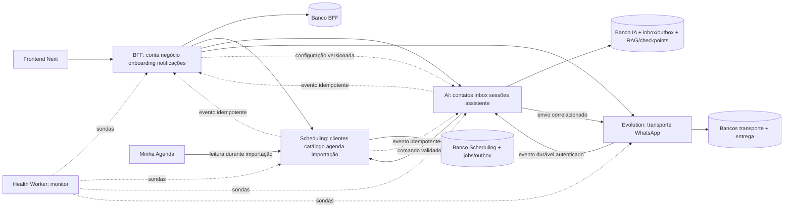

# Arquitetura alvo

Proposta técnica do Astra, baseada em `5fb5d51`. [DECISIONS](DECISIONS.md) registra status, alternativas e condições de revisão. Este documento define o destino; não afirma que ele já existe nem autoriza implementação neste Goal 0.

## Decisão central

Preservar Next/React, BFF Fastify, Scheduling, AI Orchestrator, Evolution Go, PostgreSQL/Prisma/pgvector e o monitor de saúde. A arquitetura alvo é próxima das fronteiras físicas atuais. A mudança principal é retirar a escolha operacional de agenda externa, tornar explícitos os donos dos dados e transformar efeitos assíncronos frágeis em trabalho durável e recuperável.

Não consolidar todos os serviços/bancos agora: isso ampliaria a migração sem resolver por si só identidade, consentimento, atomicidade ou entrega. Não criar microserviços de clientes, catálogo, importação ou notificações: são módulos nos donos existentes. Não converter Health Worker em executor de produto.

## Princípios e invariantes

1. Agenda Atendly é o único escritor e leitor operacional da agenda; Minha Agenda é adapter leitor de importação.
2. Tenant identifica o negócio, user identifica o ator; telefone identifica um canal de contato, não uma pessoa.
3. Cada dado tem um dono. Cópias em outros serviços são projeções versionadas ou referências, sem escrita concorrente autônoma.
4. LLM propõe intenção e chama ferramentas validadas; domínio confirma operação. Resposta não é prova do efeito.
5. Persistir recebimento/trabalho antes de ACK; efeito local e resultado recuperável devem ser atômicos. Efeito remoto admite estado incerto.
6. Consentimento, Ignorar IA, controle humano e conta ativa são guards determinísticos anteriores a LLM/transcrição/embedding e rechecados antes de efeitos.
7. Migração aditiva, consumidores preparados antes de novos valores, corte explícito e remoção por evidência de uso zero.
8. Mobile primeiro, sucesso real, erros acionáveis; complexidade técnica não aparece na jornada do profissional.

Setas de eventos representam outbox + HTTP autenticado com consumidor idempotente, não adoção de broker novo. O frontend continua acessando somente BFF. Nenhum serviço consulta tabelas de outro diretamente.

## Responsabilidades e ownership

| Dono físico | Módulos/dados autoritativos | Consumidores e limite |
| --- | --- | --- |
| BFF | User, Tenant/membership, sessão, aceite legal, BusinessProfile/modalidades/instruções, configuração desejada de IA, onboarding/activation test, lifecycle conta, vínculo administrativo WhatsApp, central de notificações e preferências | Coordena operações, expõe API pública e estado efetivo; não agenda nem guarda segunda inbox |
| Scheduling | Customer e relações/notas/tags/autorização, Service/configuração comercial, disponibilidade, bloqueios/pessoal/recorrência/holds, Appointment/itens/eventos/presença/valor final; ImportSession/items/maps/credencial temporária; regras e jobs de lembrete | BFF e tools usam APIs; importação escreve por serviços de domínio/transações locais; histórico pertence ao domínio |
| AI Orchestrator | Contact de canal e Ignorar IA, Conversation/Session/categoria/override/humano, mensagens/attachments/entrega, InboxEvent/outbox, AiRun/ToolCall, conhecimento e índices, memória derivada autorizada, checkpoint | Referencia Customer/Appointment por ID+tenant; classifica/processa somente conteúdo autorizado; sugestões humanas nunca autoenviam |
| Evolution Go | Instâncias/tokens/sessões WhatsApp, eventos e recibos técnicos, retry de transporte e outbox de webhook | Não conhece catálogo, disponibilidade, classificação comercial ou regras de negócio; autorização de alvo permanece no transporte |
| Health Worker | Resultados operacionais de sondas/logs | Sem banco de domínio, timers de agendamento ou mecanismo de ativação |

Customer possui identidade da pessoa e contatos informados; Contact da IA representa o endereço de transporte. Um Contact pode corresponder a várias pessoas. Relação `(tenantId, contactId, customerId)` não autoriza decidir a pessoa pelo telefone. Scheduling é autoritativo para identidade do cliente; IA guarda referência/mapeamento e confirma ambiguidades na operação.

Configuração comercial privada e notas/tags com autorização explícita só são fornecidas às ferramentas permitidas. Não copiar todas as notas para embeddings. Memória inferida carrega origem, cliente, timestamps/validade e permissão; a alteração de Ignorar IA invalida contexto/checkpoints pertinentes antes do próximo processamento.

## Auth, tenant e credenciais

- BFF autentica sessão, resolve membership e verifica estado da conta; endpoints não aceitam tenant escolhido pelo browser. Cardinalidades do MVP são reforçadas depois de inventário de dados; não deduzir que um índice composto existente já as garante.
- APIs internas exigem credencial de serviço, contexto validado e escopo da operação. Adotar credenciais distintas por chamador/uso (provisionamento, comandos, leitura, transporte), com configuração de permissões no receptor; `x-service-audience` sozinho não autentica o chamador. Sem novo identity provider.
- Contexto interno conceitual: tenant, ator de usuário ou sistema, request-id e operation-id/idempotency key quando há efeito. Jobs usam ator de sistema auditável, sem inventar usuário humano. Detalhes de schemas entram no Goal do contrato correspondente.
- Tenant scoping é obrigatório em queries e mutações, além das FKs compostas quando locais. IDs globais/CUID não substituem autorização. ChannelConnection continua único por tenant/provider e provider/instance; vincular WhatsAppInstance ao tenant no BFF.
- Token de instância autoriza somente a própria instância; operações administrativas seguem credencial admin e superfície separada. Goal 001 fecha o desvio confirmado de advanced-settings.
- BFF mantém gestão administrativa da credencial; IA usa credencial cifrada/projeção controlada ou resolução interna do vínculo, nunca token livre enviado no corpo do webhook como autoridade. Rotação/reconciliação registra versão; falha não deve silenciosamente voltar a chave global.
- Cookies de sessão com CSRF/origem validados, revogação de sessão/lifecycle e configuração segura por ambiente. CORS isoladamente não é controle completo de CSRF. A recomendação é compatível com a [orientação OWASP](https://cheatsheetseries.owasp.org/cheatsheets/Cross-Site_Request_Forgery_Prevention_Cheat_Sheet.html), consultada em 2026-09-05; exploração do runtime não foi realizada.

## Agenda e catálogo

Scheduling mantém a unidade transacional de clientes, serviços e agenda. CalendarService vira porta para agenda interna; uma interface de domínio pode continuar para tests/tools, mas sem factory escolhendo fonte remota.

Confirmação processa: validar ator/tenant → localizar pessoa e serviço/proposta → verificar operação idempotente → adquirir coordenação dos recursos/intervalos afetados → revalidar disponibilidade/hold/versão/acordo → gravar appointment/snapshots/histórico/resultado/outbox juntos → retornar resultado real. Criação/renomeação de cliente não é efeito preliminar de uma consulta de slot.

Preservar Serializable/advisory locks existentes, estendendo protocolo a bloqueios, exceções, regras, holds e remarcação, com ordem estável de locks e retry limitado de abortos serializáveis. Não impor constraint de não sobreposição que elimine exceções humanas explicitamente permitidas pelo produto. IA jamais aplica override; comando humano registra confirmação consciente, ator e motivo quando aplicável.

Hold dura cinco minutos conforme vault; validade é checada pelo relógio do banco no comando, sem depender de worker pontual. Remarcação mantém original enquanto nova opção não é confirmada; commit altera compromisso/ocorrência e histórico. Cancelar preserva história e invalida jobs ligados à versão anterior. Recorrência possui série e ocorrências finitas, exceções e edição por ocorrência/série conforme fluxo de produto; sem gerar série infinita silenciosa.

Serviço mantém quatro tipos: fixo, a partir de, sob consulta, não informado. Valores monetários preservam Decimal/semântica consistente no contrato; não usar float como autoridade nem zero para desconhecido. Serviço importado sem duração fica pendente, não operacional. Snapshot do atendimento mantém o acordo e versão/proveniência; edição do catálogo não o reescreve. Status do atendimento, presença pelo lembrete e valor final cobrado são dados separados.

Histórico importado incompleto permanece rastreável com ausência explícita e status original. Não criar serviço fictício para satisfazer FK. Recomenda-se permitir item histórico de origem com referência de catálogo opcional e flag de completude, enquanto novos agendamentos operacionais exigem serviço válido ou a exceção manual especificada no vault. A migração dessas constraints deve ser detalhada e ensaiada no Goal do domínio.

## Conversas, IA, memória e mídia

Separar quatro camadas no mesmo Orchestrator: transporte/inbox; política de contato/sessão; assistente/ferramentas; entrega. Persistir mensagens permitidas na inbox mesmo com IA desligada, ignorada ou humano atendendo; conteúdo ignorado não passa por classificação, transcrição, modelo, RAG ou memória.

Session representa aproximadamente 24h de contexto ativo; categoria comercial/não classificada/pessoal é atributo de organização com override manual. Contact ignorado é regra do contato e prevalece sobre sessão. Abrir chat só lê; envio humano assume a sessão antes de qualquer resposta automática concorrente. Retomar é comando explícito durante a mesma sessão; nova sessão pode reavaliar IA conforme o vault e elegibilidade global.

Debounce por conversa agrega mensagens 2–3s, com versão de input e um executor válido por conversa. Nova entrada invalida resposta ainda não enviada quando possível. Antes de executar ferramenta com efeito e antes de enviar, comparar versão/controle humano/conta/ignore. Checkpoint LangGraph ajuda retomada de raciocínio; inbox/outbox e registro da operação comprovam efeitos. Replay de um nó não pode repetir agendamento nem envio cegamente.

Tools de agenda retornam fatos, IDs, versão/resultados e erros de domínio; LLM não acessa DB de agenda. Confirmação final do cliente precisa apontar proposta conhecida e ainda válida. Falha de consulta não usa agenda antiga como verdade; erro crítico vai para humano sem mensagem automática de infraestrutura. Prompts/RAG são dados não confiáveis para autorização e respeitam filtros de privacidade fora do modelo.

Áudio: obter attachment sob autorização, transcrever, guardar proveniência e tratar confirmação clara com mesmas invariantes. Imagem: mostrar e encaminhar a humano; documento: mostrar sem interpretação. Não há ingestão de PDF nem visão no MVP. Embeddings somente do conhecimento/projeções permitidas; versão de documento e índice devem ser reconciliáveis. Criar FAQ/conhecimento/sugestões pelo módulo, não por seed como interface operacional.

## Recebimento, entrega e jobs

### Semântica de confiabilidade

Evolution persiste evento técnico sanitizado/outbox antes de depender de goroutine de HTTP. IA autentica, resolve canal e persiste inbox+chave única antes de ACK. Processamento posterior possui status, attempts, nextAttemptAt, lease/owner e resultado. Eventos duplicados retornam ACK sem novo efeito, mas eventos recebidos e falhos permanecem retomáveis.

Outbound recebe operation-id estável, mensagem/tentativa persistida e estados `pending`, `sent`, `failed` e `unknown` quando envio pode ter ocorrido. Recibo/ID externo reconcilia unknown. Não prometer exactly-once do WhatsApp sem garantia do provider; efeito de agenda é idempotente local, entrega é at-least-once com dedupe/reconciliação quando suportados. Timeout não apaga tentativa nem comprova não entrega.

### Alternativas consideradas

| Alternativa | Ganho | Custo/limite | Escolha |
| --- | --- | --- | --- |
| Timers/goroutines/Map atuais | Pouca estrutura | Perdem trabalho/coordenação em restart e múltiplas réplicas | Somente gatilho local sobre trabalho persistido |
| Health Worker genérico | Reaproveita processo | Mistura monitoramento com dados de domínio e cria acoplamento | Rejeitada |
| Jobs/outbox no PostgreSQL do dono | Commit local + trabalho atômicos, sem nova infraestrutura | Exige lease, retries, retenção, índices e testes reais | Recomendada para MVP |
| Broker externo + workers próprios | Escala/isolamento de carga | Nova dependência/custo e ainda precisa outbox/consumidor idempotente | Adiada até demanda medida |
| Biblioteca de fila PostgreSQL | Pode reduzir código do executor | Avaliar acoplamento à transação, schema e manutenção antes de escolher | Alternativa de implementação no Goal de jobs, sem dependência aprovada agora |

A recomendação concreta é executar loops de jobs nos serviços existentes, sobre tabelas do próprio dono, inicialmente sem novo serviço dedicado. Claim em transação com lease e fencing; só lease expirado pode ser recuperado; retry/backoff bounded, dead-letter/atenção e replay autorizado. `FOR UPDATE SKIP LOCKED` é adequado a consumidores de filas, não a consulta de disponibilidade como se retornasse conjunto completo; essa distinção está na [documentação PostgreSQL 15](https://www.postgresql.org/docs/15/sql-select.html), consultada em 2026-09-05. Escolha de uma biblioteca, se necessária, exige decisão registrada no Goal correspondente.

Scheduling calcula vencimento/lembrete com appointment/version e revalida status/data/opt-out/telefone antes de emitir intenção de envio. IA aplica elegibilidade do contato e estilo e entrega por Evolution; recibo retorna ao dono por evento idempotente. BFF recebe eventos de atenção e mantém central/estado lido/email crítico. Desativar conta/automação cancela ou bloqueia trabalho correspondente em todos os donos. Holds expirados não bloqueiam agenda mesmo se cleanup atrasar.

Workers precisam de execução contínua comprovada. Blueprint free não é evidência suficiente; decisão de capacidade/custo é gate antes de uso real, sem contratar infraestrutura neste Goal.

## Importação única e corte operacional

Importação é módulo de Scheduling com adapter read-only Minha Agenda. Sua interface não é CalendarProvider: lista categorias, consulta payloads e entrega snapshot/proveniência, sem consulta de vaga atual nem escrita na origem.

Sessão guarda elegibilidade, conta de origem, snapshot/preview versionado, categorias, itens/decisões/conflitos/maps, progresso e resultado. Execução por item/grupo transacional idempotente aceita destino preenchido. Parcial permanece aberta; somente `Concluir importação` grava a conclusão única do negócio e encerra uso de credenciais. Histórico permanece, credenciais temporárias são descartadas ao fechar/abandonar conforme ciclo explicitado. Nunca reabrir para “reimportar”.

Migração interna de bancos não consome esse direito. Negócios que operam no legado precisam inventário e janela de corte: congelar escritor remoto, drenar comandos, obter/reconciliar snapshot e ativar único escritor local. Durante essa janela, informar indisponibilidade/pendência real; não oferecer duas agendas operacionais. Código antigo pode permanecer instalado para reconciliação, mas não como alternativa selecionável do produto novo. [DATA_MIGRATION](DATA_MIGRATION.md) define ensaio/rollback.

## Frontend e APIs

Manter App Router/features, client BFF e componentes acessíveis. Refatorar ProductRuntime para sessão/conta/elegibilidade compartilhadas; substituir shell/tokens/composição pelo design aprovado. Server state pode continuar com hooks/adapters e polling inicialmente, com invalidação e cancelamento consistentes; não introduzir store global ou websocket sem necessidade medida.

API pública permanece família `/v1` durante mudanças aditivas. Contratos incompatíveis usam endpoint/schema novo por operação, com adapter temporário explícito; não criar V2 total por conveniência. `packages/contracts` recebe schemas consumidos pelo produtor e por ao menos um consumer real. Nunca exportar Prisma models, dados sensíveis ou estrutura de protótipo como contrato público.

Home/Settings distinguem configuração desejada, aplicação efetiva, conexão e aptidão. Onboarding completed é independente de activation test; sem WhatsApp vai à Home com checklist. Teste real bem-sucedido e mínimos válidos ativam automaticamente. Demo simulada permanece claramente distinta. Layouts mobile mantêm Clientes principal e Dia/Semana/Mês; states acessíveis não dependem apenas de toast.

## Observabilidade, testes e operação

Logs mínimos por tenant/operation/request/event/run/tool, com redaction em URL/body/raw e sem conteúdo integral por default. Métricas: backlog/idade de job, retries, unknown delivery, erro/latência das dependências, conflitos de agenda, ativação e handoffs. Health barato permanece liveness; readiness verifica recursos necessários, estado de produto não é inferido de HTTP200.

Cada mudança: contratos producer/consumer; unidade de regra relevante; integração PostgreSQL para concorrência/lease/tenant/migração; E2E para jornadas e falhas principais. Fixtures de dois tenants, pessoas com número compartilhado, dados parciais e históricos. Ensaiar restore/backfill/corte em base isolada, nunca teste destrutivo com DATABASE_URL pessoal/produção implícita.

Migrations têm dono e versão, expandem antes do rollout, rodam em etapa controlada após artefato aprovado; build não deve mutar banco. Claims de jobs/checkpointer não substituem migration review. Deploy continua na infraestrutura existente enquanto capacidade, secrets e networking passarem os gates; sem promessa de custo/zero downtime não medidos.
