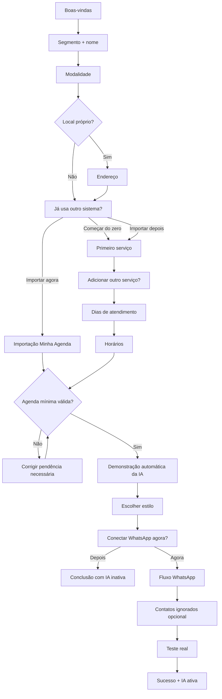

# Onboarding

## Objetivo

Levar o usuário ao primeiro valor percebido rapidamente, sem exigir toda configuração avançada antes de entrar no produto.

O primeiro valor é **ver a IA simulando um atendimento real usando os dados do próprio negócio**.

Ativação real do WhatsApp vem depois.

## Princípios

- mobile-first;
- uma decisão principal por tela sempre que fizer sentido;
- evitar formulários longos;
- evitar scroll desnecessário;
- não comprimir legibilidade apenas para eliminar scroll;
- salvar progresso a cada etapa concluída;
- permitir voltar livremente;
- não exibir menus da área logada durante onboarding;
- progresso mostrado por grandes blocos, não por quantidade de telas.

## Quatro blocos

1. **Seu negócio**
2. **Sua agenda**
3. **Sua IA**
4. **WhatsApp**

## Fluxo consolidado

## 1. Boas-vindas

Tela curta:

> Configure sua Atendly em poucos passos.

CTA:

> Começar

Sem carrossel e sem tutorial longo.

## 2. Segmento + nome

Perguntar:

- segmento;
- como os clientes conhecem o negócio/profissional.

Segmentos frequentes + `Outro`.

O nome pode ser pessoal ou comercial.

## 3. Modalidade

Seleção múltipla:

- Local próprio
- Domicílio
- Online

Se local próprio, pedir endereço.

Área de atendimento a domicílio pode ser configurada depois.

## 4. Sistema atual

Pergunta:

> Você já usa algum sistema para organizar seus clientes e agendamentos?

Ações:

- `Sim, quero importar`
- `Não, começar do zero`

Se sim:

- `Importar agora` — principal
- `Fazer depois` — secundário

## 5A. Começar do zero

Cadastrar pelo menos um serviço.

Campos:

- nome;
- duração;
- preço opcional com tipo.

Depois:

- `Adicionar outro serviço`
- `Continuar`

Recorrência, descrição avançada e regras internas ficam para a tela de Serviços depois.

## 5B. Importação

Se importação trouxer serviços e horários válidos, não pedir recadastro.

Se faltar horário, direcionar para configuração de horários.

Se nenhum serviço importado estiver operacional, corrigir pelo menos um antes da demonstração.

## 6. Dias e horários

- selecionar dias de atendimento;
- definir horário-base;
- permitir personalizar por dia.

Não configurar nesse momento:

- almoço/bloqueios;
- disponibilidade extra;
- antecedência;
- granularidade;
- recorrência.

## 7. Demonstração da IA

Demonstração automática, curta e visualmente trabalhada, usando dados reais.

Mostrar conversa e eventos discretos como:

- cliente identificado;
- serviço reconhecido;
- agenda consultada;
- horário encontrado;
- agendamento simulado.

No mobile esses eventos entram no próprio fluxo da demonstração.

## 8. Estilo

Depois da demonstração:

> Gostou da forma como a IA conversou?

Opções:

- Profissional
- Equilibrada
- Descontraída

Default: Equilibrada.

Ao trocar, mostrar amostra imediata da mesma frase/resposta nos estilos.

## 9. WhatsApp

Explicar conexão e permitir:

- `Conectar meu WhatsApp`
- `Fazer isso depois`

Se pular, onboarding é considerado concluído, mas IA fica inativa.

## 10. Conclusão sem WhatsApp

Mensagem positiva:

> **Sua Atendly está configurada.**  
> Conecte seu WhatsApp quando quiser colocar a IA para atender seus clientes.

Ações:

- `Ir para o início` — principal
- `Conectar agora` — secundária

## Checklist pós-onboarding

Enquanto IA não estiver ativa, Home mostra:

- serviço operacional;
- horários configurados;
- WhatsApp conectado;
- teste concluído.

Itens concluídos aparecem marcados até ativação.

Depois da ativação, checklist desaparece.
